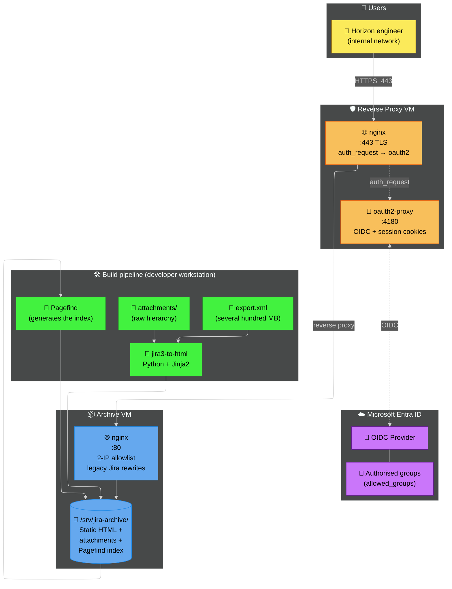
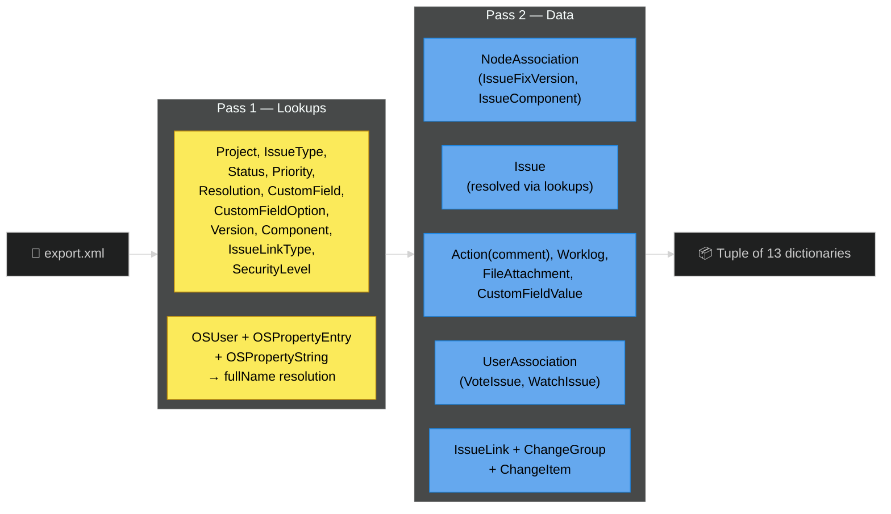
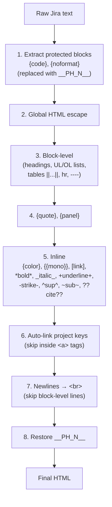
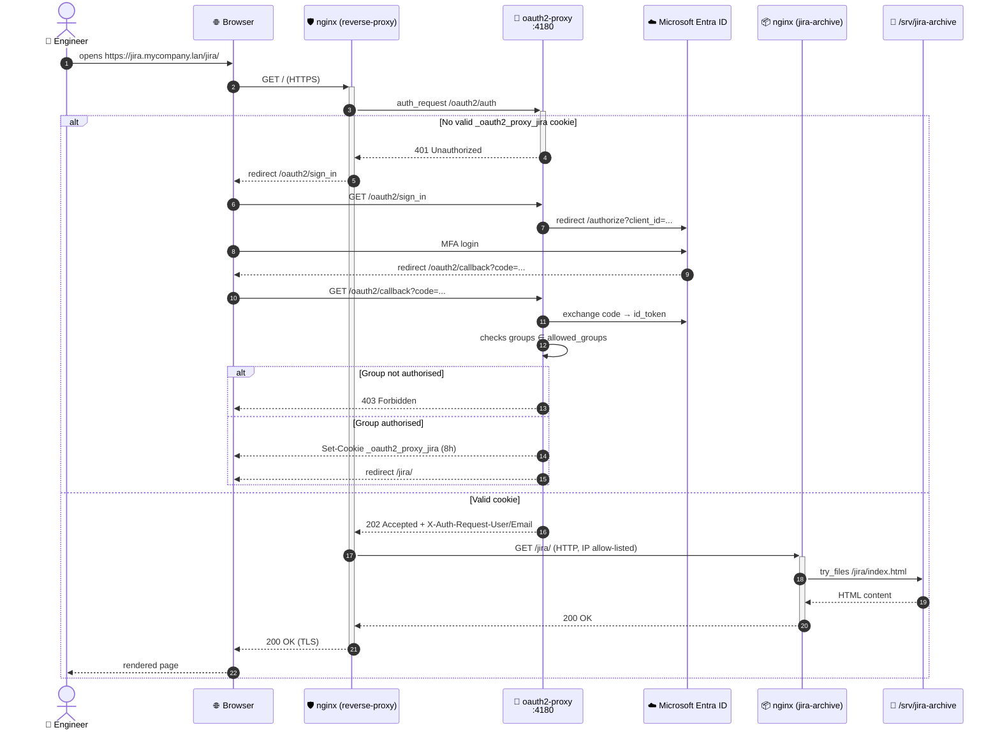
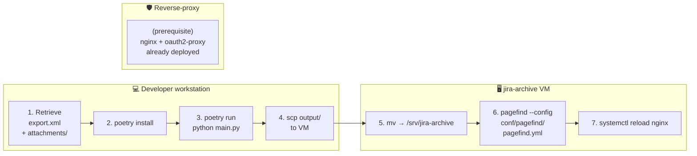

# Detailed report

## 1. Company and project context

### 1.1 The organisation: Horizon Trading Solutions

Horizon Trading Solutions is a software vendor specialising in professional trading software for financial institutions. Before the migration to **Jira Cloud**, the company's history (tickets, development work, incidents, *release notes*) was managed in a self-hosted **Jira 3.13 instance** running on an on-premise server. This ageing instance contains several **tens of thousands of tickets** spread across multiple projects, along with thousands of **attachments** (images, PDFs, archives, Excel exports, etc.).

### 1.2 The need

Keeping this instance operational represented a growing cost and risk:

- **Operating cost**: Java 8, legacy MySQL database, Tomcat application server, backups, monitoring.
- **Security risk**: Jira version 3.13 [released in 2008](https://endoflife.date/jira-software), no further security updates, outdated JVM.
- **Low engagement**: only a handful of people still consulted the history, mainly to retrieve context from old tickets.

The goal set by my company tutor was therefore to **preserve the entire history in read-only mode**, without ever having to run the Jira server itself again:

> *We want to retain access to the ticket and attachment history for engineers who need it, but we no longer want to run Jira Server. A static, indexed and secured HTML archive is enough.*

### 1.3 Existing situation and provided resources

| Resource | Details |
|---|---|
| **Jira XML export** | Full export produced by Jira (`Administration → System → Backup`). Several hundred MB. |
| **`attachments/` folder** | Raw attachment hierarchy (`<project>/<ticket-key>/<id>` or `<id>_<filename>`) totalling several GB. |
| **No existing code** | The project was bootstrapped from scratch. |
| **Infrastructure and resources** | ESXi hypervisor, allowing VM creation. |
| **Internal network** | Private network `mycompany.lan` |
| **Directory** | Microsoft Entra ID |

### 1.4 Expected outcome

- **Static archive**: an HTML/CSS/images/attachments folder browsable from any web server without any application *backend*.
- **Full-text search**: so that an engineer can locate a ticket by keywords (summary, description, comments, source code in comments, etc.).
- **Authentication**: no internal document should be accessible without corporate authentication (SSO).
- **Group-based authorisation**: only members of defined Entra ID groups (the former Jira users) can access it.
- **HTTPS** + certificate from the company's internal authority.
- **Preserved URLs**: legacy *deep links* (`/jira/browse/PROJ-123`, `ViewIssue.jspa?key=...`, `ReleaseNote.jspa?...`) must continue to work so as not to break references scattered throughout internal documentation.

---

## 2. Solution overview



The solution therefore consists of **three main parts**:

1. **A Python *parser*** that transforms the Jira XML export and the attachments folder into a static HTML website.
2. **A Pagefind index** generated once after each build to provide full-text search.
3. **A secure delivery infrastructure**: a back-end server (nginx) that serves the archive, and a front-end reverse-proxy (nginx + oauth2-proxy) that enforces SSO authentication and TLS termination.

---

## 3. The parser: XML → static HTML transformation

### 3.1 Architecture of the Python module

The project is packaged with **Poetry** and structured as follows:

```
jira3-to-html/
├── main.py                 ← entry point (delegates to cli.py)
├── jira_parser/
│   ├── cli.py              ← CLI arguments (--issue, --index-only)
│   ├── config.py           ← paths (input/, output/, templates/)
│   ├── parser.py           ← streaming XML parser (2 passes)
│   ├── markup.py           ← Jira wiki markup → HTML converter
│   ├── renderer.py         ← Jinja2 rendering + attachment copying
│   └── utils.py            ← format_time, setup_directories
├── templates/              ← 7 Jinja2 templates
│   ├── base.jinja2
│   ├── master_index.jinja2
│   ├── project_hub.jinja2
│   ├── issue.jinja2
│   ├── component.jinja2
│   ├── fix_version.jinja2
│   └── release_notes.jinja2
├── conf/
│   ├── nginx/              ← jira.conf, testlocal.conf
│   └── pagefind/pagefind.yml
├── docker/compose.yml      ← local preview
├── tests/                  ← pytest suite
└── pyproject.toml
```

### 3.2 XML parser: 2-pass streaming

The Jira export is a **monolithic XML archive** in the `entity-engine-xml` format. Its size (several hundred MB) rules out a simple `ElementTree.parse()` which would load everything into memory, consuming a lot of RAM and making the work slow or even impossible on the build machine.

The `parse_jira_xml()` function therefore uses `ET.iterparse(events=("start", "end"))` and calls `elem.clear()` + `root.clear()` after each processed element.

Parsing is performed in **two passes** over the same file:



This strategy offers three benefits:

| Benefit | Details |
|---|---|
| **Bounded memory** | At any given moment, only a single XML element is loaded. The lookups occupy a fraction of the total RAM. |
| **Pass independence** | During pass 2, `Issue` entities are translated in plain text (statuses, priorities, types) thanks to the lookups produced in pass 1. |
| **Robustness** | The parser tolerates incomplete exports: `lookups[...].get(id, "Unknown")` everywhere. |

#### Special case: resolving the user `fullName`

Jira 3.13 stores the full name of a user in a generic property table (`OSPropertyEntry` + `OSPropertyString`) rather than directly on `OSUser`. Resolution therefore requires three steps:

1. `OSUser id="42" name="jdoe"` → `_osuser_name_by_id["42"] = "jdoe"`.
2. `OSPropertyEntry entityName="OSUser" entityId="42" propertyKey="fullName" id="999"` → `_fullname_entry_by_userid["42"] = "999"`.
3. `OSPropertyString id="999" value="John Doe"` → `_fullname_by_entry_id["999"] = "John Doe"`.

At the end of pass 1, the three dictionaries are joined to produce the final mapping `lookups["users"]["jdoe"] = "John Doe"`. This makes it possible to replace `assignee="jdoe"` with `John Doe` everywhere in the HTML rendering, without ever exposing technical *usernames*.

### 3.3 HTML rendering with Jinja2

The `renderer.py` module iterates over the structures produced by the parser and delegates rendering to **seven Jinja2 templates** all inheriting from a `base.jinja2`. Each ticket produces an `output/jira/browse/<KEY>/index.html` file (which allows nginx to serve clean URLs with `index index.html;`).

The generated pages are:

| Page | URL | Template |
|---|---|---|
| Master Index | /jira/index.html | `master_index.jinja2` |
| Project Hub | /jira/browse/<KEY>/index.html | `project_hub.jinja2` |
| Ticket | /jira/browse/<KEY-NNN>/index.html | `issue.jinja2` |
| Component | /jira/browse/<KEY>/component/<id>/index.html | `component.jinja2` |
| Fix Version | /jira/browse/<KEY>/fixforversion/<id>/index.html | `fix_version.jinja2` |
| Release Notes | /jira/secure/ReleaseNote.jspa@projectId=...&styleName=Html&version=....htm | `release_notes.jinja2` |

The at sign (`@`) in the Release Notes filename is intentional: it **encodes the original Jira URL** (`?projectId=...&styleName=...&version=...`) in a filesystem-compatible filename, and nginx then dynamically rewrites the incoming URL to this file (see § 4.4).

#### Auto-linking of ticket keys

Jira comments and descriptions often contain references to other tickets in the form `PROJ-123`. The renderer builds a regex from the known project keys:

```python
project_key_pattern = re.compile(
    rf"\b((?:{'|'.join(re.escape(k) for k in project_keys)})-\d+)\b"
)
```

and this regex is applied by `format_jira_markup()` to all free-text areas, **skipping the inside of already-generated HTML tags** (see `markup.py` step 6) so as not to break existing links.

#### Attachment handling

The Jira export indicates a numeric `id` and a `filename` for each `FileAttachment`. The raw attachments folder may follow several conventions depending on the instance's history (by project *key*, by project *name*, file named with `id` only, or `id_filename`, etc.). The renderer **probes the six possible locations in this order**:

```python
possible_paths = [
    os.path.join(ATTACHMENTS_RAW_DIR, project_key, key, att_id),
    os.path.join(ATTACHMENTS_RAW_DIR, project_name, key, att_id),
    os.path.join(ATTACHMENTS_RAW_DIR, project_key, key, filename_str),
    os.path.join(ATTACHMENTS_RAW_DIR, project_name, key, filename_str),
    os.path.join(ATTACHMENTS_RAW_DIR, project_key, key, f"{att_id}_{filename_str}"),
    os.path.join(ATTACHMENTS_RAW_DIR, project_name, key, f"{att_id}_{filename_str}"),
]
```

The first one that exists is copied into `output/jira/secure/attachment/<id>/<filename>` (the same hierarchy used by Jira Server, which preserves the *deep-links*). Missing items are flagged in the HTML as `❌ <filename> (Missing)` rather than producing 404 links.

### 3.4 Conversion of Jira wiki markup

Jira 3.13 uses its own markup language (different from Markdown). The `markup.py` module implements an **8-step converter** that covers all the constructs encountered in the history:



Two choices are important:

- **Systematic HTML escaping before any processing**: user content (descriptions, comments) is first HTML-escaped to neutralise any HTML/XSS injected into the historical Jira, *then* the conversion adds only the tags strictly controlled by the converter.
- **Protection of `{code}` blocks** with `__PH_N__` *placeholders* before escaping, then restoration at the end of the pipeline so that code content is escaped only once and not altered by the other markup rules.

### 3.5 Pagefind integration

The archive is purely static: there is no server-side search engine. **[Pagefind](https://pagefind.app/)** indexes all the generated HTML files and publishes a JavaScript + WebAssembly script along with index *fragments*. The script is embedded in `master_index.jinja2`:

```html
<link href="/jira/pagefind/pagefind-ui.css" rel="stylesheet">
<script src="/jira/pagefind/pagefind-ui.js"></script>
...
<div id="search"></div>
<script>
  new PagefindUI({ element: "#search", showSubResults: true });
</script>
```

The `conf/pagefind/pagefind.yml` configuration targets **only** the content pages (and excludes the `attachment/` folder which would contain binary PDFs/images):

```yaml
site: "/srv/jira-archive"
glob: "{jira/browse/**/*.{html,htm},jira/secure/*.{html,htm},jira/*.{html,htm}}"
```

**⚠️ Indexing cost:** on the full archive, generating the Pagefind index requires **up to 32 GB** of memory (RAM + swap). This constraint is documented in the `README.md` and influenced the choice to generate the index **on the final VM** rather than on the development workstation (the VM was temporarily sized accordingly with a large swap file).

### 3.6 Tests

The **pytest** suite (`tests/`) covers the four business modules (`parser`, `renderer`, `markup`, `utils`). The fixtures in `conftest.py` make it possible to:

- dynamically generate Jira XML fragments via `make_xml(...)`;
- provide a minimal *lookups* set and a minimal parsed dataset to test rendering in isolation;
- redirect the *renderer*'s paths to `tmp_path` (`patched_renderer`) so as never to pollute the real `output/` folder during tests.

---

## 4. Delivery: infrastructure and security

### 4.1 Two-server architecture

The archive is served by **two distinct VMs**, which clearly separates responsibilities:

| VM | Role |
|---|---|
| **`jira-archive`** *(Ubuntu 24.04 LTS, created for this purpose)* | Serves the static content over plain HTTP, nginx + 2 `allow` IP rules. |
| **`nginx1`** *(existing shared reverse-proxy)* | TLS termination, Entra ID authentication via `oauth2-proxy`, reverse-proxy to the archive VM. |

The sequence diagram for an access is as follows:



### 4.2 Reverse-proxy configuration

The reverse-proxy `/etc/nginx/sites-available/jira.conf` chains **three logical `server` blocks**:

1. **HTTP → HTTPS redirection** (port 80 → 301 to HTTPS).
2. **`/oauth2/*` endpoints** proxied to `127.0.0.1:4180` (oauth2-proxy). The `/oauth2/auth` endpoint additionally receives `proxy_pass_request_body off` and `Content-Length ""` because it is merely a cookie verification (no relaying of the request body).
3. **Main `location /` block**:
   - `auth_request /oauth2/auth;` — delegates authentication to oauth2-proxy before each request;
   - `error_page 401 = /oauth2/sign_in;` — redirects to the login page on failure;
   - `auth_request_set $user $upstream_http_x_auth_request_user;` — retrieves the authenticated user and passes it as an `X-User` header to the backend (useful for audit logs);
   - `proxy_pass http://jira-archive.mycompany.lan;` — relays to the archive VM.

The `proxy_buffer_size 128k; proxy_buffers 4 256k;` along with `large_client_header_buffers 4 16k;` were sized to absorb the **large Microsoft Entra ID session cookies** (the JWT *id tokens* containing the user's `groups` list can exceed several kilobytes).

### 4.3 `oauth2-proxy` configuration

The `/etc/oauth2-proxy/oauth2-proxy.cfg` file retains the following choices:

| Parameter | Value | Justification |
|---|---|---|
| `provider` | Generic OpenID Connect | Microsoft Entra ID is a standard OIDC IdP — no need for the `azure` *provider* (which is more restrictive and discouraged by the *maintainers*). |
| `oidc_issuer_url` | `https://login.microsoftonline.com/...` | Allows oauth2-proxy to **dynamically fetch** the OIDC configuration (endpoints, JWKS) via `/.well-known/openid-configuration`. |
| `client_id` / `client_secret_file` | Entra ID application registered for the archive | The secret is read from a **dedicated file** (and not in plain text in the `.cfg`), with strict filesystem permissions. |
| `cookie_secret` | 32 random bytes | Encrypts the session cookie on the client side (prevents tampering). |
| `cookie_name` | Per-project prefix | Allows it to coexist with other applications protected by other oauth2-proxy instances on the same domain. |
| `cookie_secure` | HTTPS-only cookie | Prevents any plain-text cookie transit. |
| `cookie_expire` | 8 hours | Covers a working day without re-login, but forces re-authentication the next day. |
| `session_cookie_minimal` | Stores only essentials in the cookie | Limits cookie size; the full data remains on the oauth2-proxy side. |
| `allowed_groups`+ `oidc_groups_claim = "groups"` | Filtering by Entra ID groups | **Only members** of one of the two defined groups (former Jira users) have access. Any other `mycompany.com` account will be rejected with a 403. |
| `oidc_email_claim` | Microsoft returns the UPN in `preferred_username`, not in `email` | Without this line, oauth2-proxy would reject all accounts (the `email` claim being absent on some corporate accounts). |
| `set_xauthrequest` | Exposes the `X-Auth-Request-{User,Email}` headers | Allows nginx to log **who** consults which ticket. |
| `skip_provider_button` | Skips the intermediate "Sign in with OIDC" page | Redirects directly to Microsoft. |
| `email_domains = ["*"]` | No email domain filtering | Security relies entirely on `allowed_groups`, not on an *email pattern*. |

### 4.4 Archive VM configuration

The dedicated Ubuntu 24.04 LTS VM `jira-archive.mycompany.lan` hosts **only** the archive and its nginx. Its `nginx` configuration is intentionally minimal and **blocks all traffic that does not come from the reverse-proxy**:

```nginx
allow 10.0.10.110; # reverse-proxy 1
allow 10.0.10.111; # reverse-proxy 2
deny  all;
```

This defence in depth ensures that, even if the VM were inadvertently exposed to another network, **no document could be retrieved without going through SSO authentication**.

#### *Legacy* rewrites to preserve Jira URLs

Many internal pages, archived emails, or comments in other tools point to the old Jira URLs. The nginx block dynamically rewrites several cases:

| Incoming URL *(Jira 3.13)* | Rewrite |
|---|---|
| /jira/secure/ViewIssue.jspa?key=PROJ-123 | 301 → /jira/browse/PROJ-123/ |
| /jira/secure/ViewIssue.jspa?id=12345 *(internal ID)* | 302 → /jira/index.html *(graceful fallback)* |
| /jira/secure/IssueNavigator.jspa *(dynamic filters)* | 302 → /jira/index.html |
| /jira/secure/thumbnail/<id>/<filename> | rewrite → /jira/secure/attachment/<id>/<filename> |
| /jira/secure/ReleaseNote.jspa?projectId=...&styleName=...&version=... | try_files → /jira/secure/ReleaseNote.jspa@projectId=...&styleName=...&version=....htm |
| / *(root)* | 301 → /jira/ |

#### Forced attachment download (and the `?` bug in filenames)

Some attachments contain a `?` character in their name, which browsers interpret as the start of a *query string*. To work around this issue, the nginx block **recursively re-encodes the `?`** as `%3F` via a 301 redirect:

```nginx
location ^~ /jira/secure/attachment/ {
    if ($request_uri ~ "^([^?]*)\?(.*)$") {
        return 301 $1%3F$2;
    }
    add_header Content-Disposition "attachment";
    expires 1y;
    add_header Cache-Control "public, no-transform";
    try_files $uri $uri/ =404;
}
```

The `Content-Disposition: attachment` header **forces the download** of attachments rather than displaying them *inline*. This prevents HTML/SVG/PDFs stored as attachments from being interpreted by the browser.

### 4.5 TLS certificate

The certificate used is a **wildcard `*.mycompany.com` certificate issued by a trusted external authority**. Renewal is integrated into the existing certificate management process (out of scope for this project).

---

## 5. Full generation and deployment procedure



| Step | Command / action |
|---|---|
| 1 | Jira export (Administration → System → Backup), copy of the raw `attachments/` folder. |
| 2 | `poetry install` (Python 3.14, single dependency: `jinja2`). |
| 3 | `poetry run python main.py` (≈ several minutes). |
| 4 | `scp -r output/ user@jira-archive.mycompany.lan:/tmp/` |
| 5 | `sudo mv /tmp/output/* /srv/jira-archive/` |
| 6 | `pagefind --config /opt/jira3-to-html/conf/pagefind/pagefind.yml` *(up to 32 GB of RAM/swap)* |
| 7 | `sudo nginx -t && sudo systemctl reload nginx` |

There are also two incremental modes (useful when fixing a single ticket):

- `python main.py --issue HMM-12345`: regenerates **a single ticket** (without rebuilding the whole site).
- `python main.py --index-only`: regenerates **only** the master index (fast).

### 5.1 Local preview via Docker Compose

The `docker/compose.yml` file provides a way to preview the archive **without the reverse-proxy**:

```yaml
services:
  jira-archive:
    image: nginx:alpine
    ports:
      - "8080:80"
    volumes:
      - ../output:/usr/share/nginx/html:ro
      - ../conf/nginx/testlocal.conf:/etc/nginx/conf.d/default.conf:ro
```

The `testlocal.conf` file is a variant of the production nginx configuration **without** the `allow`/`deny` rules (since it's local) and **with** `absolute_redirect off;` so that `301`s work from `localhost:8080`. It is exactly the same rewrite logic as on the VM, ensuring that a successful local test reflects production behaviour.

---

## 6. Skills mobilised (BTS SIO framework)

### 6.1 Block 1 — IT services support and delivery (E5)

This work primarily covers **Block 1**.

| Skill | How it was mobilised in this project |
|---|---|
| **Identify and inventory digital resources** | Exhaustive inventory (§ 1.3 and § 4.1): VM `jira-archive.mycompany.lan` (Ubuntu 24.04 LTS, created for the project), reverse-proxy VM `jira.mycompany.com` (shared), Microsoft Entra ID (`mycompany.com` tenant, two authorised groups, registered application), `/srv/jira-archive` volume (static HTML + attachments + Pagefind index), wildcard certificate `*.mycompany.com`. |
| **Apply the frameworks, standards and norms adopted by the IT provider** | Open standards: **OpenID Connect** (generic OIDC provider, RFC 6749/6750), **OAuth 2.0 Authorization Code flow**, JWT (`id_token`, `groups` claim), **HTTP/1.1** (`auth_request`, `proxy_pass`), TLS (nginx termination), **Pagefind** (static search engine in line with the JAMstack philosophy), Atlassian Jira 3.13 *entity-engine-xml* conventions, PEP 8 / PEP 517 (Poetry). |
| **Set up and verify access levels associated with a service** | **Triple barrier** of authorisation: (1) access via internal network only, (2) Microsoft Entra ID SSO authentication via oauth2-proxy with `allowed_groups` (two Entra ID groups; any other `mycompany.com` account is rejected with a 403), (3) nginx IP allowlist on the archive VM forbidding any access that does not go through the reverse-proxy. |
| **Verify the conditions for IT service continuity** | **Fail-safe** architecture: the archive VM only serves static files (no database, no business process, hence no possible drift). Nginx is restarted by systemd in case of a crash. The TLS certificate is shared with other internal services and benefits from the central renewal process. Consultation is read-only: no risk of data alteration by users. |
| **Manage backups** | The archive itself is **immutable and idempotent**: from the initial `export.xml` + `attachments/`, the pipeline reproduces the website identically. A simple backup of these two resources (for example on cold storage of the Veeam type — *cf. another portfolio item*) is sufficient to rebuild the archive. The contents of `/srv/jira-archive` is itself backable by simple `tar` or VM snapshot. |
| **Verify compliance with the rules for the use of digital resources** | Secrets managed outside the Git repository: Entra ID `client_secret` in `/etc/oauth2-proxy/client-secret` with restricted filesystem permissions; random 32-byte `cookie_secret`; TLS certificate in `/etc/ssl/private/`. Forced download (`Content-Disposition: attachment`) to prevent the execution of any malicious HTML/SVG/PDFs stored as attachments. Access logs (`/var/log/nginx/jira-archive.access.log` + `X-User` header) to trace who consults which ticket. |
| **Collect, monitor and route requests** | Gathering and formalising the need with the company tutor (§ 1.2). Diagnosing and resolving concrete cases: attachments containing `?` in the name, excessive memory consumption of the parser on full exports, divergence between naming conventions of `attachments/` folders depending on the project (six paths tested in cascade). |
| **Handle requests concerning network and system services, applications** | nginx configuration (two files: `jira.conf` on the reverse-proxy side with `auth_request` + TLS; `jira.conf` on the backend side with IP allowlist + legacy rewrites). Tuning of nginx buffers (`large_client_header_buffers 4 16k`, `proxy_buffer_size 128k`, `proxy_buffers 4 256k`) to absorb large JWT *id tokens* containing the `groups` list. Configuration of the OIDC server (oauth2-proxy.cfg). |
| **Handle requests concerning applications** | `?` bug in attachment filenames: the root cause was nginx interpreting `?` as the start of a *query string*. The fix via a 301 redirect re-encoding `?` as `%3F` was designed to also work recursively on multi-`?` names. Memory bug: switch from a global `ET.parse()` to a streaming `ET.iterparse()` + `elem.clear()` + `parent.remove()`. |
| **Develop the organisation's online presence: enhance the brand image, drive referencing, evolve a website** | Although the archive is internal (not public), the same rigour applies: generation of **semantic HTML5**, **responsive**, **accessibility** (hierarchical headings, clean `<a>` tags), **clean and persistent URLs** (`/jira/browse/<KEY>/`), full-text search (Pagefind) — all of which improves the **internal visibility** of the company's knowledge. |
| **Analyse the objectives and organisational arrangements of a project** | § 1: analysis of the existing situation (ageing Jira 3.13, growing cost, few active users), formulation of the need with the tutor, choice of a target ("static, indexed, secured archive"), trade-offs (read-only, no dynamic engine). |
| **Plan activities** | Decomposition into successive batches visible in the Git history: Poetry initialisation & HTML extraction by templates (March 2026), responsive design and markup fixes, unit tests, memory optimisation, nginx + local Compose configuration, hardening via IP allowlist + oauth2-proxy integration. |
| **Evaluate project monitoring indicators and analyse variances** | Performance measurements: generation duration, size of the produced archive, RAM consumption (critical case of the *master index* on the full export), number of missing attachments. Each variance led to a targeted `fix:` commit. |
| **Carry out integration and acceptance tests of a service** | **pytest** suite (`tests/test_parser.py`, `test_renderer.py`, `test_markup.py`, `test_utils.py`) with XML fragment generation and redirection of the *renderer*'s paths to `tmp_path`. Manual integration test via `docker compose up` (`testlocal.conf` configuration) to replay locally exactly the same nginx logic as production, minus authentication. Acceptance by the company tutor on a representative subset of tickets before going live. |
| **Deploy a service** | Provisioning of a dedicated Ubuntu 24.04 LTS VM, installation of nginx, deposit of the archive in `/srv/jira-archive/`, generation of the Pagefind index on the VM (memory constraint), registration of an Entra ID application, configuration of `oauth2-proxy` on the shared reverse-proxy, addition of a `server` block in `/etc/nginx/sites-available/jira.conf` with `auth_request` and wildcard certificate. |
| **Support users in the rollout of a service** | `README.md` documentation covering the two steps (generation + indexing), notice of the 32 GB memory constraint for Pagefind, ergonomic CLI scripts (`--issue KEY` to regenerate a ticket, `--index-only`), local Docker Compose for future maintainers. Internal communication to the engineers concerned about the replacement URL. |

### 6.2 Block 2 — Application design and development (E6 SLAM)

Although this project is primarily an E5 deliverable, it also mobilises several E6 skills related to the Python parser.

| Skill | How it was mobilised in this project |
|---|---|
| **Analyse an expressed need and its legal context** | Analysis of the Jira history and its constraints (volume, formats, internal references). Consideration of the **GDPR** context: the archive contains personal data (usernames, emails, comments), which justifies **TLS encryption**, **strong SSO authentication**, **authorisation by Entra ID groups** and **traceability** via `X-Auth-Request-User`. |
| **Participate in the design of an application solution's architecture** | Layered architecture: **CLI** (`cli.py`) → **streaming parser** (`parser.py`) → **markup converter** (`markup.py`) → **Jinja2 renderer** (`renderer.py`) → **static artefacts** then served by nginx. Explicit separation of parsing / rendering / configuration. |
| **Model an application solution** | Modelling of Jira data as **Python dictionaries** organised by entity (lookups, issues, comments, attachments, custom_values, worklogs, history_items, issue_links, subtasks, fix_versions, issue_components, voters, watchers — that is, 13 collections), each indexed by the Jira `id`. The `OSUser` → `fullName` resolution via `OSPropertyEntry` + `OSPropertyString` is a concrete case of **resolving heterogeneous XML relationships**. |
| **Make use of a framework's resources** | **Jinja2**: template inheritance (`base.jinja2`), filters (`groupby('type')` for release notes, `e` for escaping), overridable blocks, `Environment(loader=FileSystemLoader)`. **Poetry**: deterministic dependency management and lockfile. |
| **Identify, develop, use or adapt software components** | Components developed: `format_jira_markup()` (8-step Jira wiki converter), `format_time()` (`seconds → "Xh Ym"`), `parse_jira_xml()` (generic streaming parser), `_write_master_index()` (private function reused by `--index-only`). Adaptation of **Pagefind** as a third-party component. |
| **Use Web technologies to implement exchanges between applications** | **OAuth 2.0 / OpenID Connect** integration with Microsoft Entra ID via oauth2-proxy. **HTTP `auth_request`** (nginx subrequest to oauth2-proxy before serving a page). HTTPS / TLS (nginx termination). Preservation of Jira *deep-links* (`ViewIssue.jspa?key=...`) via nginx rewrites. |
| **Use data access components** | `xml.etree.ElementTree.iterparse()` in streaming mode (event-based parsing), `collections.defaultdict(list)` for 1-N associations (comments, attachments, *fix versions*, *components*, etc.), filesystem as final storage system. |
| **Continuously integrate versions of an application solution** | Linear Git workflow with conventional commit messages (`feat:`, `fix:`, `refactor:`, `chore:`), milestone tags (Poetry initial, template extraction, responsive, tests, memory, nginx + Compose, oauth2-proxy). Minimal `nginx:alpine` Docker image for local preview. |
| **Carry out the tests required to validate or release into production developed or adapted elements** | pytest suite on the 4 business modules, fixtures `make_xml()` / `minimal_lookups` / `minimal_parsed_data` / `patched_renderer`. End-to-end validation locally via `docker compose up` with the same nginx configuration as production. |
| **Write technical and user documentation for an application solution** | [`README.md`](https://github.com/wblondel/jira3-to-html/blob/master/README.md) covering prerequisites, generation, indexing, Pagefind memory constraint. nginx configuration self-documented with comments. This report. |
| **Use the features of a development and testing environment** | PyCharm / VS Code, Poetry (`poetry install`, `poetry shell`, `poetry run`), Git/GitHub, Docker Compose for the preview, pytest for tests, `nginx -t` to validate the configuration before `reload`. |
| **Gather, analyse and update information on a version of an application solution** | Linear Git history with explicit messages, targeted *fix:* commits, evolutions documented in the `README.md`. |
| **Assess the quality of an application solution** | Security: systematic HTML escaping before wiki markup interpretation, neutralisation of `javascript:` in links (`markup.py`), `Content-Disposition: attachment` to block the execution of potentially active attachments, IP allowlist + SSO. Performance: XML streaming, indexed `lookups`, `defaultdict` to avoid `KeyError`s. Maintainability: short modules (each < 300 lines), readable templates. |
| **Analyse and fix a malfunction** | `7a122bb fix: memory consumption` (switch from `parse()` to `iterparse()` + explicit cleanup via `parent.remove()`),<br> `09289d4 fix: 403 and 404 errors when downloading attachments with question marks in their name` (recursive `?` → `%3F` re-encoding),<br> `4c4e5a9 fix: markup and parent issues`,<br> `7386175 fix: HTML-escape voter and watcher display names`,<br> `d9ac0a7 fix: escape p.name and p.key in master_index.html`. |
| **Update technical and user documentation for an application solution** | Update of the `README.md` at every major evolution (Pagefind addition, memory constraint). Migration of the two nginx configurations (`testlocal.conf` for Compose / `jira.conf` for production). |
| **Develop and run tests for updated elements** | Addition of dedicated tests after extracting templates; each module has its own test file. |

---

## 7. Outcome and outlook

### 7.1 Functional outcome

The archive is **in service** and accessible to authorised engineers via their Microsoft Entra ID account. It made it possible to:

- **Decommission** the legacy Jira 3.13 instance (strengthened security).
- **Preserve** the entire history: tickets, comments, attachments, change history, custom fields, voters/watchers, sub-tasks, links, fix-versions, components, release notes.
- **Retain** the legacy Jira *deep-links* thanks to the nginx rewrites, without modifying the internal documents that reference them.
- **Provide a high-performance full-text search** (Pagefind) on the client side, with no indexing server to maintain.

### 7.2 Personal outcome

This project allowed me to grasp **three complementary dimensions** of an IT service:

1. **The development** of a data transformation tool (parsing, rendering, markup conversion, attachment management) with real volume and memory constraints;
2. **The release into production** of a static web service (nginx, TLS certificates, legacy redirects);
3. **The securing** via corporate SSO (OAuth 2.0 / OIDC, oauth2-proxy, authorisation by Entra ID groups, defence in depth via IP allowlist).

I particularly enjoyed discovering the nginx `auth_request` pattern, which makes it possible to **fully delegate authentication** to a dedicated binary (oauth2-proxy) without touching the application code — a very clean approach in terms of separation of concerns.

### 7.3 Future directions

- **Incremental regeneration**: today a complete *re-build* is necessary to integrate a new export. A differential mode could be considered should the need arise (unlikely, the legacy Jira instance is frozen).
- **Automated backup**: version successive XML exports on cold storage (Veeam or equivalent) so that an intermediate archive can be reconstructed if needed.
- **Enriched access auditing**: leverage the `X-Auth-Request-User` / `X-Auth-Request-Email` headers to produce a periodic report on archive usage (who, when, which tickets).
- **Migration to HTTP/3**: the reverse-proxy VM already supports HTTP/2; adding HTTP/3 (QUIC) could be considered as part of a wider fleet update.
