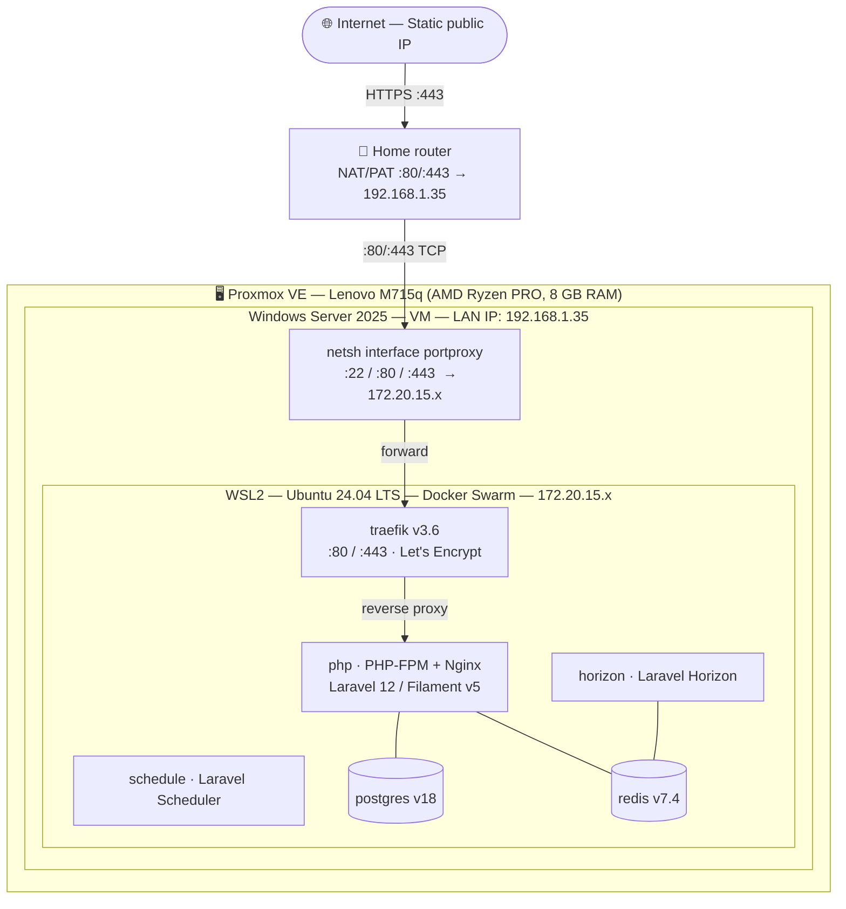
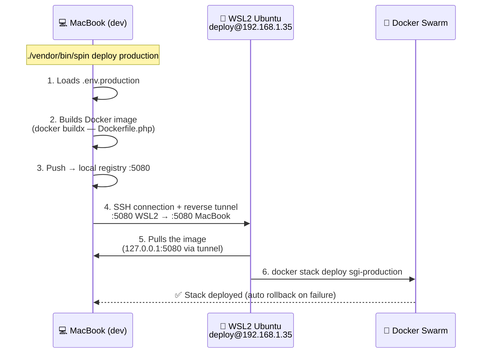

# Detailed report

## 1. Context and objective

| Item | Detail |
| --- | --- |
| **Application** | SGI — Système de Gestion de l'Intendance (Laravel 12 / Filament v5 web application) |
| **Target environment** | Windows Server 2025 (self-imposed constraint for the technical challenge) |
| **Hosting** | Lenovo ThinkCentre M715q physical server (AMD Ryzen PRO, 8 GB RAM) running Proxmox VE, hosted on site |
| **Objective** | Make the application accessible over HTTPS on a public domain name with a Let's Encrypt certificate, from a Windows Server infrastructure |
| **Candidate** | William Gérald Blondel |
| **Period** | April 2026 |

### 1.1 Problem statement

The SGI application was developed with a fully containerised technology stack on Linux (Docker, Traefik, PostgreSQL, Redis, Laravel Horizon). The project's deployment tooling — **ServerSideUp Spin** — is designed exclusively for Ubuntu hosts.

Out of technical curiosity and to explore a realistic scenario (many companies still run Windows Server workloads), I chose to constrain myself to deploying on **Windows Server 2025**. It was therefore necessary to design a hybrid architecture allowing this choice to be reconciled with the project's Docker/Linux ecosystem.

### 1.2 Identified constraints

| Constraint | Impact |
| --- | --- |
| Windows Server 2025 (self-imposed constraint) | Cannot use `spin provision` (Ansible for Ubuntu only) |
| Containerised application (6 Docker services) | Requires a Docker runtime on Windows |
| Traefik as a reverse proxy with Let's Encrypt | Requires ports 80/443 to be reachable from the Internet |
| On-site hosting (home network) | Requires public exposure via port forwarding |
| Server virtualised under Proxmox | Requires nested virtualization |

---

## 2. Solution analysis and architecture choice

### 2.1 Solutions considered

| Solution | Description | Verdict |
| --- | --- | --- |
| **Docker Desktop for Windows** | Direct installation of Docker Desktop on Windows Server | Paid licence for commercial use, Docker Swarm deprecated in Docker Desktop. **Discarded.** |
| **IIS + native PHP + PostgreSQL** | Installation of PHP 8.5, IIS, PostgreSQL and Redis directly on Windows | Major reconfiguration, abandoning the entire existing Docker/Traefik stack. **Discarded.** |
| **WSL2 + Docker Engine** | Installation of WSL2 (Ubuntu 24.04) inside Windows Server, native Linux Docker Engine in the WSL distribution | Preserves the entire existing stack, no additional licence, compatibility with `spin deploy`. **Selected.** |
| **Hyper-V with Ubuntu VM** | Using Windows Server purely as a hypervisor | Adds a layer with no benefit compared to WSL2. **Discarded.** |

### 2.2 Selected architecture



### 2.3 Network flows

1. **Incoming HTTPS request**: Internet → public IP → router (NAT/PAT port 443) → Windows Server (192.168.1.35:443) → `netsh interface portproxy` → WSL2 (172.20.15.x:443) → Traefik → PHP-FPM container.
2. **Deployment via `spin deploy`**: MacBook (LAN) → SSH to 192.168.1.35:22 → `netsh portproxy` → WSL2:22 → `deploy` user → Docker Swarm → `docker stack deploy`.

---

## 3. Detailed implementation

### 3.1 Preparing the Proxmox hypervisor

**Objective:** allow the Windows Server VM to run WSL2, which relies on Hyper-V (nested virtualization).

**Actions performed:**

1. Verifying AMD-V (SVM) support on the host processor:
   ```bash
   grep -c svm /proc/cpuinfo    # → 4 (4 AMD threads)
   ```

2. Enabling nested virtualization in the KVM kernel module:
   ```bash
   cat /sys/module/kvm_amd/parameters/nested    # must display 1
   # If 0:
   echo "options kvm-amd nested=1" > /etc/modprobe.d/kvm-amd.conf
   update-initramfs -u && reboot
   ```

3. Configuring the VM's CPU type to `host` mode (transparent passthrough of SVM instructions):
   ```bash
   qm set 110 --cpu host
   ```

**Issue encountered:** the VM was configured with the default CPU type `x86-64-v2-AES`, which does not pass virtualization extensions through to the guest. WSL2 was failing with the error `HCS/ERROR_NOT_SUPPORTED`, then `HCS_E_HYPERV_NOT_INSTALLED`. Switching to the `host` type resolved the issue.

### 3.2 Configuring Windows Server 2025

**Objective:** install and configure WSL2 with Ubuntu 24.04.

**Actions performed:**

1. Enabling the required Windows components:
   ```powershell
   Enable-WindowsOptionalFeature -Online -FeatureName VirtualMachinePlatform -All -NoRestart
   Enable-WindowsOptionalFeature -Online -FeatureName Microsoft-Windows-Subsystem-Linux -All -NoRestart
   Restart-Computer -Force
   ```

2. Installing the Ubuntu distribution:
   ```powershell
   wsl --set-default-version 2
   wsl --install -d Ubuntu-24.04
   ```

3. Configuring WSL2 resources via `C:\Users\Administrateur\.wslconfig`:
   ```ini
   [wsl2]
   memory=6GB
   processors=2
   swap=2GB
   ```

**Issue encountered:** the `wsl --install` command on Windows Server does not automatically enable the `VirtualMachinePlatform` and `Microsoft-Windows-Subsystem-Linux` components, unlike on the Windows 11 client. Manually enabling them via `Enable-WindowsOptionalFeature` followed by a reboot was required.

**Issue encountered:** the WSL2 `networkingMode=mirrored` mode (which shares the host's network interfaces) is incompatible with nested virtualization under Proxmox. The `CreateInstance/CreateVm/ConfigureNetworking/0x803b0015` error forced the use of the default NAT mode, compensated for by port forwarding rules (`netsh interface portproxy`).

### 3.3 Installing Docker Engine inside WSL2

**Objective:** have a complete Docker runtime (daemon + CLI + Compose + Buildx) available in the Ubuntu environment.

**Actions performed:**

1. Verifying systemd (required by Docker):
   ```bash
   ps -p 1 -o comm=    # → systemd
   ```

2. Installing Docker Engine via the official Docker repository for Ubuntu:
   ```bash
   sudo apt-get install -y docker-ce docker-ce-cli containerd.io \
        docker-buildx-plugin docker-compose-plugin
   sudo usermod -aG docker $USER
   sudo systemctl enable docker containerd
   ```

3. Validation:
   ```bash
   docker run --rm hello-world    # → Hello from Docker!
   ```

### 3.4 Automatic startup at Windows boot

**Objective:** ensure that WSL2 and Docker start automatically when the Windows VM reboots, with no manual intervention.

**Actions performed:**

1. Creating the launch script:
   ```cmd
   REM C:\start-wsl.cmd
   wsl.exe -d Ubuntu-24.04 -- sleep infinity
   ```
   The `sleep infinity` process stays in the foreground, preventing WSL2 from shutting down once the command finishes. Systemd, active inside Ubuntu, automatically starts the Docker service.

2. Creating a Windows scheduled task:
   ```powershell
   $action = New-ScheduledTaskAction -Execute "C:\start-wsl.cmd"
   $trigger = New-ScheduledTaskTrigger -AtStartup
   $trigger.Delay = "PT30S"    # 30-second delay (waiting for the LxssManager service)
   $settings = New-ScheduledTaskSettingsSet -ExecutionTimeLimit (New-TimeSpan -Days 0)
   Register-ScheduledTask -TaskName "Start WSL2 Ubuntu" `
       -Action $action -Trigger $trigger -Settings $settings `
       -User "Administrateur" -Password $password -RunLevel Highest
   ```

**Issue encountered:** the first attempt used the `SYSTEM` account, which has no access to WSL2 distributions (these are registered per user). Switching to the `Administrateur` account with a 30-second delay (to let the `LxssManager` service start) resolved the problem.

### 3.5 Network configuration — Port forwarding

**Objective:** make Docker services (ports 80, 443, 22) reachable from the local network and from the Internet, despite WSL2's NAT.

**Actions performed:**

1. Dynamic forwarding script (`C:\update-wsl-portproxy.ps1`):
   ```powershell
   $wslIp = (wsl -d Ubuntu-24.04 -- hostname -I).Trim().Split(" ")[0]
   if ($wslIp) {
       netsh interface portproxy reset
       netsh interface portproxy add v4tov4 listenport=22  listenaddress=0.0.0.0 `
           connectport=22  connectaddress=$wslIp
       netsh interface portproxy add v4tov4 listenport=80  listenaddress=0.0.0.0 `
           connectport=80  connectaddress=$wslIp
       netsh interface portproxy add v4tov4 listenport=443 listenaddress=0.0.0.0 `
           connectport=443 connectaddress=$wslIp
   }
   ```
   This script is run automatically at startup via a second scheduled task (60-second delay, after WSL2 has started).

2. Opening the Windows Defender firewall:
   ```powershell
   New-NetFirewallRule -DisplayName "HTTP Inbound"  -Direction Inbound `
       -Protocol TCP -LocalPort 80  -Action Allow -Profile Any
   New-NetFirewallRule -DisplayName "HTTPS Inbound" -Direction Inbound `
       -Protocol TCP -LocalPort 443 -Action Allow -Profile Any
   ```

3. Port forwarding on the home router:
   - TCP port 80 → 192.168.1.35:80
   - TCP port 443 → 192.168.1.35:443
   - DHCP reservation to ensure the stability of the VM's IP address.

**Rationale for the dynamic script:** WSL2's internal IP address (172.20.x.x) changes every time the distribution restarts. The script retrieves the current address and updates the forwarding rules accordingly.

### 3.6 Preparing the server for deployment

**Objective:** allow the `spin provision` and `spin deploy` tools (run from the development workstation) to connect to the server via SSH and drive Docker Swarm.

**Actions performed:**

1. Installing the OpenSSH server inside Ubuntu WSL2:
   ```bash
   sudo apt-get install -y openssh-server
   sudo systemctl enable ssh
   ```

2. Initialising the Docker Swarm cluster (the `--advertise-addr` option is necessary because WSL2 exposes several network interfaces):
   ```bash
   docker swarm init --advertise-addr 172.20.15.103
   ```

3. Configuring the `.spin.yml` file to declare the production server and the deployment user:
   ```yaml
   users:
     - username: wblondel
       name: William Blondel
       groups: ['sudo']
       authorized_keys:
         - public_key: "ssh-ed25519 AAAA... wblondel@MacBook"

   servers:
     - server_name: dev-docker
       environment: production
       address: 192.168.1.35
   ```

4. Provisioning the server via Spin (initial connection as `root`, before the deployment account is created by the Ansible playbooks):
   ```bash
   ./vendor/bin/spin provision -u root
   ```
   Spin runs Ansible playbooks that create the deployment user, configure the authorised SSH keys and prepare the environment for `spin deploy`.

### 3.7 Deployment with Spin

**Objective:** use the project's deployment tool (`spin deploy`) to automate the building of the Docker image, its transfer and the deployment to Docker Swarm.

**How `spin deploy` works:**



**Actions performed on the development workstation (MacBook):**

1. Creating the `.env.production` file with the production variables:
   - `APP_ENV=production`, `APP_DEBUG=false`
   - PostgreSQL and Redis passwords generated randomly (`openssl rand -base64 24`)
   - `APP_URL` pointing to the public domain name
   - `APP_KEY` generated with `echo "base64:$(openssl rand -base64 32)"`

2. Building the frontend assets:
   ```bash
   ./vendor/bin/spin run node npm run build
   ```

3. Removing the `public/hot` file (file created by the Vite development server, which redirects Laravel to `vite.dev.test` instead of using the compiled assets).

4. Adding `public/hot` to `.dockerignore` to prevent any recurrence of the issue.

5. Launching the deployment:
   ```bash
   cp .env.production .env      # The Docker image embeds the .env
   ./vendor/bin/spin deploy production
   cp .env.dev.bak .env         # Restore the development environment
   ```

6. Running migrations and seeding:
   ```bash
   ssh deploy@192.168.1.35 'PHP=$(docker ps -q -f name=sgi-production_php.1); \
     docker exec $PHP php artisan migrate --force && \
     docker exec $PHP php artisan db:seed --force && \
     docker exec $PHP php artisan storage:link && \
     docker exec $PHP php artisan optimize'
   ```

**Issue encountered:** the first deployment failed because `APP_KEY` was empty in `.env.production`. The PHP container was stuck in a restart loop with the `MissingAppKeyException` exception. Generating the key locally and redeploying resolved the issue.

**Issue encountered:** after deployment, the application was trying to connect to the Vite development server (`vite.dev.test`) instead of serving the compiled assets. The cause was the presence of the `public/hot` file in the Docker build context. Removing it and adding it to `.dockerignore` fixed the issue.

### 3.8 HTTPS certificate — Let's Encrypt

**Objective:** automatically obtain a valid TLS certificate via Traefik and the ACME protocol.

**Existing configuration** (`.infrastructure/conf/traefik/prod/traefik.yml` file):

```yaml
certificatesResolvers:
  letsencryptresolver:
    acme:
      email: "contact@williamblondel.fr"
      storage: "/certificates/acme.json"
      httpChallenge:
        entryPoint: web    # HTTP-01 challenge on port 80
```

**How it works:** Traefik intercepts Let's Encrypt HTTP-01 requests on port 80, proves ownership of the domain, and stores the certificate in a persistent Docker volume. Renewal is automatic (every 60 days).

**Validated prerequisites:**
- DNS A record pointing to the static public IP address.
- Ports 80 and 443 forwarded from the router to the Windows Server VM.
- Ports 80 and 443 forwarded by `netsh portproxy` to the WSL2 distribution.
- Ports 80 and 443 allowed in the Windows Defender firewall.

---

## 4. Deployed services

| Service | Image | Role | Exposed port |
| --- | --- | --- | --- |
| **traefik** | `traefik:v3.6` | Reverse proxy, TLS termination, Let's Encrypt, HTTP routing | 80, 443 |
| **php** | `sgi-php:latest` (custom) | Laravel application (PHP-FPM + Nginx) | 8443 (internal) |
| **schedule** | `sgi-php:latest` | Runs `php artisan schedule:work` (Laravel scheduled tasks) | — |
| **horizon** | `sgi-php:latest` | Runs `php artisan horizon` (Redis workers for queued jobs) | — |
| **postgres** | `postgres:18` | PostgreSQL database | 5432 (internal) |
| **redis** | `redis:7.4` | Session cache and job queue | 6379 (internal) |

All services are orchestrated by **Docker Swarm** in single-node mode, with:
- **Automatic rollback** on deployment failure (`failure_action: rollback`).
- **Health checks** on each service (PostgreSQL: `pg_isready`, Redis: `redis-cli ping`, PHP: `/up`, Traefik: `traefik healthcheck`).
- **Persistent volumes** for PostgreSQL data, Redis, uploaded files and TLS certificates.
- **Automatic restart** (`restart_policy: condition: any`).

---

## 5. Security

| Measure | Detail |
| --- | --- |
| **HTTPS enforced** | Traefik automatically redirects HTTP → HTTPS (entrypoint `web` → `websecure`). |
| **TLS certificate** | Let's Encrypt via ACME HTTP-01, automatic renewal. |
| **Application secrets** | Database and Redis passwords generated randomly (`openssl rand`), stored only in `.env.production` (not versioned). |
| **Encryption key** | Laravel `APP_KEY` generated with 32 bytes of entropy (`openssl rand -base64 32`). |
| **SSH access** | Public-key authentication only (no password). Dedicated `deploy` user. |
| **Windows firewall** | Only ports 80, 443 and 22 are open. RDP port (3389) restricted to the administrator's IP. |
| **Docker network** | Internal services (PostgreSQL, Redis) are not exposed outside the `web-public` Docker network. |
| **`.env` file** | Excluded from Git versioning (`.gitignore`). |
| **Docker Swarm** | Secrets do not transit in clear text thanks to Swarm's native TLS encryption. |

---

## 6. Redeployment procedure

For subsequent updates of the application, the procedure is as follows:

```bash
# From the development workstation (MacBook)
cd /path/to/application-sgi

# 1. Build the frontend assets
./vendor/bin/spin run node npm run build

# 2. Prepare the production environment
cp .env.production .env

# 3. Deploy (build + push + Swarm deploy)
./vendor/bin/spin deploy production

# 4. Restore the development environment
cp .env.dev.bak .env

# 5. Run migrations if needed
ssh deploy@192.168.1.35 'PHP=$(docker ps -q -f name=sgi-production_php.1); \
  docker exec $PHP php artisan migrate --force'
```

The existing GitHub Actions CI/CD pipeline (`action_deploy-production.yml`) can also be configured to automate this process on every push to the `main` branch, provided that the server's SSH port is exposed to the Internet.

---

## 7. Difficulties encountered and solutions

| Issue | Cause | Solution |
| --- | --- | --- |
| `HCS/ERROR_NOT_SUPPORTED` when installing WSL2 on Hetzner Cloud | Hetzner Cloud does not offer nested virtualization on its cloud instances (CX, CPX, CCX). | Migration to a self-hosted physical server running Proxmox VE. |
| `HCS_E_HYPERV_NOT_INSTALLED` after enabling Windows components | The Proxmox VM's CPU type (`x86-64-v2-AES`) does not pass through SVM extensions. | Changing the CPU type to `host` (`qm set 110 --cpu host`). |
| `VirtualMachinePlatform: Disabled` despite `wsl --install` | On Windows Server 2025, `wsl --install` does not automatically enable the optional components, unlike Windows 11. | Manual activation via `Enable-WindowsOptionalFeature` + reboot. |
| WSL2 stops after automatic startup | The scheduled task used `SYSTEM` (no access to WSL distributions) and the command terminated immediately. | Run under the `Administrateur` account with `sleep infinity` in the foreground. |
| `networkingMode=mirrored` fails (error `0x803b0015`) | The mirrored network mode requires nested virtualization capabilities that Proxmox does not pass through entirely. | Reverting to the default NAT mode + `netsh interface portproxy` for port forwarding. |
| `MissingAppKeyException` on PHP container startup | Empty `APP_KEY` in `.env.production`. | Local key generation (`openssl rand -base64 32`) and redeployment. |
| The application tries to connect to `vite.dev.test` | The `public/hot` file (created by `npm run dev`) was present when the Docker image was built. | Removing the file and adding it to `.dockerignore`. |

---

## 8. Wrap-up

### 8.1 Skills demonstrated (BTS SIO reference framework)

#### 8.1.1 Block 1 — Support and provisioning of IT services (E5)

This project is first and foremost a Block 1 deliverable. The table below details how each sub-skill was demonstrated; sub-skills not covered here are demonstrated in other portfolio pieces.

| Skill | How it was demonstrated in this project |
|---|---|
| **Identify and inventory digital resources** | Exhaustive inventory of the deployed infrastructure: Lenovo ThinkCentre M715q physical server (AMD Ryzen PRO, 8 GB RAM), Proxmox VE hypervisor, Windows Server 2025 VM (8 GB RAM allocated), WSL2 Ubuntu 24.04 LTS distribution (6 GB RAM, 2 vCPUs, eth0 172.20.15.103), 6 Docker services (Traefik, PHP-FPM, Horizon, Schedule, PostgreSQL, Redis), persistent volumes and `web-public` Docker network. All these elements are documented in sections 2.2 and 4 of this report. |
| **Use the reference frameworks, norms and standards adopted by the IT service provider** | Use of open standards: Docker Engine (OCI specification), Docker Swarm (orchestration), Traefik v3.6 (HTTP/2 proxy), ACME HTTP-01 protocol (RFC 8555) for Let's Encrypt, OpenSSH (public-key authentication, RFC 4253), `netsh interface portproxy` (documented Microsoft command), YAML format for Spin configuration (`.spin.yml`), Ansible playbooks executed by `spin provision`. |
| **Set up and verify the access levels associated with a service** | Creation of a dedicated `deploy` user (passwordless) belonging to the `docker` group, development workstation's SSH public key added to `authorized_keys` (password authentication forbidden), Windows Defender firewall limited to ports 80, 443 and 22, RDP port (3389) restricted to the administrator's IP. Internal services (PostgreSQL 5432, Redis 6379) are only exposed inside the Docker network. |
| **Verify the conditions for the continuity of an IT service** | Two Windows scheduled tasks ensure automatic startup without intervention: (1) `sleep infinity` keeps WSL2 active and systemd starts Docker; (2) the `update-wsl-portproxy.ps1` script recreates the `netsh` rules with the new WSL2 IP after each restart. Docker Swarm is configured with `restart_policy: condition: any` and `failure_action: rollback`. Active health checks on each service (PostgreSQL: `pg_isready`, Redis: `redis-cli ping`, PHP: `/up`, Traefik: `traefik healthcheck`). |
| **Manage backups** | Critical data (PostgreSQL, Redis, uploaded files, Let's Encrypt TLS certificates) is stored in named, persistent Docker volumes that are independent of the container lifecycle. An automatic Docker Swarm rollback is configured (`failure_action: rollback`) to revert to the previous version on a failed redeployment. Volume backups can be performed via a simple Docker export. |
| **Verify compliance with the rules of use of digital resources** | `.env.production` file excluded from Git versioning (`.gitignore`); `public/hot` file (which would have exposed the Vite server's address) added to `.dockerignore` so it is never included in the Docker image; secrets (database and Redis passwords, `APP_KEY`) generated with `openssl rand` (sufficient entropy); exclusive SSH key (no password is transmitted in clear text). |
| **Collect, track and route requests** | Methodical and iterative diagnosis of 7 successive technical issues: each issue was identified (error message, system log or observed behaviour), analysed (root cause), resolved (precise corrective action) and documented in this report (section 7). This approach demonstrates the ability to handle incidents in a structured way, even on new technologies. |
| **Handle requests concerning network, system and application services** | Complete network configuration: WSL2 NAT mode, dynamic forwarding (`netsh interface portproxy` on 22/80/443 to the WSL2 internal IP), Windows Defender firewall opening, TCP 80/443 port forwarding on the home router with DHCP reservation. Resolution of the `networkingMode=mirrored` issue (error `0x803b0015`) by reverting to NAT mode. |
| **Handle requests concerning applications** | Resolution of two distinct application issues: (1) `MissingAppKeyException` — empty `APP_KEY` in `.env.production`, fixed by generating with `openssl rand -base64 32` and redeploying; (2) `vite.dev.test` — `public/hot` file present during the Docker image build, fixed by removing the file and adding it to `.dockerignore`. |
| **Analyse the objectives and organisation of a project** | Sections 1 and 2 of this report: analysis of the 5 imposed constraints (Windows Server, Docker containers, Traefik/Let's Encrypt, on-site hosting, Proxmox virtualization), comparative study of 4 possible solutions (Docker Desktop, native IIS, WSL2 + Docker Engine, Hyper-V VM) with a reasoned verdict for each. |
| **Plan the activities** | Decomposition of the deployment into 8 sequential steps (sections 3.1 to 3.8 of this report), each with a precise objective, a list of actions and an expected outcome. The 12 deployment steps were followed and completed in order. |
| **Evaluate project tracking indicators and analyse deviations** | Section 7: the 7 issues encountered constitute as many deviations from the initial plan. For each one, the root cause was identified and a corrective solution was applied. This tracking makes it possible to measure the actual complexity of the infrastructure (nested virtualization, WSL2 networking, Windows/Linux interoperability) compared to a direct native Linux installation. |
| **Carry out integration and acceptance tests of a service** | End-to-end tests after each step: SSH connection from the MacBook (`ssh deploy@192.168.1.35`), Docker test (`docker run hello-world`), automatic restart test after VM reboot, HTTP/HTTPS test from the Internet (`curl https://app-sgi.127011.xyz`), validation of Docker Swarm health checks (`docker service ps sgi-production_php`), verification of the Let's Encrypt certificate signature in the browser. |
| **Deploy a service** | **Core of the project**: deployment of 6 Docker services (Traefik, PHP-FPM, Horizon, Schedule, PostgreSQL, Redis) via `spin deploy production`, which orchestrates the multi-stage Docker image build (buildx), push to the local registry (port 5080), establishment of a reverse SSH tunnel, and `docker stack deploy` on the Swarm node. Migrations, seeders and Laravel optimisation run via SSH after the deployment. |
| **Support users in setting up a service** | This detailed report (sections 1 to 9) is the reference documentation. Section 6 provides the complete redeployment procedure, ready to be used by another developer. The `.docs/Rapport_Deploiement_Windows_Server.md` report is versioned in the project's Git repository. |
| **Set up a personal learning environment** | Exploration and mastery of new technologies: Proxmox VE (hypervisor), WSL2 on Windows Server 2025, Docker Swarm (vs Docker Compose in development), Traefik v3.6, `netsh interface portproxy`, Windows Server scheduled tasks, `spin provision` + `spin deploy` workflow in production. |
| **Implement information watch tools and strategies** | Official documentation consulted: Microsoft (WSL2 on Windows Server, `netsh interface portproxy`, scheduled tasks), Docker (Engine, Swarm, Buildx), Traefik (v3.6, `providers.swarm`, ACME), Let's Encrypt (ACME HTTP-01, RFC 8555), Proxmox VE (KVM AMD nested virtualization), ServerSideUp Spin (`.spin.yml`, `spin provision`, `spin deploy`). |

#### 8.1.2 Block 2 — Application design and development (E6 SLAM)

This deployment project complements the two E6 deliverables (*SGI Application* and *H3 Release Checker*) on production rollout and environment skills. It does not replace them on design and development skills.

| Skill | How it was demonstrated in this project |
|---|---|
| **Continuously integrate the versions of an application solution** | `spin provision` + `spin deploy production` workflow: `spin provision -u root` prepares the server via Ansible playbooks; `spin deploy production` orchestrates the multi-stage Docker image build (`docker buildx`), push to the local registry (port 5080), creation of a reverse SSH tunnel, and `docker stack deploy` with automatic rollback. The redeployment procedure (section 6) allows further releases in 5 commands. |
| **Write technical and user documentation for an application solution** | This detailed report (9 sections, ASCII diagrams of the architecture and the `spin deploy` flow, comparison tables of the solutions, redeployment procedure in section 6, table of the 8 difficulties encountered), the `.docs/Rapport_Deploiement_Windows_Server.md` report versioned in the repository, and the two commented PowerShell scripts (`start-wsl.cmd`, `update-wsl-portproxy.ps1`). |
| **Use the features of a development and testing environment** | Mastery of the deployment toolset: Docker Engine (daemon, CLI, Compose, Buildx), Docker Swarm (`docker swarm init --advertise-addr`, `docker stack deploy`, `docker service ps`, rollback), Traefik v3.6 (`providers.swarm`, ACME, entrypoints), ServerSideUp Spin (`spin deploy`, `spin run`), OpenSSH (reverse tunnel, `authorized_keys`), PowerShell (`netsh`, `New-ScheduledTask`, `Enable-WindowsOptionalFeature`), Proxmox CLI (`qm set --cpu host`). |

The skills of design, modelling, component development, database management and application testing are covered in the *SGI Application* (Deliverable 2, E6) and *H3 Release Checker* (Deliverable 1, E6) projects.

### 8.2 Personal contributions

- **Designing a hybrid Windows/Linux architecture** that reconciles the "Windows Server" constraint with the project's Docker/Linux ecosystem — a documented and reproducible solution.
- **Methodical resolution** of 7 successive technical issues (nested virtualization, Windows components, WSL2 networking, autostart, application key, Vite assets) through systematic diagnosis.
- **Implementation of the `spin provision` + `spin deploy` workflow** in a non-standard context: once the network layer (WSL2 NAT, netsh portproxy, SSH via port proxy) is properly built, Spin works just as it would on a native Ubuntu server — which validates the chosen hybrid Windows/Linux architecture.
- **Full automation**: the server reboots autonomously (Windows scheduled tasks → WSL2 → systemd → Docker → application services) without manual intervention.

### 8.3 Limitations and outlook

- **On-site hosting**: availability depends on the home Internet connection and the server's power supply. A UPS and monitoring (Uptime Kuma or similar) would be desirable.
- **Dynamic WSL2 IP address**: WSL2's internal address changes on every restart, requiring the port proxy update script. The `mirrored` network mode would eliminate this complexity if nested virtualization allowed it.
- **CI/CD from GitHub Actions**: the existing pipeline could deploy automatically on each push to `main`, but would require exposing the SSH port to the Internet (currently restricted to the LAN).
- **Migration to a cloud provider**: for sustainable production, an Ubuntu VPS (Hetzner, OVH, Scaleway) with `spin provision` + `spin deploy` would offer a more robust solution better suited to the project's stack.

---

## 9. Appendices

| Document | Description |
| --- | --- |
| `.spin.yml` | Spin configuration: users, authorised SSH keys, production servers (`address`, `environment`) |
| `.env.production` | Production environment variables (not versioned) |
| [`docker-compose.yml`](https://github.com/LucaBONNIN/application-sgi/blob/master/docker-compose.yml) | Base definition of the Docker services |
| [`docker-compose.prod.yml`](https://github.com/LucaBONNIN/application-sgi/blob/master/docker-compose.prod.yml) | Production overrides (Traefik, volumes, replicas, health checks) |
| [`Dockerfile.php`](https://github.com/LucaBONNIN/application-sgi/blob/master/Dockerfile.php) | Multi-stage Docker image for PHP-FPM + Nginx |
| [`.infrastructure/conf/traefik/prod/traefik.yml`](https://github.com/LucaBONNIN/application-sgi/blob/master/.infrastructure/conf/traefik/prod/traefik.yml) | Traefik configuration (entrypoints, ACME, Cloudflare trusted IPs) |
| [C:\start-wsl.cmd](#34-automatic-startup-at-windows-boot) | WSL2 automatic startup script |
| [C:\update-wsl-portproxy.ps1](#35-network-configuration--port-forwarding) | Script for dynamically updating port forwarding rules |
