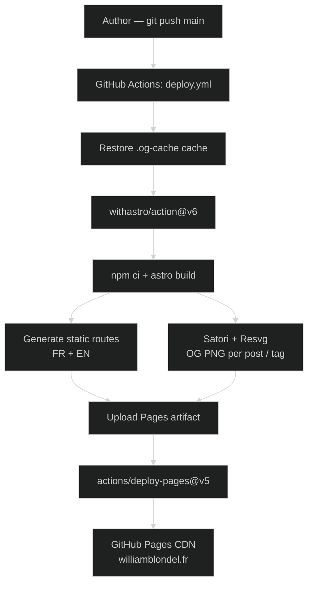

# Detailed report

## 1. Context and objective

| Item | Detail |
| --- | --- |
| **Nature** | Personal project deliverable — mandatory medium for the BTS SIO E5 examination. |
| **Period** | 2024 → 2026 |
| **Format** | Solo, voluntary, no client framework. |
| **Public URL** | [williamblondel.fr](https://williamblondel.fr) |
| **Source code** | [github.com/wblondel/blog](https://github.com/wblondel/blog) |

### 1.1 Problem statement

The BTS SIO requires the **provision of a portfolio-type medium** accessible online during the E5 and E6 examinations (cf. §1 of the E5 examination: *"Its accessibility in electronic format is mandatory and is the sole responsibility of the candidate"*). Beyond this academic constraint, I had three personal objectives:

1. **Promote my professional image** on digital media (career path, experience, certifications, recommendations);
2. **Maintain a bilingual technical blog** (French / English) on cybersecurity and AI, at a rate of one article per week over 52 weeks;
3. **Centralize the detailed reports** of the E5/E6 professional achievements as well as the `Annexe VII-1-B` descriptive sheets, GitHub links, database access, demonstration videos, and synthesis tables.

### 1.2 Self-imposed specifications

| Requirement | Justification |
| --- | --- |
| **Bilingual FR / EN** from the root | Targets French-speaking and English-speaking recruiters (I worked 4 years internationally). |
| **100% static**, no application server | Free hosting (GitHub Pages), no backend attack surface, maximum performance. |
| **No blocking JavaScript** | Accessibility, SEO, high Lighthouse score. |
| **Hosted on a custom domain** | Control of digital identity. |
| **Persistent dark / light mode** | Reading comfort, expected by a technical audience. |
| **Sitemap, RSS, Open Graph, hreflang** | Multilingual SEO, sharing on social networks. |
| **Git versioning + automated review** | Traceability, tracked dependency updates. |
| **Downloadable E6 descriptive sheets** | Compliance with Annexe VII-1-B (access modalities to deliverables). |

---

## 2. Existing situation and preliminary study

### 2.1 Existing situation

**None.** The repository was initialized from scratch. Several earlier versions of my personal site (WordPress, Hugo, Ghost...) existed but were abandoned due to... lack of motivation :).

### 2.2 Comparative study of frameworks

| Framework studied | Strengths | Weaknesses for my use case | Decision |
| --- | --- | --- | --- |
| **Next.js 15** | React ecosystem, ISR, App Router. | Client-side JavaScript overhead, less direct static hosting, RSC *bundling* complexity. | Rejected. |
| **Hugo** | Very fast Go compilation, mature theme ecosystem. | Unpleasant Go templating, complex plugin authoring, less flexible i18n. | Rejected. |
| **Jekyll** | Native to GitHub Pages, simple. | Aging Ruby stack, MDX impossible, poorly suited to rich components. | Rejected. |
| **Astro 6** | *Islands architecture*, 100% static output by default, native `.md` / `.mdx` support, Zod-typed *content collections*, built-in i18n, official MDX / sitemap / RSS integrations. | Younger community. | **Selected.** |

The detailed study of the choices is recorded in the [`README.md`](https://github.com/wblondel/blog/blob/main/README.md).

### 2.3 Detailed technology choices

| Layer | Choice | Role |
| --- | --- | --- |
| **Framework** | [Astro](https://astro.build) | Static site generation, *islands*, file-based routes. |
| **Language** | TypeScript | Typing of `.astro` components and *content collections*. |
| **Styles** | [Tailwind CSS](https://tailwindcss.com) v4 | Utility-first, integration via Vite plugin. |
| **Typography** | `@tailwindcss/typography` | Article formatting via `prose`. |
| **Content** | MDX via `@astrojs/mdx` | Markdown enriched with Astro components. |
| **Content validation** | Zod (via Astro Content Layer) | Typed schemas for `blog`, `projects`, `series`. |
| **Icons** | `astro-icon` + `@iconify-json/fa6-*` | Inlining of Font Awesome 6 SVGs (solid, brands, regular). |
| **Images** | `sharp` | mozjpeg / webp / avif / png compression at build time. |
| **Diagrams** | `astro-mermaid` + `@mermaid-js/layout-elk` | Rendering of Mermaid diagrams (sequence, flowchart) with ELK *layout*. |
| **Open Graph** | `satori` + `satori-html` + `@resvg/resvg-js` | Generation of OG PNGs per article and per tag at build time. |
| **Fonts** | `@fontsource/inter` | Self-hosted font for OG images. |
| **RSS** | `@astrojs/rss` | RSS feed per language. |
| **Sitemap** | `@astrojs/sitemap` | Multilingual sitemap with `xhtml:link` tags. |
| **External links** | `rehype-external-links` | Automatic addition of `target="_blank" rel="noopener noreferrer"`. |
| **E2E tests** | `playwright` | Occasional manual checks (forms, redirects). |
| **Versioning** | Git + GitHub | *Feature* branches, public repository. |
| **CI/CD** | GitHub Actions + `withastro/action` | Automatic build and deployment to GitHub Pages. |
| **Hosting** | GitHub Pages | Global CDN, Let's Encrypt HTTPS, free. |
| **Dependency tracking** | Dependabot | Proactive npm updates. |
| **SEO analysis** | Lighthouse, Sitebulb | Periodic audits. |
| **Analytics** | Google Tag Manager | Anonymized audience, opt-in. |

---

## 3. Application architecture

### 3.1 Overview

The application is a **static site generator**: on each `git push` to `main`, GitHub Actions runs Astro, which pre-renders all HTML pages, generates the Open Graph PNG images, and publishes everything to GitHub Pages.



### 3.2 Repository structure

```
my-portfolio/
├── .github/
│   ├── workflows/deploy.yml      # CI/CD pipeline
│   └── dependabot.yml            # Weekly npm updates
├── astro.config.mjs              # Astro config (i18n, redirects, plugins)
├── src/
│   ├── content.config.ts         # Zod schemas (blog, projects, series)
│   ├── content/
│   │   ├── blog/{en,fr}/         # 110 .md/.mdx articles
│   │   ├── projects/{en,fr}/     # E5/E6 reports
│   │   └── series/{en,fr}/       # 8 themed series
│   ├── data/portfolio-{en,fr}.json   # CV data (experience, skills…)
│   ├── i18n/{ui.ts,utils.ts}     # ~200 translation keys + helpers
│   ├── layouts/Layout.astro      # SEO, OG, hreflang, GTM
│   ├── components/
│   │   ├── Header / Footer / PostCard / PageHeader / TOC / Tags
│   │   └── portfolio/            # CV sections (AboutMe, Skills…)
│   ├── pages/
│   │   ├── [lang]/
│   │   │   ├── index.astro       # Bilingual home page
│   │   │   ├── [slug].astro      # Blog article
│   │   │   ├── [slug]/og.png.ts  # Dynamic OG image per article
│   │   │   ├── archive.astro     # Chronological list
│   │   │   ├── portfolio.astro   # CV/portfolio page
│   │   │   ├── projects/[slug].astro
│   │   │   ├── series/[slug].astro
│   │   │   ├── tag/[tag].astro + tag/[tag]/og.png.ts
│   │   │   └── tags/index.astro
│   │   ├── archive/, series/, tag/, tags/   # Legacy redirects
│   │   ├── index.astro           # Root redirect to /en/
│   │   └── rss.xml.js
│   ├── remark/                   # Custom Markdown plugins
│   │   ├── remark-video-optimizer.js
│   │   ├── remark-autoscroll-image.js
│   │   └── remark-language-tabs.js
│   ├── rehype/rehype-image-zoom.js
│   ├── redirects/                # 301 redirect JSON
│   │   ├── slug-redirects.json
│   │   ├── tag-redirects.json
│   │   └── custom-redirects.json
│   ├── scripts/image-zoom.js     # JS zoom overlay
│   ├── styles/                   # global.css, syntax.css, geist-mono.css
│   └── assets/                   # Optimized images (post-covers, projects, fonts)
├── public/                       # Files served as-is
│   ├── documents/
│   │   ├── E5/Epreuve E5.md
│   │   ├── E6/                   # Descriptive sheets PDF + Trello xlsx
│   │   └── certifications/       # PDF certificates
│   ├── og-default.png
│   └── favicon.ico
├── scripts/                      # Node/Python maintenance scripts
│   ├── rename-numbered-posts.mjs
│   ├── update-series-order.mjs
│   ├── fetch-cover-images.mjs
│   ├── clean-slug-redirects.mjs
│   ├── add_slashes_to_internal_links.py
│   └── check_tag_links.py
└── package.json                  # 14 prod deps, 5 dev deps
```

### 3.3 Content model (Content Collections)

The file [`src/content.config.ts`](https://github.com/wblondel/blog/blob/main/src/content.config.ts) defines three collections typed by Zod, which serves as the **database equivalent for a static site**:

| Collection | Loader | Main fields | Examples |
| --- | --- | --- | --- |
| `blog` | `glob('**/[^_]*.{md,mdx}', './src/content/blog')` | `title`, `seoTitle?`, `description?`, `pubDate`, `coverImage?`, `tags[]`, `series?`, `seriesOrder?`, `readTime` | 110 articles |
| `projects` | `glob('**/[^_]*.{md,mdx}', './src/content/projects')` | `title`, `context`, `coverImage?`, `githubLink?`, `liveLink?`, `credentialsLink?`, `documentationLink?`, `projectManagementLink?`, `ficheDescriptiveLink?`, `bts?`, `order?`, `draft?` | 5 deliverables |
| `series` | `glob('**/[^_]*.{md,mdx}', './src/content/series')` | `title`, `description`, `translationKey?` | 8 series |

The `[^_]` prefix excludes `_*.md` files (drafts never published). The `data.draft` filter is applied only in production: `import.meta.env.DEV || !data.draft`.

### 3.4 Internationalization

The Astro configuration declares two locales and prefixes **all** routes with their language:

```js
i18n: {
  defaultLocale: "en",
  locales: ["en", "fr"],
  routing: {
    prefixDefaultLocale: true,
    redirectToDefaultLocale: false
  }
}
```

The i18n relies on three elements:

1. A **centralized dictionary** [`src/i18n/ui.ts`](https://github.com/wblondel/blog/blob/main/src/i18n/ui.ts) (~200 `en` / `fr` keys).
2. **Helpers** [`useTranslations(lang)`](https://github.com/wblondel/blog/blob/main/src/i18n/utils.ts) and `usePlural(lang)` (handling of `zero` / `one` / `other` forms with `{count}` interpolation).
3. **Server-side language detection** via `getLangFromUrl(url)` which inspects the URL segment.

Each page emits complete `hreflang` tags (explicit alternates + `x-default`) and a `<link rel="canonical">`. On tag and article pages, if the other language does not have an equivalent, a *fallback* (`isFallback: true`) is generated.

### 3.5 Route generation

| Pattern | File | Output |
| --- | --- | --- |
| `/{lang}/` | `src/pages/[lang]/index.astro` | EN/FR home page |
| `/{lang}/portfolio/` | `src/pages/[lang]/portfolio.astro` | CV + projects + recommendations |
| `/{lang}/projects/{slug}/` | `src/pages/[lang]/projects/[slug].astro` | Project report |
| `/{lang}/{slug}/` | `src/pages/[lang]/[slug].astro` | Blog article |
| `/{lang}/{slug}/og.png` | `src/pages/[lang]/[slug]/og.png.ts` | Dynamic OG image |
| `/{lang}/series/{slug}/` | `src/pages/[lang]/series/[slug].astro` | List of articles in a series |
| `/{lang}/tag/{tag}/` | `src/pages/[lang]/tag/[tag].astro` | Articles by tag |
| `/{lang}/tag/{tag}/og.png` | `src/pages/[lang]/tag/[tag]/og.png.ts` | Dynamic OG image per tag |
| `/{lang}/tags/` | `src/pages/[lang]/tags/index.astro` | Tag cloud |
| `/{lang}/archive/` | `src/pages/[lang]/archive.astro` | Chronological list |
| `/rss.xml` | `src/pages/rss.xml.js` | RSS feed |

The `getStaticPaths()` functions iterate over the filtered `getCollection()` and declare all `{ lang, slug }` permutations at build time.

---

## 4. Notable implementations

### 4.1 Open Graph image generation (Satori + Resvg)

For each article and each tag, a **1200×630 PNG image** is generated on the fly during `astro build`:

1. `satori` renders a JSX *layout* into SVG using the *self-hosted* `Inter` font (`@fontsource/inter`).
2. `@resvg/resvg-js` converts the SVG to PNG.
3. The renders are **cached on disk** (`.og-cache/<sha1>.png`) so that only images whose content has changed are rebuilt. The cache is restored between CI *runs* via `actions/cache@v5`.
4. A **concurrency pool** (`MAX_CONCURRENT = 3`) limits CPU/memory pressure during the build.

See [`src/pages/[lang]/[slug]/og.png.ts`](https://github.com/wblondel/blog/blob/main/src/pages/[lang]/[slug]/og.png.ts).

### 4.2 Custom Markdown / HTML plugins

| Plugin | Type | Role |
| --- | --- | --- |
| `remark-video-optimizer` | remark | Converts `<video>` tags to *lazy-loading* with `preload="metadata"`, `playsinline`, generated *poster*. |
| `remark-autoscroll-image` | remark | Adds horizontal scroll panels for long screenshots. |
| `remark-language-tabs` | remark | Generates multi-language code tabs from consecutive `\`\`\`lang` blocks. |
| `rehype-image-zoom` | rehype | Decorates each `` with a `data-zoomable`, linked to a JS overlay for full-screen zoom. |
| `rehype-external-links` | rehype (official) | Opens external links in a new tab, adds `rel="external noopener noreferrer"`. |

### 4.3 Redirect system

To **never lose a historical link** (renamed old articles, *re-tagging*, old domain), `astro.config.mjs` aggregates four sources:

1. `getLocaleRedirects()` — dynamically generates `/old-slug → /en/old-slug/` for each `.md` file detected at build time.
2. `getSlugRedirects()` — reads [`src/redirects/slug-redirects.json`](https://github.com/wblondel/blog/blob/main/src/redirects/slug-redirects.json), maintained by the `scripts/rename-numbered-posts.mjs --audit --fix` script.
3. `getTagRedirects()` — `301` redirects for renamed tags.
4. `getCustomRedirects()` — various manual redirects.

All are emitted as static HTML files with a `meta http-equiv="refresh"` tag and a `<link rel="canonical">` tag pointing to the new URL.

### 4.4 Portfolio data

The `About`, `Experience`, `Education`, `Skills`, `Certifications`, `Interests`, and `Recommendations` sections are serialized into two twin JSON files:

- [`src/data/portfolio-en.json`](https://github.com/wblondel/blog/blob/main/src/data/portfolio-en.json)
- [`src/data/portfolio-fr.json`](https://github.com/wblondel/blog/blob/main/src/data/portfolio-fr.json)

Each section is a self-contained Astro component (`AboutMe.astro`, `ExperienceAndEducation.astro`, `Skills.astro`, `Projects.astro`, `Recommendations.astro`, `ContactForm.astro`) consuming the relevant portion of JSON. The projects in the *Deliverables* section, however, are read from the `projects` *content collection* filtered by the current language.

### 4.5 Email address protection

To prevent *scraping* by spam bots, the email address is **Base64-encoded at build time** and **decoded in JavaScript in the browser** when the page loads (cf. [`ContactForm.astro:14,49-58`](https://github.com/wblondel/blog/blob/main/src/components/portfolio/ContactForm.astro)). The static HTML never contains the address in clear text.

### 4.6 Dark mode without *flash*

The *inline* script in [`Layout.astro:157-187`](https://github.com/wblondel/blog/blob/main/src/layouts/Layout.astro) reads the `localStorage.theme` preference (`light` / `dark` / `system`) **before** the first render and applies the `dark` class to `<html>`. No *flash of unstyled content* (FOUC) on initial load.

### 4.7 Image optimization

The Astro configuration pushes the *encoders* to their optimal settings:

```js
image: {
  service: {
    config: {
      jpeg: { mozjpeg: true },
      webp: { effort: 6, alphaQuality: 80 },
      avif: { effort: 4, chromaSubsampling: '4:2:0' },
      png:  { compressionLevel: 9 }
    }
  }
}
```

The Astro `<Image>` and `<Picture>` components automatically generate the responsive variants (`srcset`, `sizes`) and the `avif` / `webp` formats with JPG *fallback*.

---

## 5. Deployment and CI/CD

### 5.1 GitHub Actions pipeline

The [`.github/workflows/deploy.yml`](https://github.com/wblondel/blog/blob/main/.github/workflows/deploy.yml) workflow:

1. Triggers on **push to `main`** or via **`workflow_dispatch`** (manual).
2. Restores the `.og-cache/` cache (key `og-images-${runner.os}-${sha}` with prefix *fallback*).
3. Runs `withastro/action@v6` (Node 24, `npm ci`, `astro build`, *upload* of the `_site` artifact).
4. The `deploy` job consumes the artifact via `actions/deploy-pages@v5` and publishes to the `github-pages` environment.
5. The `PUBLIC_GTM_ID` environment variable is injected from GitHub *secrets*.

Minimum permissions granted: `contents: read`, `pages: write`, `id-token: write` (*OIDC* for Pages).

### 5.2 Custom domain

- `williamblondel.fr` domain registered with OVH.
- DNS configuration: `A` records pointing to GitHub Pages IPs + `AAAA` IPv6 + `CNAME` `www`.
- Configuration on GitHub Pages.
- Let's Encrypt HTTPS certificate automatically provisioned by GitHub.

### 5.3 Dependency monitoring

[`dependabot.yml`](https://github.com/wblondel/blog/blob/main/.github/dependabot.yml) triggers a weekly `npm` audit. Each PR is reviewed, tested locally (`npm run build` + `npm run preview`), then merged. The `vite: ^7` override rule enforces *bundler* consistency despite transitional versions.

---

## 6. SEO and online presence

| SEO lever | Implementation |
| --- | --- |
| **XML Sitemap** | `@astrojs/sitemap` configured with `en` / `fr` locales. Submitted to Google Search Console. |
| **RSS** | `src/pages/rss.xml.js` — feeds separated by language, read by Hashnode and some aggregators. |
| **OG / Twitter Cards** | All pages: `og:type`, `og:title`, `og:description`, `og:image` (1200×630), `og:locale`, `twitter:card=summary_large_image`. |
| **Schema.org JSON-LD** | `WebSite` on all pages, `Article` on articles. |
| **`hreflang` + `x-default`** | Emitted by `Layout.astro` and by pages producing explicit *alternates*. |
| **Clean slugs** | Canonical URLs in kebab-case, 301 redirects for renames. |
| **Lighthouse** | Audits stored in `.lighthouse/`, Performance score > 95 on tested pages. |
| **Sitebulb** | Full audit (~400 URLs) stored in `.sitebulb/`. |
| **Audience analytics** | Google Tag Manager (`PUBLIC_GTM_ID`), conditionally loaded, with PostHog tag. |
| **Outbound linking** | LinkedIn, GitHub, Credly (certifications). |

As of writing: **110 articles published**, **8 series**, **5 professional achievement reports**, ~400 indexable pages (× 2 languages).

---

## 7. Tests and quality

| Area | Tooling |
| --- | --- |
| **Schema validation** | Zod via `astro:content` — a build fails if frontmatter is incomplete. |
| **Internal link validation** | Python script [`scripts/check_tag_links.py`](https://github.com/wblondel/blog/blob/main/scripts/check_tag_links.py) — checks that no *tag* referenced in an article is orphaned. |
| **Link normalization** | [`scripts/add_slashes_to_internal_links.py`](https://github.com/wblondel/blog/blob/main/scripts/add_slashes_to_internal_links.py) — homogenizes *trailing slashes* (consistency with `prefixDefaultLocale: true` mode). |
| **Slug audit** | [`scripts/rename-numbered-posts.mjs --audit --fix`](https://github.com/wblondel/blog/blob/main/scripts/rename-numbered-posts.mjs) — detects unredirected renames. |
| **Occasional E2E tests** | Playwright (`devDependencies`) to manually validate routing changes. |
| **Preview build** | `npm run preview` tested locally before each dependency PR. |
| **Lighthouse / Sitebulb** | Periodic manual audits (perf, a11y, SEO). |

---

## 8. Security

| Risk | Measure |
| --- | --- |
| **Application attack surface** | None: 100% static output, no PHP, no exposed SQL database. |
| **Dependency vulnerabilities** | Weekly Dependabot + GitHub `Security advisories`. |
| **Email scraping** | Base64 encoding + JS decoding at runtime. |
| **CSRF / XSS** | `rehype-external-links` adds `rel="noopener noreferrer"`. No *user-generated* content present. |
| **HTTPS** | Enforced by GitHub Pages (HSTS). |
| **Privacy** | No application cookies. Optional GTM via `PUBLIC_GTM_ID`. |
| **Authorizations** | Pushing to `main` requires being the repository owner; *secrets* (`PUBLIC_GTM_ID`) are encrypted by GitHub. |
| **Backups** | Source code: local Git redundancy + remote GitHub. Content: versioned in the same repository. |

---

## 9. Coverage of the framework's competencies

### 9.1 Block 1 — E5 "Support and Delivery of IT Services"

| Competency | Contribution provided by the portfolio |
| --- | --- |
| **Inventory and identify digital resources** | Inventory of dependencies (`package.json`, `package-lock.json`), in-house remark / rehype plugins, source images under `src/assets/`. |
| **Use frameworks, norms, and standards** | Compliance with W3C standards (semantic HTML, ARIA), schema.org, Open Graph, RSS 2.0, sitemap.xml, ECMAScript, MDX, CommonMark Markdown. |
| **Set up and verify authorization levels** | GitHub Actions permissions (`contents: read`, `pages: write`, `id-token: write`) — least privilege principle. |
| **Verify the conditions for the service continuity of an IT service** | GitHub Pages CDN hosting (implicit multi-region SLA), 301 redirects preserving inbound links, build monitoring via GitHub notifications. |
| **Manage backups** | Git versioning + local mirrors; no server state to back up thanks to the static architecture. |
| **Verify compliance with usage rules** | GDPR: no cookies without consent, opt-in GTM, legal notice in the footer, no server-side personal data storage. |
| **Collect, track, and route requests** | Tracking via GitHub Issues for reported bugs or dependency update notifications (Dependabot). |
| **Handle requests concerning applications** | Public GitHub Issues, fixes delivered via Dependabot PRs or *feature branches*. |
| **Contribute to promoting the organization's image** | Complete **Portfolio** section (CV, experience, certifications, recommendations, projects) in two languages, social sharing via dynamic OG images. |
| **Reference online services and measure their visibility** | Sitemap submitted to Google Search Console, Lighthouse / Sitebulb audits, PostHog analytics via GTM, `hreflang` tags for geographic targeting. |
| **Contribute to the evolution of a website** | Weekly iterations (1 article / week), redesign of the Skills page, addition of E5/E6 reports throughout training. |
| **Analyze the objectives and organization of a project** | [`SCHEDULE.md`](https://github.com/wblondel/blog/blob/main/SCHEDULE.md): editorial schedule over 52 weeks, 4 themed series. |
| **Plan activities** | Cadence of 1 article every Friday for a year, *backlog* maintained in `SCHEDULE.md`. |
| **Evaluate tracking indicators** | Number of articles published, Lighthouse score, build size, number of redirects, OG image cache hit-rate. |
| **Carry out integration and acceptance tests** | Local `npm run preview` + Lighthouse / Sitebulb audits before publication. |
| **Deploy a service** | Automatic deployment to GitHub Pages via Actions on each *push* to `main`. |
| **Support users** | Bilingual [`README.md`](https://github.com/wblondel/blog/blob/main/README.md), contributor documentation, frontmatter conventions. |
| **Set up one's learning environment** | `.nvmrc` (pinned Node version), `.vscode/` (shared extensions), `tsconfig.json`, reproducible environment. |
| **Information watch tools and strategies** | Dependabot, RSS subscriptions, Hashnode, Hacker News, daily.dev (referenced in `interests`). |
| **Manage one's professional identity** | Personal domain `williamblondel.fr`, linked LinkedIn / GitHub / Credly profiles, visual consistency. |
| **Develop one's career project** | *Career project* section highlighted: "Senior Full-Stack Developer / Security Engineer — application security and DevSecOps". |

### 9.2 Block 2 — E6 "Application Design and Development"

Although this project is not one of the **two professional achievements** presented in E6 (those are *H3 Release Checker* and *SGI Application*), it draws on many of the Block 2 competencies:

| Competency | Contribution provided by the portfolio |
| --- | --- |
| **Analyze a need and its legal context** | Self-imposed specifications, GDPR taken into account for audience analytics. |
| **Contribute to the architecture design** | Choice of a *Jamstack* architecture (static + CDN) after comparative study of Next.js, Hugo, Jekyll. |
| **Model an application solution** | Mermaid diagrams embedded in reports, content model (3 collections, typed frontmatter). |
| **Use the resources of a *framework*** | Astro 6: *Content Layer*, *islands*, remark/rehype plugins, MDX/sitemap/RSS integrations, image hooks. |
| **Identify, develop, or adapt software components** | Reusable `.astro` components, in-house remark/rehype plugins, portfolio components (`AboutMe`, `Skills`, etc.). |
| **Use Web technologies to implement exchanges** | RSS, JSON-LD, OG, hreflang generation; Hashnode integration (cross-posting). |
| **Use data access components** | Astro `glob` loaders, Zod schemas; Markdown files act as the data model. |
| **Continuously integrate** | GitHub Actions (build + deployment), Dependabot, `.og-cache` cache. |
| **Carry out tests** | Zod schema validation, audit scripts (`check_tag_links.py`, `--audit`), Playwright. |
| **Write technical and user documentation** | Bilingual `README.md`, `SCHEDULE.md`, detailed project reports, this document. |
| **Use the features of a development and testing environment** | TypeScript, Vite (HMR), `astro dev`, `astro preview`, ESLint via VS Code, Playwright. |
| **Collect, analyze, and update information about a version** | Pinned semantic versions in `package.json`, implicit *changelog* via Git, Dependabot tracking. |
| **Evaluate the quality of an application solution** | Lighthouse (perf, a11y, SEO, best-practices), Sitebulb, manual audits. |
| **Analyze and fix a malfunction** | GitHub Issues, local debugging, 301 redirects for detected broken links. |
| **Update documentation** | README and frontmatter updated with each structural change. |
| **Design and carry out tests of updated elements** | Full build verified before each merge, local preview. |
| **Design or adapt a database** | No relational DBMS — Astro content model (Zod + MDX) plays the equivalent role; evolvable schemas. |
| **Administer and deploy a database** | N/A for this project (static). |

---

## 10. Outcome

### 10.1 Results

- **Bilingual site of ~400 URLs × 2 languages** online at `williamblondel.fr`, **€0 hosting cost**, **build < 2 min** and **TTI < 1 s** on tested pages.
- **E5 compliance**: the portfolio holds the synthesis table, the `Annexe VII-1-B` descriptive sheets, the detailed reports of each professional achievement, the downloadable certifications, and is accessible from any examination workstation.
- **Regular iterations**: 110 articles published at the cadence planned by `SCHEDULE.md` (1 per week over 52 weeks).
- **Vertical mastery**: from framework choice to production deployment, including CI/CD, SEO, and security.

### 10.2 Difficulties encountered

| Difficulty | Solution |
| --- | --- |
| Migration from Astro 5 → 6 (*content layer* changes) | Reading the *upgrade guide*, refactoring `content.config.ts`, adapting `getCollection()`. |
| OG image build performance (CPU-bound Satori) | `.og-cache` disk cache + concurrency pool + restoration via `actions/cache`. |
| *Trailing slash* consistency with `prefixDefaultLocale` | Python script `add_slashes_to_internal_links.py` run as an informal pre-commit. |
| Retroactive slug renaming without breaking SEO | `rename-numbered-posts.mjs --audit --fix` script that automatically populates `slug-redirects.json`. |

### 10.3 Future improvements

- Add a **broken link check** GitHub Actions *workflow* (lychee) on each PR.
- Add a **`/uses`** page listing hardware and software used (the "now / uses" trend).
- Extend **Playwright tests** with an automated *smoke test* (visiting the main routes + screenshots).
- Integrate an **alternative Atom feed** to RSS for more modern aggregators.
- Migrate the **CV data** (`portfolio-{en,fr}.json`) to a typed Zod *content collection* to benefit from build-time validation.

---

The sources, the complete configuration, and the project history are publicly accessible on [GitHub](https://github.com/wblondel/blog).
