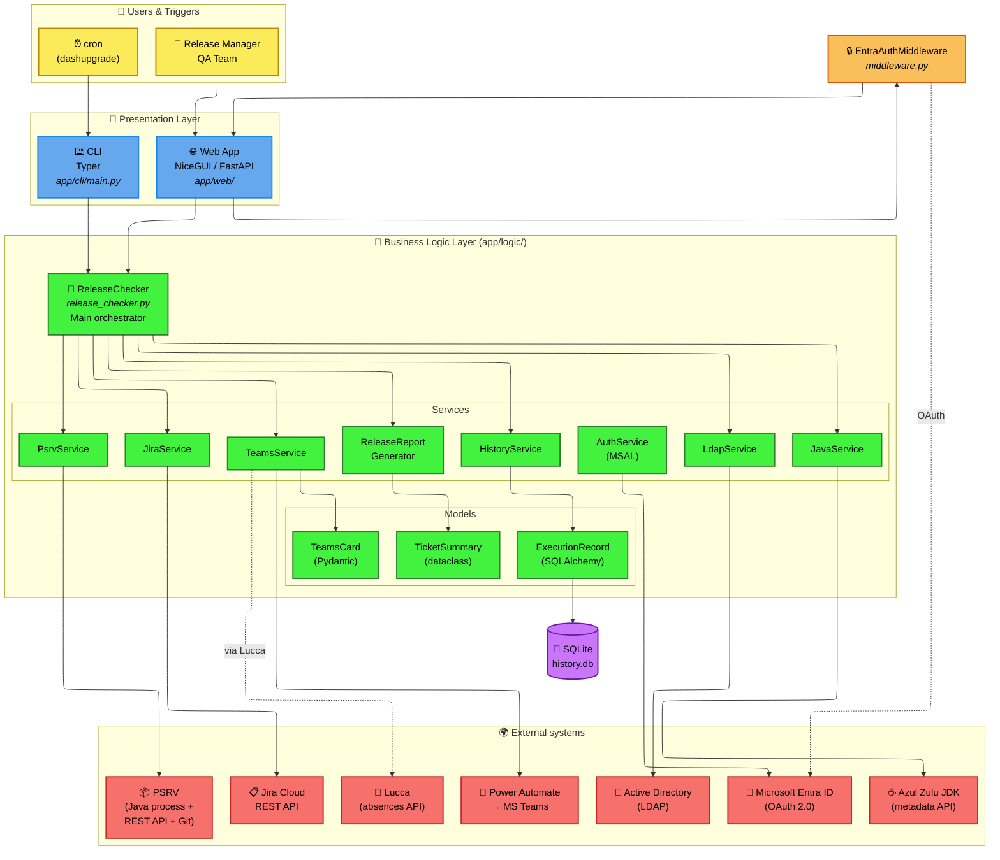
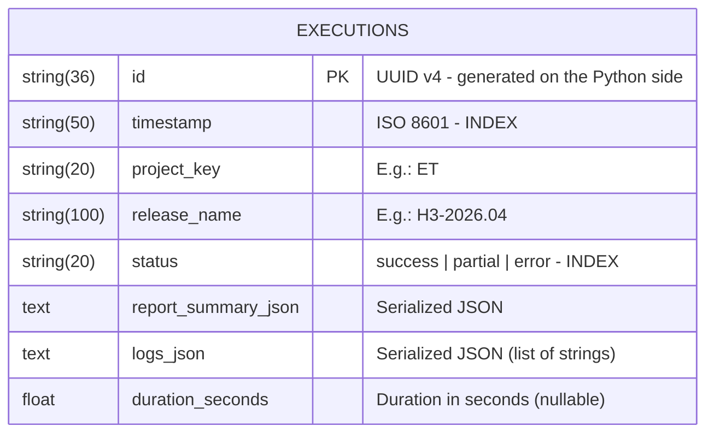
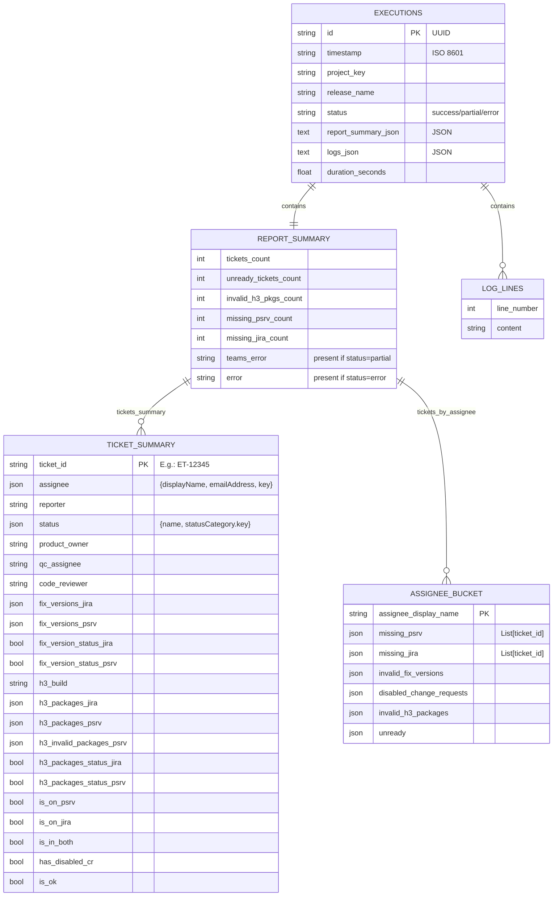
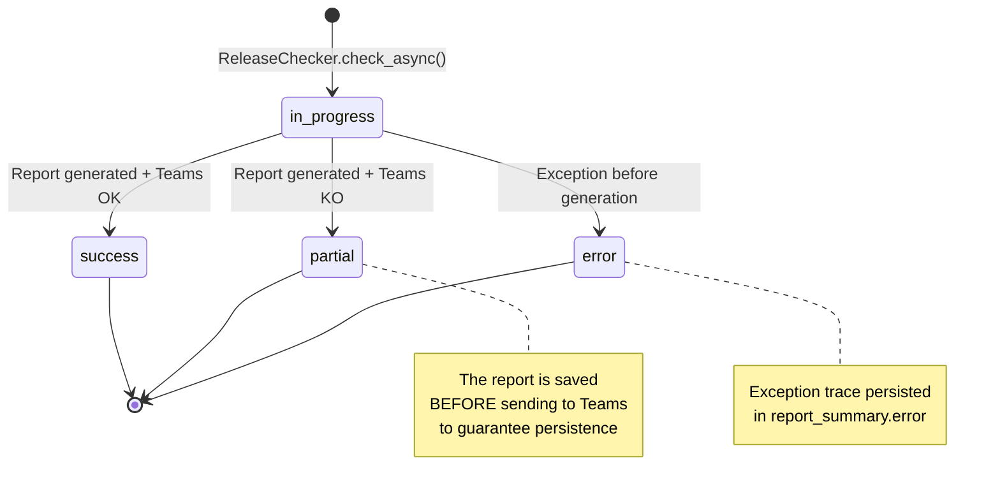
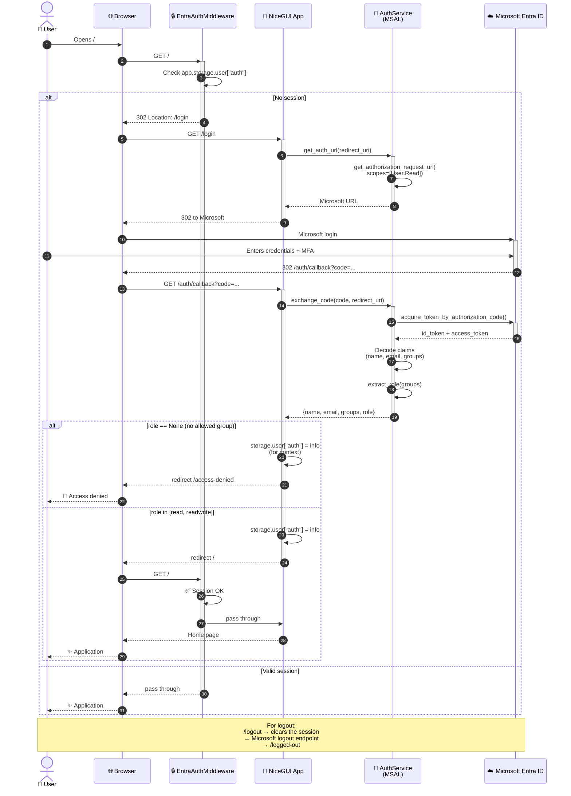
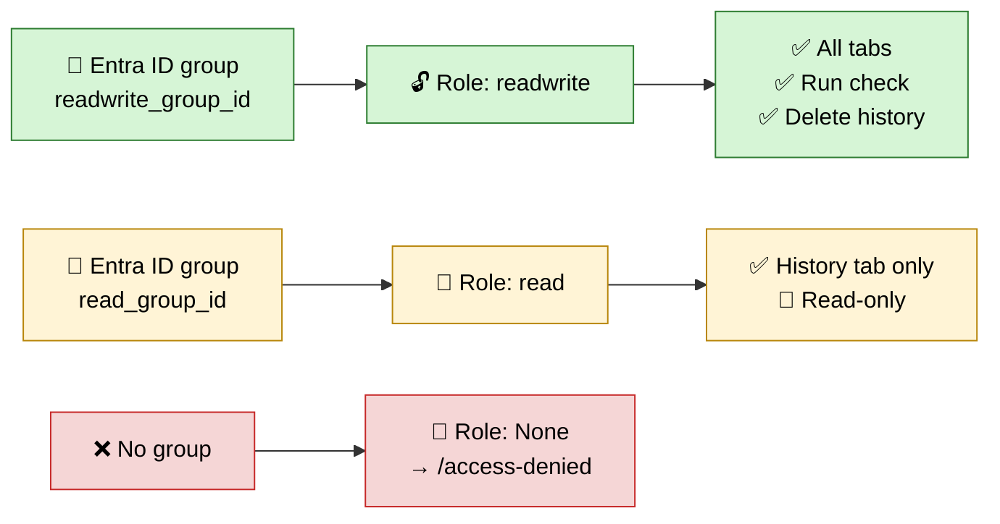
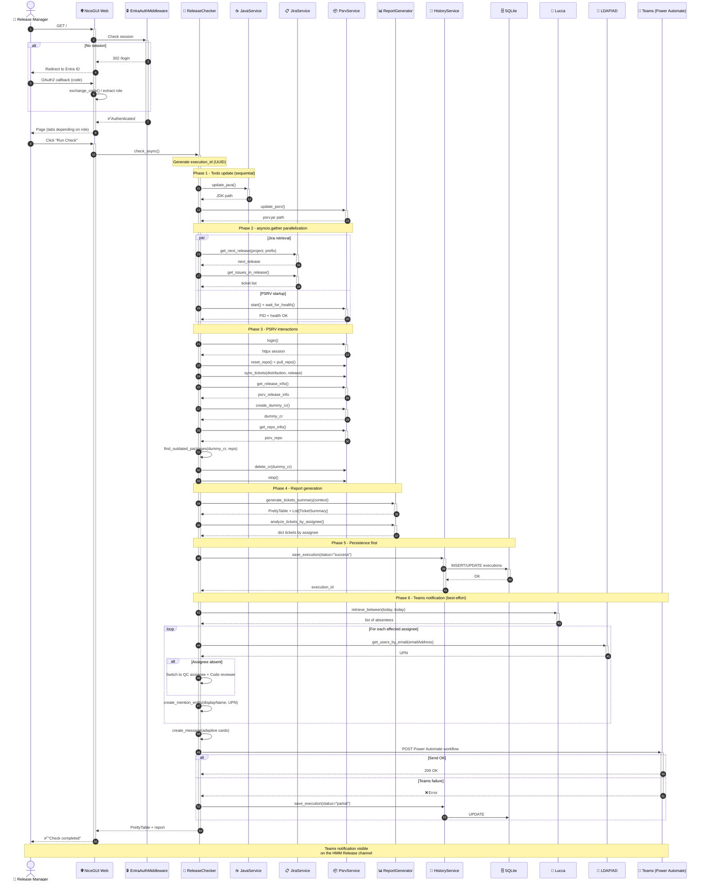
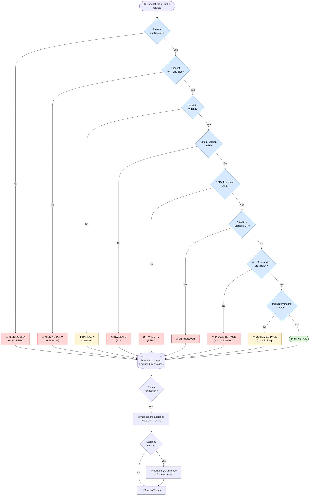

# Detailed report

## 1. Company and project context

### 1.1 The organization: Horizon Trading

Horizon Trading is a vendor of professional trading software aimed at financial institutions (investment banks, brokers, funds). Its flagship product, **Horizon Market Maker 3** (H3 / *HMM3*), is a modular platform used in production by many clients around the world.

H3 development is organized into **Scrum Teams** working in two-week sprints. At the end of every cycle, a new version (*service pack*) of the software is prepared, validated, and shipped to clients.

### 1.2 The Release Manager role

For every sprint, **a Scrum team takes its turn as Delivery Manager** (Release Manager) for H3. Its responsibility is to **guarantee the consistency and quality of the upcoming release** before it is shipped.

To do so, they had to walk through a **manual checklist** (formalized in the internal document *"How To Deliver a H3 Service Pack"*) which included, for the *Tasks done by the delivery manager* part, more than ten distinct checks:

1. Verify that no *Change Request* is disabled for the release.
2. Verify that package versions are up to date.
3. Verify completion of the *Quality Control* (QC) for every ticket in the release.
4. Verify that no client name appears in tickets AND in the *release note*.
5. Manually *resync* every ticket on the PSRV.
6. Verify *fix versions* (each ticket must be tied to the right version).
7. Identify and fix tickets present in two consecutive versions.
8. Verify the H3 package list (typos, unknown packages, etc.).
9. Re-sync after every fix.
10. Request a *Go / NoGo* from the QA team.
11. Create the final version and publish.

This procedure was **time-consuming** (around 30 to 45 minutes per release, more if inconsistencies had to be fixed), **tedious**, and **prone to human error**.

### 1.3 The requirements

My company tutor, in consultation with the QA team and the Release Managers, formulated the following need:

> *"We want a tool that, launched automatically several times a week and on demand, runs all the checklist verifications, generates a synthetic report and posts it to the 'HMM Release' Teams channel mentioning the right people. The Release Manager should be able to know at a glance whether the release is ready."*

A strong requirement is that **the checks must exactly mirror the existing manual checklist**, so that the tool's report is immediately understood and accepted by the teams.

| Before: visual detection of anomalies  | Before: visual detection of obsolete packages  |
|:-----------------------------------------:|:--------------------------------------------------:|
|  |  |

---

## 2. Existing landscape and preliminary analysis

### 2.1 Tools already in place

| Tool | Role | Access mode |
|---|---|---|
| **Jira Cloud** | Ticket, version and *fix version* management | REST API + Python `pycontribs/jira` library |
| **PSRV** *(Packaging Server)* | Internal tool managing distributions, *change requests*, packages, *release notes* and synchronization with a packaging Git repository | REST API `httpx` + local Java process |
| **Microsoft Teams** | Team communication, in particular the *HMM Release* channel | Webhook via Power Automate Workflow |
| **Active Directory** | User directory (UPN ↔ email resolution) | LDAP (`ldap3`) |
| **Lucca** | Absence management (leave, RTT) | REST API via the internal `lucca` library |
| **Internal GitLab** | Code forge, *issues*, CI/CD, Docker *registry* | SSH + HTTPS |
| **Microsoft Entra ID** | Organization SSO authentication | OAuth 2.0 (MSAL) |

### 2.2 Existing code

**None.** The project was initialized from scratch on **17 December 2024**. It is an entirely personal undertaking, from *design* through to production, including the successive evolutions requested by users.

| An H3 release in Jira | Custom fields used on a ticket |
|:---:|:---:|
|  |  |

### 2.3 Functional requirements analysis

Starting from the manual checklist, I extracted the **exhaustive list of checks to automate**:

1. **Tickets missing on the PSRV side**: a Jira ticket flagged with *fixVersion = `<release>`* but absent from the PSRV *release*.
2. **Tickets missing on the Jira side**: conversely, a ticket present in the PSRV *release* but without the matching Jira *fixVersion*.
3. **Invalid fix versions**: a ticket whose *fixVersion* (Jira or PSRV) is empty, duplicated, or does not exactly match the name of the upcoming release.
4. **Disabled Change Requests**: presence of a *change request* with `disabled = true` for the release.
5. **Invalid H3 packages**: a ticket declares a package that does not exist in the PSRV's known package list (typos, old names, etc.).
6. **Obsolete packages**: the version of a package included in the release is not the latest available (e.g., `SHORTSELL 0.16.0 (latest: 0.17.0)`).
7. **Unfinished tickets**: a ticket whose Jira `statusCategory` is not `done`.
8. **Exclusion of internal tickets**: tickets carrying the *INTERNAL* label must not appear in the public *release note*.

---

## 3. Solution design and architecture

### 3.1 Overview

The application is structured into **three main modules**:

```
app/
├── cli/        ← Typer application (command-line interface)
│   └── main.py
├── logic/      ← Reusable business core
│   ├── clients/        (third-party library wrappers: JiraClient)
│   ├── services/       (business services: Jira, PSRV, Teams, LDAP, History, Auth, Java…)
│   ├── models/         (SQLAlchemy + Pydantic Adaptive Cards models)
│   ├── enums/          (JiraCustomField...)
│   ├── exceptions/     (business exceptions)
│   ├── utils/          (logger, file_manager, path_helper...)
│   ├── config/         (Pydantic settings)
│   └── release_checker.py    (main orchestrator)
└── web/        ← NiceGUI application (web interface)
    ├── main.py
    ├── middleware.py           (Entra ID auth)
    ├── auth_routes.py
    ├── components/             (ReleaseCheckForm, PsrvControl...)
    └── tabs/                   (release_check, history, latest_release, tools_management)
```

This separation makes it possible to **reuse** the same business logic from the CLI, from the web interface, and from unit tests.

### 3.2 Technical architecture



**Legend**

- **🟡 Users & Triggers**: who or what triggers a release check.
- **🔵 Presentation Layer**: user interfaces (NiceGUI web app or Typer CLI).
- **🟠 Authentication middleware**: protects the web interface (deny by default).
- **🟢 Business Logic Layer**: reusable services, data models, central orchestrator.
- **🟣 Persistence**: local SQLite database (execution history).
- **🔴 External systems**: third-party APIs and services consumed by the application.


### 3.3 Justified technology choices

| Choice | Justification |
|---|---|
| **Python 3.13** | Language already used in other internal tools; broad ecosystem (Jira, MSAL, ldap3, SQLAlchemy, NiceGUI). |
| **Poetry 2** | Deterministic dependency management, *lockfile*, dev/prod dependency *groups*, easy packaging. |
| **Typer** | Very fast construction of a clean CLI from simple Python type annotations. |
| **NiceGUI (on FastAPI)** | Lets you write a reactive web frontend **entirely in Python** without having to develop a separate React/Vue client. Ideal for an internal tool maintained by a single person. |
| **Pydantic + Pydantic Settings** | Typed validation and serialization (used both for *Adaptive Cards* and for configuration via environment variables). |
| **SQLAlchemy 2.0 + SQLite** | Mature ORM, no database server to administer; SQLite is more than enough for the history volume of an internal tool. |
| **httpx (async)** | Asynchronous HTTP client, essential for parallelizing calls to Jira and the PSRV (which significantly reduces total execution time). |
| **MSAL Python** | Official Microsoft library for Entra ID authentication using the *Authorization Code* flow. |
| **Multi-stage Docker** | Minimal production image, development image with hot-reload, *offline* exam build (`Dockerfile.exam`) without internal network access. |
| **Ruff** | Ultra-fast *linter* + formatter, `ALL` preset for the highest level of strictness. |
| **pytest** | De facto standard for Python tests, async support via `pytest-asyncio`. |

### 3.4 Data model: `executions` table

#### 3.4.1 Single-table model
The application persists execution history in a **local SQLite** database managed via the **SQLAlchemy 2.0** ORM. The schema is intentionally simple: **a single `executions` table**, in which complex fields (report and logs) are serialized as JSON in `TEXT` columns.

**Why a "single-table with JSON" model?**

| Choice | Justification |
|---|---|
| **A single table** | The application is single-user on the write side (cron + occasional clicks). No need for complex joins. |
| **`report_summary` as JSON** | The report contents (statistics, ticket-by-ticket table, grouping by assignee) are **opaque** to the SQL engine: they are never filtered or aggregated in SQL, and only serve to display the details of an execution. |
| **`logs` as JSON** | Same: an execution's logs are consulted as a whole in the detail view, never searched line by line. |
| **Index on `timestamp` and `status`** | These two columns are the only ones used in the *History* view filters (sort by date, filter by status). |
| **`id` as `String(36)`** | UUID v4 generated on the Python side, passed as-is to Power Automate to enable the `?tab=history&id=<uuid>` *deep-link* from the Teams notification. |


*<p align="center">ER diagram of the `executions` table</p>*

The `success` / `partial` / `error` statuses make it possible to distinguish:
- `success`: everything went smoothly.
- `partial`: the report was generated and persisted, but sending to Teams failed (for example, Power Automate unavailable). The report remains accessible in the history.
- `error`: an exception was raised before the report could be generated. The trace is saved for analysis.

#### 3.4.2 Report structure
Although SQLAlchemy only sees a `TEXT` blob, the internal structure of `report_summary_json` is itself **strongly typed on the Python side** (via the `TicketSummary` and `ReportContext` *dataclasses*).

Here is its logical breakdown:


*<p align="center">Internal structure of the JSON stored in `report_summary_json` and `logs_json`</p>*

#### 3.4.3 Lifecycle of an `executions` row
The lifecycle of an `executions` row is as follows:


#### 3.4.4 Estimated volume

| Field | Typical size | Comment |
|---|---|---|
| `id` | 36 bytes | Fixed UUID v4 |
| `timestamp` | ~26 bytes | ISO 8601 with microseconds |
| `project_key` | 2 to 20 bytes | E.g.: `ET` |
| `release_name` | ~10 to 15 bytes | E.g.: `H3-2026.04` |
| `status` | 5 to 7 bytes | Enum |
| `report_summary_json` | **5 to 50 KB** | Depends on the number of tickets in the release (50 to 300 tickets in practice) |
| `logs_json` | **2 to 10 KB** | ~50 to 200 log lines per execution |
| `duration_seconds` | 8 bytes | Float |

At a rate of about **3 executions per week** (cron) plus a few manual executions, the database barely reaches **a few megabytes over a full year**: SQLite is more than adequately sized for this need.

### 3.5 Security and authentication

The web interface is protected by a **Starlette middleware** (`app/web/middleware.py`) which applies the **"deny by default"** principle:

- All routes require a valid user session (`app.storage.user["auth"]`).
- A very narrow allow-list authorizes the public routes required by the OAuth flow: `/login`, `/auth/callback`, `/logout`, `/logged-out`, `/access-denied` and the NiceGUI static resources (`/_nicegui/`, `/static/`).

The authentication service (`app/logic/services/auth.py`):

1. Generates the Entra ID authorization URL via MSAL (`get_authorization_request_url`).
2. On receiving the *callback*, exchanges the authorization code for an *access token* + *id token* (`acquire_token_by_authorization_code`).
3. Extracts the *claims* (`name`, `preferred_username`, `groups`) from the *id token*.
4. Maps the `groups` (Entra ID object IDs) to two application-level roles:
   - `readwrite` (group `ENTRA_READWRITE_GROUP_ID`)
   - `read` (group `ENTRA_READ_GROUP_ID`)
5. If the user does not belong to any allowed group, they are redirected to the `/access-denied` page.

The web application then reacts to the role:

- A `read` user only sees the **History** tab (read-only).
- A `readwrite` user sees all tabs and can trigger checks, delete history entries, etc.


*<p align="center">OAuth 2.0 flow diagram</p>*


*<p align="center">Role mapping</p>*

| Microsoft sign-in page | Authenticated header + role |
|:---:|:---:|
|  |  |

| *Access Denied* page (no group) | *Logged Out* page |
|:---:|:---:|
|  |  |

---

## 4. Feature details

This diagram illustrates the **complete flow** of a `releases check` command run (from either the web interface or the CLI), from the user's click through to the Microsoft Teams notification. It highlights the **asynchronous parallelization** between fetching the Jira context and starting the PSRV thanks to `asyncio.gather`.



The six phases are as follows:

1. **Phase 1**: Tools update (Java, PSRV) sequentially.
2. **Phase 2**: `asyncio.gather` parallelization: while the PSRV starts up, the Jira data is fetched in parallel.
3. **Phase 3**: HTTP interactions with the PSRV REST API: repo reset, pull, ticket *resync*, retrieval of release and repo information, creation/deletion of a dummy *change request* (used to detect obsolete packages).
4. **Phase 4**: Generation of the summary table and the per-assignee groupings.
5. **Phase 5**: Immediate persistence of the report **before** attempting the Teams notification (so a report is never lost if sending fails).
6. **Phase 6**: Sending the Microsoft Teams notification via Power Automate, with UPN resolution via LDAP, taking absences into account via Lucca, and a **`partial` fallback** mechanism if sending fails.

This diagram presents the **decision tree** applied to each ticket during a release check, along with the anomalies surfaced in the report.



The anomalies fall into several categories:

| Category | Severity | Description |
|---|---|---|
| **MISSING PSRV** | 🔴 Blocking | The Jira ticket has the right *fixVersion* but is not in the PSRV release. |
| **MISSING JIRA** | 🔴 Blocking | The ticket is in the PSRV release but does not have the matching Jira *fixVersion*. |
| **INVALID FV** | 🔴 Blocking | The Jira or PSRV *fixVersion* is empty, duplicated, or points to another release. |
| **DISABLED CR** | 🔴 Blocking | The ticket is attached to a disabled *change request*. |
| **INVALID H3 PKGS** | 🔴 Blocking | At least one of the packages declared on the ticket is not known to the PSRV (typo). |
| **UNREADY** | 🟡 To watch | The Jira status is not `done` (e.g., *In Progress*, *In Review*). |
| **OUTDATED PKGS** | 🟡 Informational | A package is in production with a version lower than the latest available (info, non-blocking). |


### 4.1 `releases check` CLI command

```text
Usage: my-cli releases check [OPTIONS]

 Check release.

 Raises:
 typer.Exit: If an error occurs during the release check.

╭─ Options ─────────────────────────────────────────────────────────────────────────────────────────────────────────────────────────────╮
│ --project-key          -p       TEXT  Project key [default: ET]                                                                       │
│ --release-prefix       -r       TEXT  Release prefix [default: H3]                                                                    │
│ --release                       TEXT  Release to check. If none is provided, the latest will be determined automatically.             │
│ --[no]-stop-psrv                      Stop the PSRV after checks are done. [default: stop-psrv]                                       │
│ --[no]-start-psrv                     Start the PSRV before doing the checks. [default: start-psrv]                                   │
│ --[no]-hard-reset-repo                Hard reset the repo before doing the checks. [default: hard-reset-repo]                         │
│ --[no]-update-tools                   Update the tools before doing the checks. [default: update-tools]                               │
│ --[no]-resync-tickets                 Resync all tickets before doing the checks. [default: resync-tickets]                           │
│ --[no]-push-commit                    Push the 'Refresh tickets' commit after synchronization. [default: no-push-commit]              │
│ --reply-to-message-id           TEXT  ID of the Teams Channel Message ID to reply to.                                                 │
│ --[no]-show-done-each-step            On each step, write 'Done!' at the end of line when done. [default: no-show-done-each-step]     │
│ --help                                Show this message and exit.                                                                     │
╰───────────────────────────────────────────────────────────────────────────────────────────────────────────────────────────────────────╯
```

This is the command called from **cron** on the `dashupgrade` server. It can also be used by developers.

| General `--help` | `releases check` help |
|:---:|:---:|
|  |  |

| Successful CLI execution (PrettyTable) | Tools management |
|:---:|:---:|
|  |  |

### 4.2 The comparison engine

The business core is implemented in [**`ReleaseReportGenerator.generate_tickets_summary()`**](https://github.com/wblondel/h3-release-checker/app/logic/services/release_report.py). It takes as input a `ReportContext` containing the release's Jira tickets, the release's PSRV tickets, the disabled *change requests* and the list of known packages, and produces for each ticket a `TicketSummary` object containing all the fields needed for display: status, Jira and PSRV *fix versions*, packages, inconsistency *flags*, etc.

The algorithm:

1. For each Jira ticket in the release:
   - Check whether it is also present in the PSRV release.
   - Check whether it is cited in a disabled *change request*.
   - Retrieve the corresponding PSRV *fix version*.
   - Compare the H3 packages declared at the ticket level with the PSRV release's `packageRules`.
   - Mark as **invalid** any package that does not appear in any of the rules.
2. Compute, for each ticket, the booleans: `is_in_both`, `has_disabled_cr`, `is_ok` (green if everything is good).
3. Build a `PrettyTable` with a *custom format* per column (`Y` / `N` / `N/A` for booleans, *display name* for *Jira Users*, etc.).

A second method, **`analyze_tickets_by_assignee()`**, groups the anomalies by assignee, which allows the Teams notification to mention the right people directly rather than making them scan a long list.

### 4.3 Interaction with the PSRV

The [`PsrvService`](https://github.com/wblondel/h3-release-checker/app/logic/services/psrv.py) service manages the complete lifecycle of the PSRV process:

1. **Download** of the latest JAR from the internal artifactory.
2. **Startup** of the Java process with all the necessary options.
3. **Wait for availability** via an HTTP *health check*.
4. **Authentication** on the REST API.
5. **Operation execution**: repo reset, pull, ticket *resync*, retrieval of release and repo information, creation/deletion of a dummy *change request* (used to detect obsolete packages).
6. **Clean shutdown** of the process by reading the PID file produced by the PSRV.

The systematic use of `httpx.AsyncClient` makes it possible to **parallelize** the fetching of the Jira context and the startup of the PSRV (which takes several tens of seconds), via `asyncio.gather`. This significantly reduces total execution time.

### 4.4 The Microsoft Teams notification (Adaptive Cards + Power Automate)

I modeled the entire Adaptive Card with [Pydantic](https://github.com/wblondel/h3-release-checker/app/logic/models/teams_card.py). `TeamsService.create_message()` produces a `TeamsMessage` made up of **three attached cards**:

1. **Main card**: avatar + release name + start date + description + `FactSet` (counters: `Tickets missing in PSRV`, `Invalid FV`, `Disabled CRs`, `Outdated pkgs`, `Invalid H3 pkgs`, `Unready tickets`) + mentioned-people block + action buttons.
2. **Table card**: an `Adaptive Card` *Table* listing, per assignee, the tickets affected by each type of anomaly.
3. **"Reply" card**: if a Teams `parentMessageId` was passed as a parameter, the new notification is posted as a *reply* to an existing message, which makes it possible to *thread* the check history of a single release.

The payload is then POSTed to a **Power Automate workflow** whose URL and signature are configured via environment variables (`TEAMS_WORKFLOW_HOST`, `TEAMS_WORKFLOW_ID`, `TEAMS_WORKFLOW_SIGNATURE`). The Power Automate flow receives the payload and posts it to the Teams channel.

#### The smart mentions system

For an `@Name` mention to be clickable on Teams, you need to know the person's **UPN** (User Principal Name), not just their name. However, Jira only provides the email address. Resolution therefore happens in several steps:

1. For each assignee affected by an anomaly, retrieve their `emailAddress` from Jira.
2. Query **Active Directory** via LDAP (`LdapService.get_users_by_email()`) to obtain the `userPrincipalName`.
3. If the UPN is found, create an Adaptive Card `MentionEntity`.
4. **If the assignee is on leave** (information retrieved via the Lucca API with the internal `lucca` library), switch the mention to the **QC assignee** and **code reviewer** (retrieved via the Jira *custom fields* `JiraCustomField.QC_ASSIGNEE` and `JiraCustomField.CODE_REVIEWER`).

This logic avoids spamming someone who is absent and helps move the ticket forward with their backup.

| Main Adaptive Card | Per-assignee table |
|:---:|:---:|
|  |  |

| Threaded reply |
|:---:|
|  |

| Power Automate flow | Detail of a successful flow execution |
|:---:|:---:|
|  |  |

### 4.5 Web interface

The NiceGUI web application offers **four tabs**:

#### 4.5.1 Release Check

- Configuration form (project key, prefix, optional release, *Reply to Message ID*).
- Toggle buttons to enable/disable each step.
- **Automatic detection**: if you paste a Teams URL into the *Reply To Message ID* field, the application automatically extracts the `parentMessageId` from it.
- **Live log**: the `ReleaseChecker` output is *streamed* at the bottom of the form.

| Empty form (initial state) | Run in progress (live logs) |
|:---:|:---:|
|  |  |

| Run completed successfully |
|:---:|
|  |

#### 4.5.2 Get Latest Release

- Small utility that queries Jira to display the next release (useful for the Release Manager to check quickly).

| Display of the next release |
|:---:|
|  |

#### 4.5.3 Tools Management

- Buttons to start / stop the PSRV manually (useful for debugging) and to trigger Java and PSRV updates.

| *Tools Management* tab |
|:---:|
|  |

#### 4.5.4 History

- Paginated list of executions with:
  - filters by **status** and by **release**;
  - colored badges (green / orange / red) depending on the status;
  - *View report* and *Delete* buttons;
  - *Clear All* button (read-write only);
  - **automatic refresh** every 2 seconds (only when on the list, not in the detail view).
- Detailed view of an execution:
  - header (release, project, status, duration, date);
  - **Export JSON** button to download the report;
  - 4 statistics cards (total tickets, *missing PSRV*, *invalid pkgs*, *unready*);
  - **"Actionable Items by Assignee"** table;
  - ticket-by-ticket table with clickable Jira links and visual icons (✓ green / ⚠ red);
  - collapsible execution log panel.
- If the status is `error`, the view directly shows the exception trace and the logs (short-circuiting the rest).
- If the status is `partial`, an orange banner explains that the report was indeed generated but the Teams notification failed, and provides access to the error details.

| Paginated list (mixed statuses, filters) | Detailed view — `success` status |
|:---:|:---:|
|  |  |

| Detailed view — `partial` status | Detailed view — `error` status |
|:---:|:---:|
|  |  |

| *Export JSON* button (download the report) |
|:---:|
|  |

### 4.6 Deployment

#### Multi-stage Docker image

```dockerfile
FROM python:3.13.11-slim AS python-base
...
FROM python-base AS builder-base
RUN apt-get install ... build-essential curl ssh
RUN curl -sSL https://install.python-poetry.org | python3 -
COPY poetry.lock pyproject.toml ./
RUN poetry install --no-root --without=dev
...
FROM python-base AS development
...
RUN poetry install --no-root --with=dev
USER appuser
ENTRYPOINT ["python", "-m", "app.web.main"]

FROM python-base AS production
COPY --from=builder-base $PYSETUP_PATH $PYSETUP_PATH
COPY ./app /app/app
USER appuser
ENTRYPOINT ["python", "-m", "app.web.main"]
```

The *production* image contains neither the Poetry source code, nor the development dependencies, nor the build tools: it is minimal and runs as a non-root user (`appuser`).

#### Docker Compose profiles

The `compose.yaml` provides **three profiles**:

- `dev`: local build of the *development* image, hot-reload via mounted volume.
- `prod`: local build of the *production* image.
- `registry`: directly uses the *production* image published to the internal registry.

#### Cron on `dashupgrade`

```shell
# Monday to Wednesday (and Friday) at 8am HKT (2am CEST)
0 2 * * 1-3,5 $HOME/h3-releases-auto-follow-up/send_post.sh

# Wednesday at 8am and 12pm CEST
0 8,12 * * 3 $HOME/h3-releases-auto-follow-up/send_post.sh
```

The `send_post.sh` script applies a **week-parity logic**:

- **Friday**: only runs on **even** weeks.
- **Monday to Thursday**: only runs on **odd** weeks.

This matches the two-week sprint cycle: progress is checked at the start and end of the sprint, without disturbing the teams outside the useful windows.


| GitLab CI pipeline (latest successful *run*) | Docker image in the internal registry |
|:---:|:---:|
|  |  |

| Docker container list on `dashupgrade` | Scheduled tasks on `dashupgrade` |
|:---:|:---:|
|  |  |

### 4.7 Demo mode and exam build

To be able to present the tool **during the E6 exam**, without access to the corporate network, I set up:

- A demo mode that can be enabled via an environment variable, replacing `JiraService`, `PsrvService`, `LdapService` and `LuccaCalendar` with their [*mock*](https://github.com/wblondel/h3-release-checker/app/logic/services/mock_services.py) equivalents. Demo mode generates a plausible report (with fake tickets and a few representative anomalies) and keeps the user experience intact.
- A local copy of the private `lucca` package in `vendor/lucca/`.
- A **`Dockerfile.exam`**, a **`pyproject.exam.toml`** and a **`compose.exam.yaml`** that *override* the standard configuration to point to the *vendored* `lucca`. This build does not require any SSH access to the internal GitLab.
- Everything is documented in [`README.exam.md`](https://github.com/wblondel/h3-release-checker/README.exam.md).

---

## 5. Tests and code quality

### 5.1 Test strategy

- **Unit tests of business services**: they validate that `ReleaseReportGenerator` produces the correct `TicketSummary` for various cases (OK ticket, ticket with invalid *fix version*, unknown package, disabled *change request*, etc.).
- **Web component tests**.
- **Asynchronous tests** with `pytest-asyncio`.
- **Mocks** of external services (`pytest-mock`) so as never to depend on the network during tests.
- **Error cases**: the suite also verifies that `_save_failure_record` correctly persists failed executions, that Jira / LDAP exceptions are properly propagated, and that the Teams notification is *fail-safe* (`partial` status).

### 5.2 Linting and formatting

- **Ruff** is configured with the `ALL` preset (see `pyproject.toml`), which enables every available rule.
- Exceptions are **explicitly justified** per file (`per-file-ignores`).
- The code follows a 120-character line length and the `google` convention for *docstrings*.

| `pytest` output | `ruff check` output |
|:---:|:---:|
|  |  |

### 5.3 Successive refactorings

Several refactorings aimed at improving maintainability or adding features were necessary:

- `90670f`: replacement of long argument lists with *dataclasses*.
- `91d52ae`: modularization of the web interface into separate components and tabs.
- `2639885`: migration of history storage from a JSON file to SQLite + SQLAlchemy.
- `45f4acb`: addition of Entra ID authentication.

---

## 6. Skills demonstrated (BTS SIO reference framework)

### 6.1 Block 2 — Application design and development (E6 SLAM)

| Skill | How it was demonstrated in this project |
|---|---|
| **Analyze a stated need and its legal context** | Reading, formalizing, and validating the existing manual checklist with the Release Manager and QA. Taking into account the internal regulatory context (access security, secrets management, GDPR for AD personal data). |
| **Take part in designing the architecture of an application solution** | Layered design CLI / logic / web, separation of responsibilities, choice of a centralized orchestration (`ReleaseChecker`). |
| **Model an application solution** | `dataclass` models (`TicketSummary`, `ReportContext`, `ReleaseCheckerConfig`), SQLAlchemy models (`ExecutionRecord`), Pydantic models (Teams Adaptive Cards). |
| **Use the resources of an application framework** | FastAPI / NiceGUI for the web, Typer for the CLI, SQLAlchemy ORM for the DB, Pydantic Settings for configuration. |
| **Identify, develop, use, or adapt software components** | Development of reusable NiceGUI components (`ReleaseCheckForm`, `PsrvControl`, `ToolsUpdate`), `JiraClient`, `LdapService` wrappers. |
| **Use Web technologies to implement application-to-application exchanges** | Asynchronous REST calls with `httpx`, OAuth 2.0 integration with MSAL, Power Automate webhooks, Atlassian Jira Cloud API, PSRV REST API, Lucca API, Azul Zulu API. |
| **Use data access components** | SQLAlchemy 2.0 (sessions, *DeclarativeBase*, `mapped_column`, ORM queries, *upsert*), `lru_cache` for Jira service resolution, JSON serialization for payloads. |
| **Continuously integrate the versions of an application solution** | GitLab CI pipeline, automatic build and publication of the Docker image to the internal registry, `dev` / `prod` / `registry` Compose profiles, *cron* on `dashupgrade`. |
| **Carry out the tests required for validation or production rollout** | `pytest` unit tests, asynchronous tests, web component tests, error case checks, manual end-to-end execution in demo mode. |
| **Write technical and user documentation** | Comprehensive [`README.md`](https://github.com/wblondel/h3-release-checker/README.md) (build, configuration, commands, deployment), [`README.exam.md`](https://github.com/wblondel/h3-release-checker/README.exam.md) (*offline* exam build), Google docstrings on every public function, this report, and the [Annex VII-1-B](/documents/E6/BLONDEL_WILLIAM_VII-1-B_R2.pdf). |
| **Use the features of a development and testing environment** | PyCharm, Python debugger, ruff integration, pytest, Docker Compose, Git/GitLab. |
| **Gather, analyze, and update information on a version of an application solution** | Semantic versioning, rich Git history, documenting changes in *feat:* / *fix:* / *refactor:* commits, update of the internal *"How To Deliver a H3 Service Pack"* documentation. |
| **Assess the quality of an application solution** | Ruff *preset ALL* linter, test suite, manual review of refactorings, monitoring of execution duration (`duration_seconds` field in the database). |
| **Analyze and fix a malfunction** | Several *fix:* commits (`fix: app gets stuck when Jira instance is not responding`, `fix(release_check): resolve ruff issues and refactor db sessions`...): diagnosis from execution logs stored in the database, reproduction in demo mode, fix and test. |
| **Update the technical and user documentation of an application solution** | `README.md` updated at every major change, internal *"How To Deliver a H3 Service Pack"* document updated after the tool was put into service. |
| **Design and run tests of updated elements** | At every refactoring (for example the JSON → SQLite migration), addition of dedicated tests and full execution of the test suite. |
| **Use a query language to exploit data** | SQLAlchemy ORM queries (`session.query(ExecutionRecord).order_by(...).all()`), Python filters on ticket lists, JQL on the Jira side (`project = ET AND fixVersion = "..."`). |
| **Develop application features within a database management system** | Creation of a SQLite schema via SQLAlchemy `Base.metadata.create_all`, JSON serialization/deserialization in `Text` columns, manual *upsert* for partial executions. |
| **Design or adapt a database** | Choice of model (single `executions` table with JSON columns), choice of indexes (`timestamp`, `status`), schema evolution without formal migration (local SQLite, recreation allowed). |
| **Administer and deploy a database** | *File-based* SQLite, persistence in the `storage/` Docker volume, simple backup by file copy. |

### 6.2 Block 1 — IT services support and provisioning (E5)

This project also contributes to covering the E5 reference framework. The table below lists the sub-skills this work helps demonstrate; the others are covered by other items in the portfolio.

| Skill | How it was demonstrated in this project |
|---|---|
| **Identify and inventory digital resources** | Section 2.1 *"Tools already in place"*: exhaustive inventory of the resources consumed by the tool (Jira Cloud, PSRV, Microsoft Teams, Active Directory, Lucca, internal GitLab, Microsoft Entra ID), with each one's business role and access mode. |
| **Use reference frameworks, standards, and norms** | OAuth 2.0 (MSAL), REST/JSON, JSON Schema (via Pydantic), Microsoft *Adaptive Cards* specification, Atlassian Jira Cloud API conventions, PEP 8 enforced by Ruff *preset ALL*. |
| **Set up and verify the authorization levels associated with a service** | Microsoft Entra ID SSO authentication (*Authorization Code* flow), Starlette middleware applying *"deny by default"*, mapping of Entra ID groups to two application-level roles (`read` read-only, `readwrite` full), redirection to `/access-denied` for users outside the group (see section 3.5). |
| **Verify the conditions for IT service continuity** | *Fail-safe* mechanism with priority report persistence (`partial` status if Teams sending fails), HTTP `wait_for_health()` on the PSRV before any interaction, explicit shutdown of the Java process via PID file, automatic restart of Docker containers in production. |
| **Manage backups** | History persistence in a `storage/` Docker volume; simply copying the SQLite file is enough for a full backup, which is documented in the `README.md`. *(Skill explored in depth in a portfolio project dedicated to Veeam Backup & Replication.)* |
| **Verify compliance with rules for the use of digital resources** | Strict secrets management via environment variables (`pydantic-settings`), execution as a non-root user inside the container, vendoring of the private `lucca` package so as not to expose the internal registry, logged access to Active Directory. |
| **Handle requests concerning applications** | The tool **is** an internal support service for Release Managers: it automates a manual support procedure, updates the internal *"How To Deliver a H3 Service Pack"* documentation, and automatically notifies the right people via Teams (with switchover to the QC assignee + code reviewer if the assignee is on leave). |
| **Analyze the objectives and organizational arrangements of a project** | Section 1.3 *requirements expression* (formulation by the company tutor, validation with QA and Release Managers), section 2 *preliminary analysis*, section 3 *design and architecture*. |
| **Plan activities** | Project initialization dated (17 December 2024), refactorings planned in successive iterations (see section 5.3), week-parity cron scheduling so the tool is only triggered at useful moments of the Scrum cycle. |
| **Evaluate project tracking indicators and analyze gaps** | Persistence of the `duration_seconds` field on every execution in the `executions` table, `success` / `partial` / `error` statuses, *History* view enabling the analysis of gaps between successive executions (duration, Teams failure rate, recurring anomalies). |
| **Carry out integration and acceptance tests of a service** | pytest suite (unit tests + asynchronous tests + web components), mocks of external services via `pytest-mock`, **demo mode** activatable via environment variable for acceptance tests without access to the corporate network, *offline* exam build (`Dockerfile.exam`). |
| **Deploy a service** | Multi-stage Docker image (development / production), `compose.yaml` with **three profiles** (`dev`, `prod`, `registry`), GitLab CI pipeline publishing the image to the internal registry, automated deployment on the `dashupgrade` server, cron scheduling with week-parity logic for recurring runs. |
| **Support users in setting up a service** | Update of the internal *"How To Deliver a H3 Service Pack"* documentation after rollout, support of successive Release Managers via the *HMM Release* Teams channel, [`README.md`](https://github.com/wblondel/h3-release-checker/README.md) covering build, configuration, commands and deployment. |

---

## 7. Outcome and outlook

### 7.1 Functional outcome

The tool is **in production** and used **daily**. It has replaced the manual checklist in the new version of the internal documentation (see [`How-To-Deliver-H3-after-automated-tool.md`](../How-To-Deliver-H3-after-automated-tool.md)). Successive Release Managers no longer have to perform the checks by hand: they simply consult the report posted automatically on Teams and only step in when it flags an anomaly.

**Measurable gains**:

- Time spent on manual checks: **divided by 5 to 10**.
- Human errors (forgotten *resync*, missed *fix version*): **eliminated**.
- Team visibility on the release's progress: **improved** (daily report on Teams).

### 7.2 Personal outcome

This project allowed me to lead **a complete software project from end to end**: analysis, design, development, testing, deployment, maintenance, user support, refactorings, hardening. It is representative of the developer's job in a corporate setting: it includes both architectural questions (where to draw the line between layers?) and very concrete problems (how do you resolve a UPN from an email? how do you make Java and Python work together inside a container?).

I particularly enjoyed:

- the **concrete impact** on the team (the users are my own colleagues);
- the **richness of the Python ecosystem** (Jira, MSAL, ldap3, SQLAlchemy, NiceGUI, Pydantic, httpx);
- the **architectural freedom** my tutor gave me, and the feedback he provided at each review;
- the **real production rollout**: the tool runs every day, so it must be **robust**.

### 7.3 Future evolutions

- Extend the tool to distributions other than H3.
- Allow a package *whitelist* / *blacklist*, so that certain recurring anomalies can be deliberately ignored.
- Migrate SQLite to PostgreSQL if the history database grows (several years of history).
- Integrate **QC verification** (Jira *Quality Control* status) directly into the report.
