# Compte rendu détaillé

## 1. Contexte et organisation

| Élément | Détail |
| --- | --- |
| **Organisation support** | Lycée Corneille (La Celle-Saint-Cloud) |
| **Demandeur métier** | Service Intendance de l'établissement |
| **Équipe projet** | William Blondel, Luca Bonnin, Nicolas Ignacio |
| **Méthode** | Scrum, sprints de 1 à 2 semaines |
| **Période** | 22 janvier 2026 → 25 mars 2026 (5 sprints) |
| **Volumétrie** | 24 user stories, 57 tickets, 116 story points livrés |
| **Outils de suivi** | [Trello](https://trello.com/b/eIcnlMPs/application-sgi) + classeur [Gestion_Projet_App_SGI.xlsx](/documents/E6/Gestion_Projet_App_SGI.xlsx) |

### 1.1 Problématique métier

Le service Intendance reçoit l'ensemble des demandes opérationnelles de l'établissement (commandes de fournitures, sorties scolaires, réservations du théâtre, etc.) via des canaux hétérogènes : courrier papier, e-mail, ENT, appels téléphoniques. Cette dispersion entraîne :

- des **pertes d'information** (demandes égarées, allers-retours non tracés) ;
- des **délais de traitement importants** ;
- un **manque de traçabilité** (qui a demandé quoi, quand, à qui ?) ;
- l'**absence de priorisation** des demandes ;
- l'**absence de vision globale** de l'activité du service Intendance.

### 1.2 Cible fonctionnelle

À terme, l'application web SGI doit centraliser **trois fonctionnalités** (priorisées par l'équipe Intendance) :

1. **Demandes de commande de fournitures** — *livrée dans cette itération*.
2. Organisation des sorties scolaires.
3. Réservations du théâtre.

Le présent compte rendu porte exclusivement sur la **fonctionnalité 1**.

---

## 2. Étude préalable et choix techniques

L'étude détaillée (frameworks PHP, *admin panels*, plates-formes de déploiement) est consignée dans le document [Étude comparative et choix technologiques](https://github.com/LucaBONNIN/application-sgi/blob/master/.docs/Etude_Comparative_et_Choix_Technologiques.md).

| Couche | Choix retenu | Justification résumée |
| --- | --- | --- |
| Langage | **PHP 8.4** | Maîtrisé par l'équipe, écosystème mûr. |
| Framework backend | **Laravel 12** | Vitesse de développement, Eloquent, écosystème (Horizon, Auditing, Shield). |
| Framework UI | **Filament v5** | SDUI : pas de HTML/CSS/JS manuel. CRUDs, formulaires complexes, *role-aware*, gestion native du `Repeater` et de `FileUpload`. |
| SGBD | **PostgreSQL 16** | Rigueur sur les contraintes d'intégrité, types avancés. |
| File d'attente | **Redis** + **Laravel Horizon** | Notifications asynchrones (e-mails) sans bloquer les requêtes. |
| Messagerie locale | **Mailpit** | SMTP « trappe » pour visualiser les e-mails sans envoi réel. |
| Conteneurisation | **Spin Pro** (Docker) | Environnement homogène pour les 3 développeurs (`spin up`). |
| IDE | **PhpStorm + Laravel Idea** | Analyse statique, autocomplétion sur les facettes magiques de Laravel. |
| Versionnage | **Git + GitHub** | Branches par fonctionnalité, Pull Requests, revues croisées. |
| Formatage | **Laravel Pint** (PSR-12) | Style uniforme automatique avant chaque commit. |
| Tests | **PHPUnit 11** | Tests unitaires + features Filament/Livewire. |

L'environnement est documenté dans le document [Environnement de développement et architecture](https://github.com/LucaBONNIN/application-sgi/blob/master/.docs/Environnement_de_Developpement_et_Architecture.md).

---

## 3. Architecture de l'application

### 3.1 Modèle de données

7 tables métier (hors `users`, `cache`, `jobs`, `audits`, `permissions`, `vacation_periods`) :

| Table | Rôle | Relations principales |
| --- | --- | --- |
| `users` | Comptes nominatifs (demandeurs et administrateurs) | `belongsToMany services`, `hasMany orders` |
| `services` | Services / disciplines de l'établissement | `belongsToMany users`, `hasMany budgets`, `hasMany orders` |
| `service_user` | Pivot d'affectation utilisateur ↔ service | — |
| `budgets` | Budget annuel par service | `belongsTo service`, `hasMany orders` |
| `suppliers` | Fournisseurs (nom, SIRET, contact, URL) | `hasMany orders` |
| `categories` | Catégories de produits | `hasMany orderLines` |
| `orders` | Demande de commande | `belongsTo user`, `service`, `supplier`, `budget`, `hasMany lines`, statut typé `OrderStatus` |
| `order_lines` | Ligne de produit d'une commande | `belongsTo order`, `category` |
| `vacation_periods` | Périodes de vacances scolaires (Zone C) | utilisée par `OrderAgeCalculator` |
| `audits` | Trace de toutes les actions sensibles | `morphTo` |

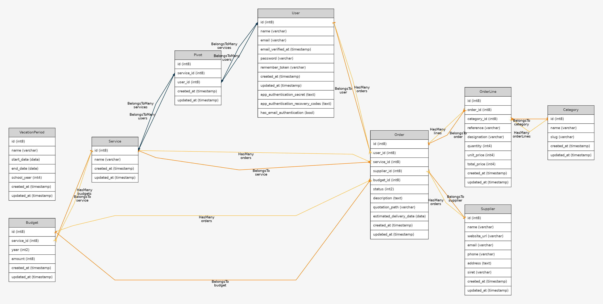
*<p align="center">Figure 1 — Diagramme de classes des modèles Eloquent</p>*

### 3.2 Architecture applicative

L'application suit la structure standard Laravel 12 / Filament v5 :

```
app/
├── Enums/                  # OrderStatus (machine à états + contrats Filament)
├── Filament/App/Resources/ # Ressources Filament (Orders, Budgets, Categories, Services,
│                           #   Suppliers, Users, VacationPeriods, Audit) découpées en
│                           #   {Resource}, Schemas/, Tables/, Pages/, RelationManagers/
├── Listeners/              # Auditing des événements d'authentification
├── Models/                 # Modèles Eloquent + traits Auditable
├── Notifications/          # OrderCreated, OrderStatusChanged (ShouldQueue)
├── Policies/               # OrderPolicy, BudgetPolicy, VacationPeriodPolicy, ...
├── Providers/              # AppPanelProvider (Filament)
└── Services/               # OrderAgeCalculator (calcul jours ouvrés)
```

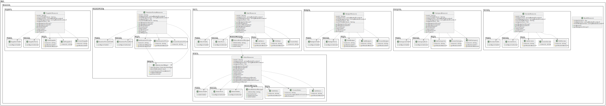
*<p align="center">Figure 2 — Diagramme de classes des ressources Filament</p>*

### 3.3 Patterns mis en œuvre

- **Server-Driven UI** : toute l'interface est définie en PHP (pas de HTML/CSS/JS manuel).
- **Machine à états** centralisée sur l'enum `OrderStatus` (`allowedTransitions`, `canTransitionTo`, `isTerminal`) — *single source of truth* pour les transitions.
- **Policies Laravel** appliquant les règles d'autorisation à chaque action métier (CRUD + transitions).
- **Form Requests / validation Filament** : règles de validation déclaratives (incluant la validation **conditionnelle** sur la présence du devis PDF).
- **Service Layer** isolant la logique métier complexe (`OrderAgeCalculator`).
- **Notifications queued** (`ShouldQueue`) traitées par Laravel Horizon.
- **Audit trail** automatique sur tous les modèles métier (`owen-it/laravel-auditing`).

---

## 4. Description fonctionnelle

### 4.1 Acteurs et rôles

| Acteur | Rôle Shield | Capacités principales |
| --- | --- | --- |
| **Demandeur** (professeur, personnel administratif) | `demandeurs` | Crée ses propres demandes de commande, suit leur statut, peut annuler tant que la demande est `Sent`, ne voit que ses propres commandes. |
| **Service Intendance** | `super_admin` | Vision globale (toutes les commandes, tous les utilisateurs), validation, transitions de statut, gestion du référentiel (services, budgets, fournisseurs, catégories, vacances scolaires). Permission `BypassOwnership:Order`. |

### 4.2 Cycle de vie d'une demande

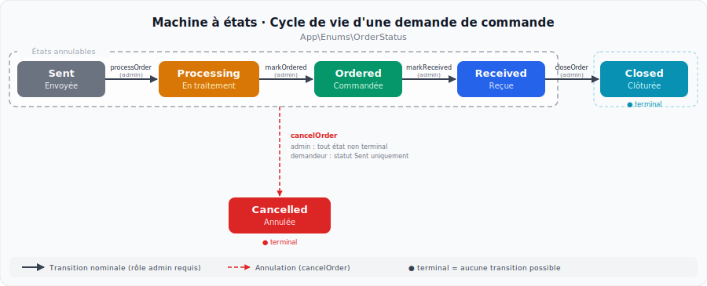
*<p align="center">Figure 3 — Machine à états — Cycle de vie d'une demande de commande</p>*

Statuts terminaux : `Closed`, `Cancelled`. Toute tentative de transition invalide est rejetée par `OrderStatus::canTransitionTo()` **et** par la `OrderPolicy` (double sécurité).

### 4.3 Parcours « Création d'une demande »

1. Le demandeur ouvre l'écran **Nouvelle demande**.
2. Il sélectionne le **service** (filtré sur ses services d'affectation), le **fournisseur** (recherche), saisit une **description**.
3. Il **joint éventuellement un devis PDF** (10 Mo max). Si un devis est joint, **la référence et le prix unitaire deviennent obligatoires** sur chaque ligne.
4. Il ajoute les **lignes de produits** via le `Repeater` (catégorie, référence, désignation, quantité, prix unitaire). Le **total est calculé automatiquement**. Au moins une ligne est obligatoire ; les prix négatifs sont interdits.
5. À la création, `mutateFormDataBeforeCreate()` force `user_id` au demandeur courant et `status = Sent`.
6. `afterCreate()` déclenche la notification `OrderCreated` à tous les `super_admin`.

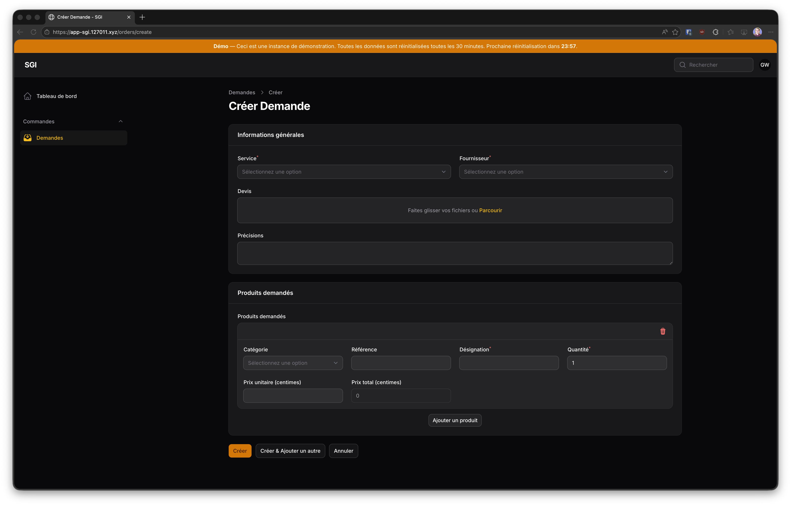
*<p align="center">Figure 4 — Formulaire de création de commande (vide)</p>*

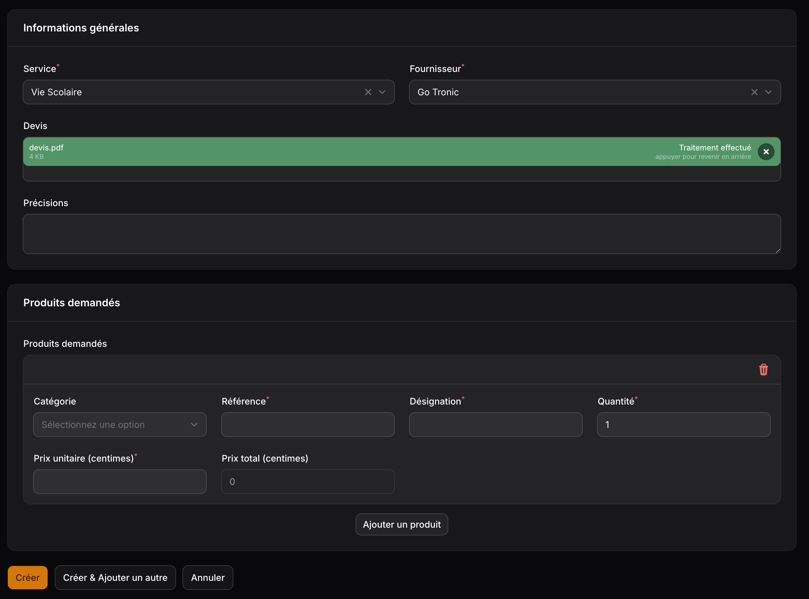
*<p align="center">Figure 5 — Formulaire de création de commande avec devis PDF joint</p>*

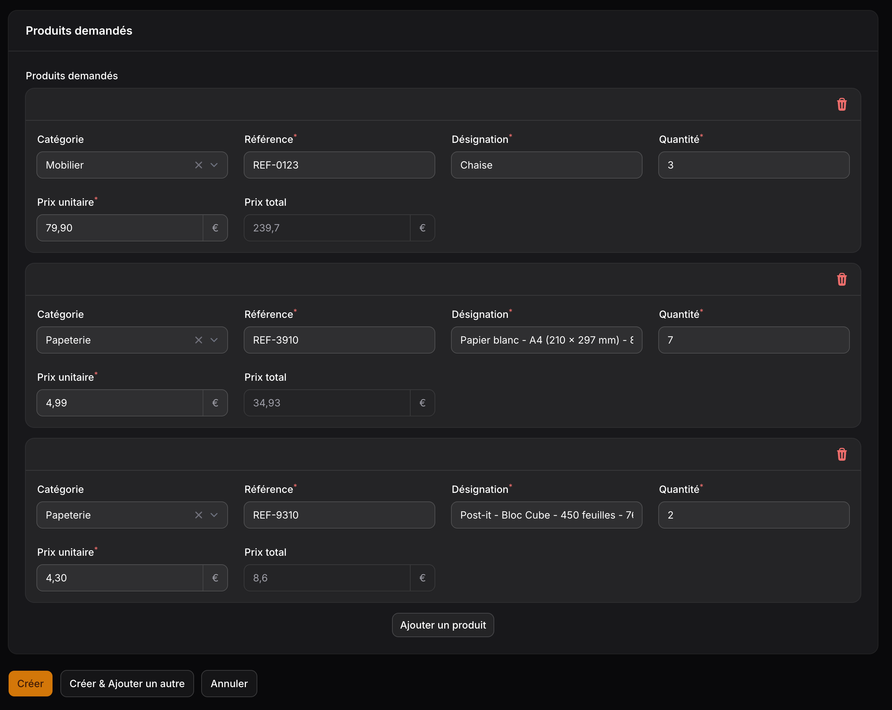
*<p align="center">Figure 6 — Repeater des lignes de commande</p>*

### 4.4 Parcours « Traitement par l'Intendance »

1. L'administrateur reçoit l'e-mail `OrderCreated` (Mailpit en local).
2. Il ouvre la commande, clique sur l'action **« Mettre en traitement »** : une modale lui demande de sélectionner un **budget** parmi ceux du service de la commande. Le statut passe à `Processing` et `budget_id` est renseigné.
3. Il clique ensuite sur **« Marquer comme commandée »** : modale avec `DatePicker` pour la **date de livraison estimée**. Statut → `Ordered`.
4. À réception physique des produits, il clique sur **« Marquer comme reçue »** : statut → `Received`.
5. Une fois les produits remis au service demandeur, il clique sur **« Clôturer »** : statut → `Closed` (terminal).
6. À chaque transition, la notification `OrderStatusChanged` est envoyée au demandeur (ancien statut, nouveau statut, fournisseur, service, lien direct).

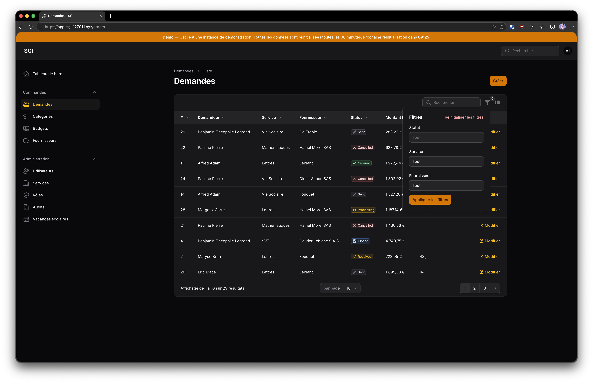
*<p align="center">Figure 7 — Liste des commandes (vue administrateur)</p>*

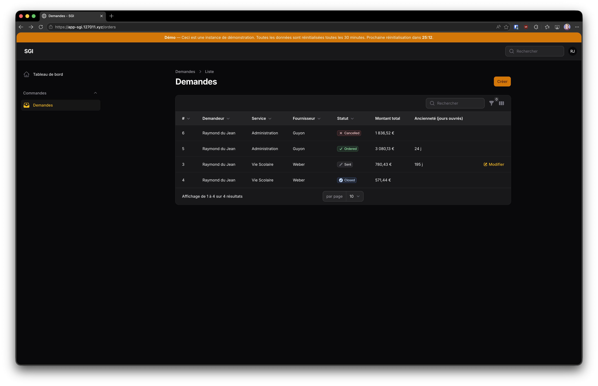
*<p align="center">Figure 8 — Liste des commandes (vue demandeur)</p>*

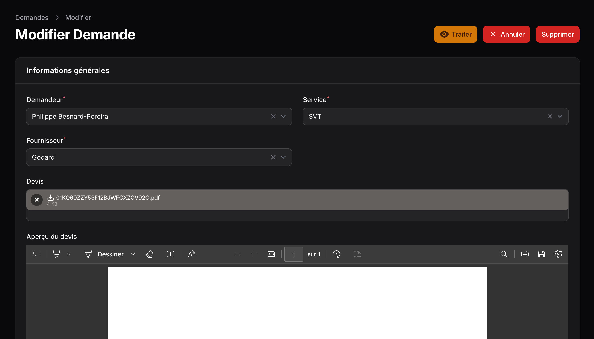
*<p align="center">Figure 9 — Page de modification d'une commande au statut "Envoyé" (vue administrateur)</p>*

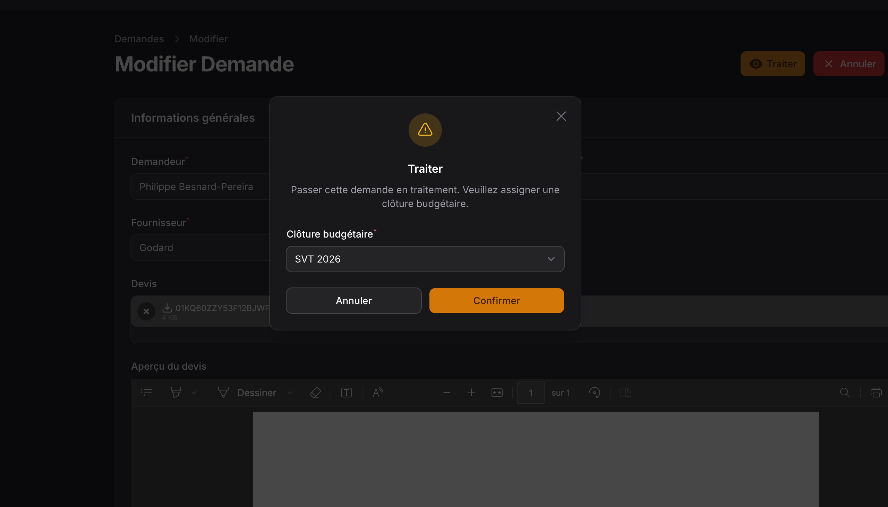
*<p align="center">Figure 10 — Modale "Traiter" (processOrder) (vue administrateur)</p>*

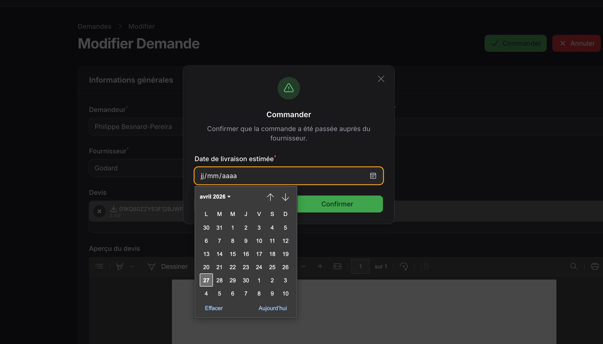
*<p align="center">Figure 11 — Modale "Commander" (markOrdered) (vue administrateur)</p>*


> **[CAPTURE 12 — Page Edit d'une commande au statut « Closed »]**
> *Capture montrant qu'aucune action de transition n'est disponible (preuve que isTerminal() fonctionne en UI).*

> **[CAPTURE 13 — Email OrderCreated dans Mailpit]**
> *Capture de la vue HTML de l'email envoyé aux super_admin lors de la création d'une commande (nom demandeur, service, fournisseur, lien).*

> **[CAPTURE 14 — Email OrderStatusChanged dans Mailpit]**
> *Capture de la vue HTML de l'email envoyé au demandeur lors d'une transition de statut (ancien statut, nouveau statut, fournisseur, service, lien).*

### 4.5 Règle métier de l'ancienneté

Le service `OrderAgeCalculator::calculateBusinessDays()` calcule le nombre de jours ouvrés entre deux dates en excluant :

- les **week-ends** (samedi, dimanche) ;
- les **périodes de vacances scolaires** (Zone C — Paris) chargées depuis la table `vacation_periods` via le `scopeOverlapping`.

L'ancienneté est affichée dans la table des commandes (suffixe « j »), `null` pour les statuts terminaux.

---

## 5. Sécurité et autorisations

- **Authentification** : Laravel native, MFA optionnel via Filament (l'intégration ENT est planifiée pour une itération ultérieure).
- **Autorisation** : RBAC fine via Filament Shield. Deux rôles seulement : `super_admin` et `demandeurs`. Permissions granulaires par ressource et par action (`ViewAny:Order`, `View:Order`, `Update:Order`, `BypassOwnership:Order`, etc.).
- **Filtrage Eloquent** dans `OrderResource::getEloquentQuery()` : un demandeur ne peut récupérer que ses propres commandes — la restriction est appliquée au niveau de la requête, pas seulement à l'affichage.
- **Policies** : la `OrderPolicy` couvre les opérations CRUD **et** les transitions de statut (`processOrder`, `markOrdered`, `markReceived`, `closeOrder`, `cancelOrder`). La règle métier « un demandeur ne peut éditer sa commande qu'au statut `Sent` » est encodée à un seul endroit.
- **Audit** : tous les modèles implémentent `Auditable`, et les événements d'authentification (login / logout / failed login) sont également audités via `Listeners/`.

> **[CAPTURE 15 — Gestion des rôles et permissions (Filament Shield)]**
> *Capture de la page Shield montrant les rôles super_admin et demandeurs avec leurs permissions respectives (BypassOwnership:Order, ViewAny:Order, Create:Order, etc.).*

> **[CAPTURE 16 — Historique d'audit sur une commande]**
> *Capture de la page d'audit montrant les modifications successives d'une commande (qui a modifié quoi, quand, anciennes/nouvelles valeurs).*

---

## 6. Stratégie de test

| Fichier | Type | Tests | Couverture |
| --- | --- | --- | --- |
| `tests/Unit/OrderStatusTest.php` | Unitaire | 7 | Toutes les transitions valides et invalides, état terminal, état non terminal. |
| `tests/Unit/OrderAgeCalculatorTest.php` | Unitaire | 9 | Jours ouvrés, week-ends exclus, vacances exclues, cas limites (`from >= to`, intervalle vide). |
| `tests/Feature/OrderPolicyTest.php` | Feature | 28 | CRUD admin/demandeur, `cancel`, `processOrder`, `markOrdered`, `markReceived`, `closeOrder`. |
| `tests/Feature/Filament/Orders/CreateOrderTest.php` | Feature (Livewire) | 7 | Création d'une commande, auto-fill du `user_id`, statut `Sent` automatique, notification admin, validations conditionnelles. |
| `tests/Feature/Filament/Orders/ListOrdersTest.php` | Feature (Livewire) | 5 | Chargement de la page, vision admin / demandeur, filtres. |
| `tests/Feature/Notifications/OrderNotificationTest.php` | Feature | 6 | Contenu des e-mails, canaux, payload `toArray` pour `OrderCreated` et `OrderStatusChanged`. |

**Total : 62 tests, 138+ assertions.**

Lancement : `./.infrastructure/scripts/mcp-wait.sh ./vendor/bin/spin run -T php php artisan test --compact`.

> **[CAPTURE 17 — Sortie des tests PHPUnit (tous verts)]**
> *Capture de la sortie terminal de `php artisan test --compact` montrant les 62 tests verts (PASS) et les 138+ assertions.*

---

## 7. Internationalisation

L'interface est entièrement traduite en **français** et en **anglais** pour les ressources `Order` et `VacationPeriod` (labels, sections, actions, champs, descriptions). Les autres ressources héritent des traductions de base de Filament fournies par `laravel-lang/lang`.

> **[CAPTURE 18 — Calendrier des vacances scolaires (VacationPeriodResource)]**
> *Capture de la liste des périodes de vacances scolaires dans Filament (Zone C — Paris, 2025-2026 et 2026-2027).*

---

## 8. Planification et livraison

| Sprint | Période | Objectif | Pts | Tickets |
| :---: | --- | --- | :---: | :---: |
| **0** — Cadrage | 22/01 → 28/01/2026 | Choix techno, environnement Spin Pro, projet Laravel vierge | 15 | 6 |
| **1** — Fondation | 29/01 → 11/02/2026 | Migrations, modèles, enum `OrderStatus`, factories, Shield | 23 | 16 |
| **2** — CRUD & formulaire | 12/02 → 25/02/2026 | Ressources Filament, formulaire role-aware, upload PDF, repeater, policies | 29 | 14 |
| **3** — Workflow & métier | 26/02 → 11/03/2026 | Machine à états, actions de transition, vacances scolaires, calculateur d'ancienneté | 30 | 15 |
| **4** — Notifications, i18n & tests | 12/03 → 25/03/2026 | Notifications queued, traductions FR/EN, suite PHPUnit complète | 19 | 12 |
| **Total** | | | **116** | **57** |

### Charge par développeur

| Développeur | Story points | Part |
| --- | :---: | :---: |
| William Gérald Blondel | 51 | 44 % |
| Luca Bonnin | 33 | 28 % |
| Nicolas Ignacio | 32 | 28 % |
| **Total** | **116** | **100 %** |

> Détail par ticket : feuille « Tickets » du classeur `Gestion de projet - Répartition des tâches.xlsx`.

> **[CAPTURE 19 — Board Trello du projet]**
> *Capture du board Trello montrant les colonnes/listes et les cartes du backlog.*

> **[CAPTURE 20 — Dashboard Laravel Horizon]**
> *Capture du dashboard Horizon montrant un job de notification traité avec succès.*

---

## 9. Bilan du candidat

### 9.1 Compétences mobilisées (référentiel BTS SIO bloc 2)

**Concevoir et développer une solution applicative**

- *Analyser un besoin exprimé et son contexte juridique* : entretiens avec l'équipe Intendance, formalisation du besoin dans `Ébauche Spécifications techniques.docx`, prise en compte de la traçabilité (audit) et du RGPD (comptes nominatifs, finalité limitée).
- *Participer à la conception de l'architecture* : choix Laravel + Filament + PostgreSQL motivés et documentés (`Etude_Comparative_et_Choix_Technologiques.md`).
- *Modéliser une solution applicative* : MCD, diagramme de classes des modèles Eloquent et des ressources Filament.
- *Exploiter les ressources du cadre applicatif* : Eloquent, Form Requests, Policies, Notifications, Queues, Auditing, Filament v5 (SDUI), Filament Shield (RBAC).
- *Identifier, développer, utiliser ou adapter des composants logiciels* : `Repeater`, `FileUpload`, `Action`, `RelationManager`, `OrderAgeCalculator` (composant maison), enum à machine à états.
- *Utiliser des composants d'accès aux données* : Eloquent + relations typées + scopes (`scopeOverlapping`), évitement des N+1 par eager loading.
- *Intégrer en continu* : Git, branches par fonctionnalité, revues croisées, Laravel Pint avant chaque commit, environnement CI Docker.
- *Réaliser les tests nécessaires* : 62 tests PHPUnit couvrant les chemins nominaux, d'erreur et les cas limites.
- *Rédiger des documentations technique et d'utilisation* : étude comparative, environnement de développement, fiche descriptive, compte rendu détaillé, diagrammes de classes.
- *Exploiter les fonctionnalités d'un environnement de développement et de tests* : PhpStorm + Laravel Idea, Spin Pro, Mailpit, Horizon, Boost MCP.

**Assurer la maintenance corrective ou évolutive**

- Itération incrémentale entre les sprints (ex. : ajout du statut `Closed` au Sprint 3, refactorisation de la `OrderPolicy`).
- Correction de bugs identifiés en revue (ex. : `T-045` — `columnSpanFull` sur les sections du formulaire).

**Gérer les données**

- Conception du schéma PostgreSQL via migrations Laravel.
- Requêtes Eloquent typées, scopes nommés, factories et seeders pour le jeu de développement et les tests.

### 9.2 Difficultés rencontrées

- **Validation conditionnelle dans Filament** (champs obligatoires si un devis PDF est joint) : nécessité d'utiliser `Get $get` à l'intérieur du `Repeater` et de bien comprendre le cycle de vie réactif des composants Livewire.
- **Restriction de l'édition selon le statut et le rôle** dans le `LinesRelationManager` : encoder la règle « demandeur si `Sent`, admin toujours » sans dupliquer la logique de la `OrderPolicy`.
- **Tests d'intégration Filament** : prise en main du *testing helper* `livewire()` et de la création d'utilisateurs avec les bons rôles Shield via factories.
- **Calcul des jours ouvrés** : isolation de la logique en service pour pouvoir la tester unitairement sans dépendre de l'écosystème Filament.

### 9.3 Apports personnels

- Mise en place de la **machine à états centralisée** sur l'enum (et non dupliquée dans la policy ou le contrôleur) — choix qui s'est révélé payant pour les tests.
- Conception du **formulaire role-aware** qui élimine le besoin d'avoir deux écrans distincts pour le demandeur et l'administrateur.
- **Validation conditionnelle** sur la présence du devis : règle métier exprimée déclarativement.
- **Suite de tests** garantissant la non-régression sur les transitions de statut et les permissions.

### 9.4 Limites et perspectives

- L'authentification ENT n'est pas encore branchée (nécessite l'accès au connecteur de l'établissement).
- La fonctionnalité « Sorties scolaires » et « Réservations du théâtre » seront traitées dans des itérations ultérieures.
- La mise en production sur l'infrastructure du lycée reste à planifier avec le service informatique.

---

## 10. Annexes documentaires

| Document | Localisation | Contenu |
| --- | --- | --- |
| Étude comparative et choix technologiques | `.docs/Etude_Comparative_et_Choix_Technologiques.md` | Comparaison des stacks, justification de Laravel + Filament. |
| Environnement de développement & architecture | `.docs/Environnement_de_Developpement_et_Architecture.md` | Spin Pro, PhpStorm, Git, qualité de code. |
| Spécifications techniques (entretiens) | `.docs/Ébauche Spécifications techniques.docx` | Recueil du besoin, statuts, règles métier. |
| Diagramme de classes des modèles Eloquent | `.docs/models_class_diagram.png` | Vue ER de la base de données. |
| Diagramme de classes des ressources Filament | `.docs/filament_class_diagram.svg` / `.puml` | Découpage des ressources Filament. |
| Plan des sprints, user stories, tickets, vélocité | `.docs/Gestion de projet - Répartition des tâches.xlsx` | Suivi détaillé du backlog et de la charge. |
| Fiche descriptive (Annexe VII-1-B) | `.docs/ANNEXE_VII-1-B_Fiche_Descriptive.md` | Recto / Verso de la fiche officielle. |

