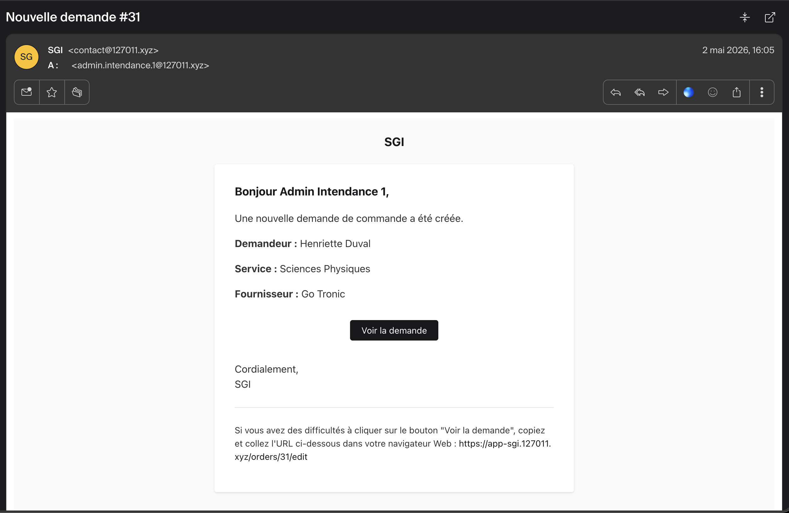
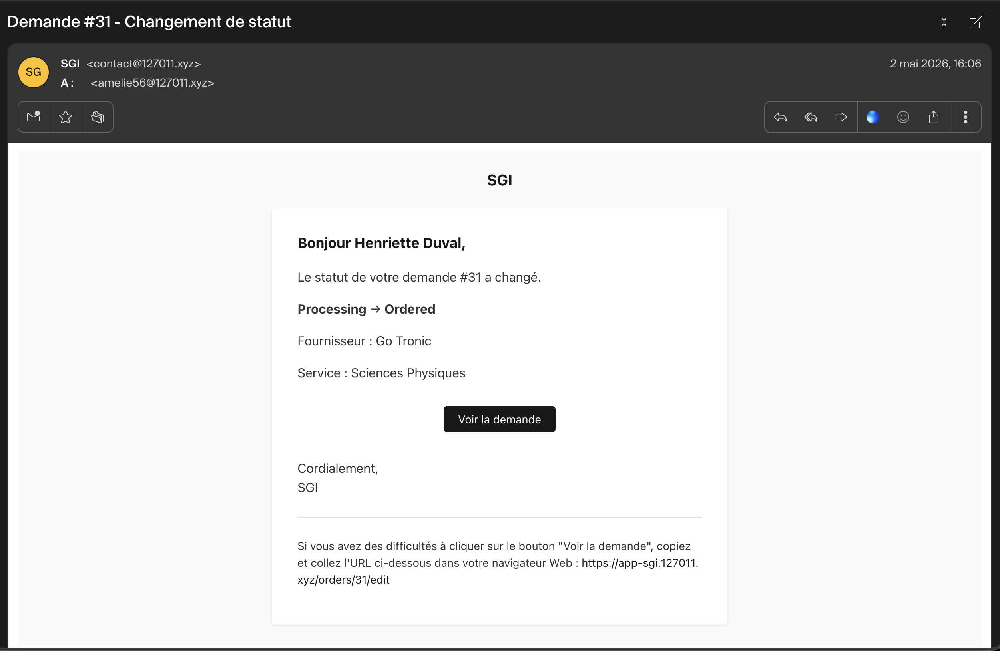
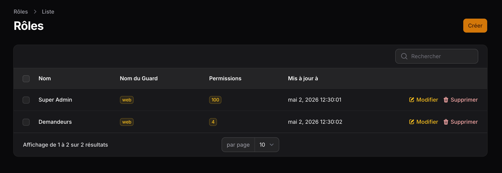
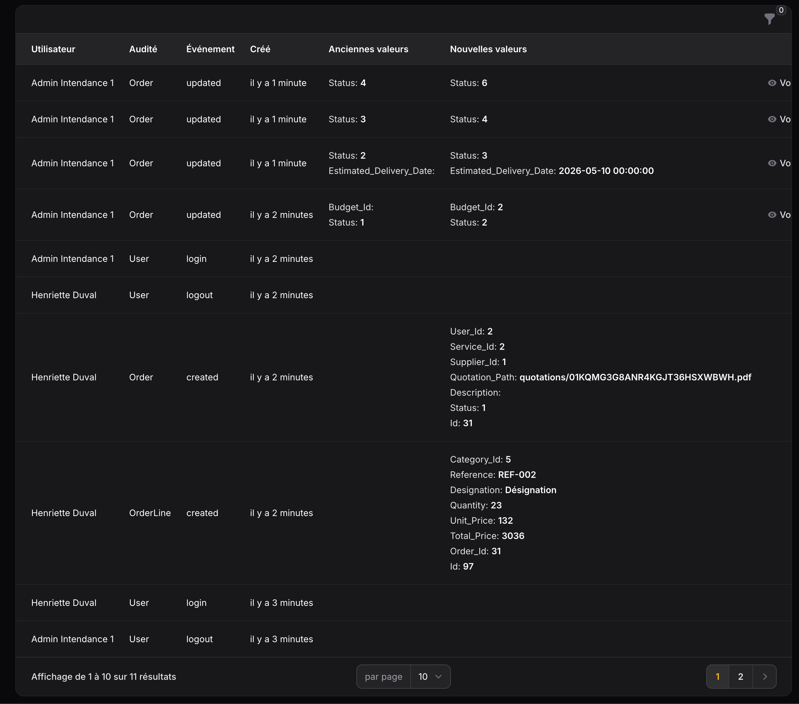

# Compte rendu détaillé

## 1. Contexte et organisation

| Élément | Détail |
| --- | --- |
| **Organisation support** | Lycée Corneille (La Celle-Saint-Cloud) |
| **Demandeur métier** | Service Intendance de l'établissement |
| **Équipe projet** | William Blondel, Luca Bonnin, Nicolas Ignacio |
| **Méthode** | Scrum, sprints de 1 à 2 semaines |
| **Période** | 22 janvier 2026 → 25 mars 2026 (5 sprints) |
| **Volumétrie** | 25 user stories, 63 tickets, 116 story points livrés |
| **Outils de suivi** | [Trello](https://trello.com/b/eIcnlMPs/application-sgi) + classeur [Gestion_Projet_App_SGI.xlsx](/documents/E6/Gestion_Projet_App_SGI.xlsx) |

### 1.1 Problématique métier

Le service Intendance reçoit l'ensemble des demandes opérationnelles de l'établissement (commandes de fournitures, sorties scolaires, réservations du théâtre, etc.) via des canaux hétérogènes : courrier papier, e-mail, ENT, appels téléphoniques. Cette dispersion entraîne :

- des **pertes d'information** (demandes égarées, allers-retours non tracés) ;
- des **délais de traitement importants** ;
- un **manque de traçabilité** (qui a demandé quoi, quand, à qui ?) ;
- l'**absence de priorisation** des demandes ;
- l'**absence de vision globale** de l'activité du service Intendance.

### 1.2 Cible fonctionnelle

À terme, l'application web SGI doit centraliser **trois fonctionnalités** (priorisées par l'équipe Intendance) :

1. **Demandes de commande de fournitures** — *livrée dans cette itération*.
2. Organisation des sorties scolaires.
3. Réservations du théâtre.

Le présent compte rendu porte exclusivement sur la **fonctionnalité 1**.

---

## 2. Étude préalable et choix techniques

L'étude détaillée (frameworks PHP, *admin panels*, plates-formes de déploiement) est consignée dans le document [Étude comparative et choix technologiques](https://github.com/LucaBONNIN/application-sgi/blob/master/.docs/Etude_Comparative_et_Choix_Technologiques.md).

| Couche | Choix retenu | Justification résumée |
| --- | --- | --- |
| Langage | **PHP 8.4** | Maîtrisé par l'équipe, écosystème mûr. |
| Framework backend | **Laravel 12** | Vitesse de développement, Eloquent, écosystème (Horizon, Auditing, Shield). |
| Framework UI | **Filament v5** | SDUI : pas de HTML/CSS/JS manuel. CRUDs, formulaires complexes, *role-aware*, gestion native du `Repeater` et de `FileUpload`. |
| SGBD | **PostgreSQL 16** | Rigueur sur les contraintes d'intégrité, types avancés. |
| File d'attente | **Redis** + **Laravel Horizon** | Notifications asynchrones (e-mails) sans bloquer les requêtes. |
| Messagerie locale | **Mailpit** | SMTP « trappe » pour visualiser les e-mails sans envoi réel. |
| Conteneurisation | **Spin Pro** (Docker) | Environnement homogène pour les 3 développeurs (`spin up`). |
| IDE | **PhpStorm + Laravel Idea** | Analyse statique, autocomplétion sur les facettes magiques de Laravel. |
| Versionnage | **Git + GitHub** | Branches par fonctionnalité, Pull Requests, revues croisées. |
| Formatage | **Laravel Pint** (PSR-12) | Style uniforme automatique avant chaque commit. |
| Tests | **PHPUnit 11** | Tests unitaires + features Filament/Livewire. |

L'environnement est documenté dans le document [Environnement de développement et architecture](https://github.com/LucaBONNIN/application-sgi/blob/master/.docs/Environnement_de_Developpement_et_Architecture.md).

---

## 3. Architecture de l'application

### 3.1 Modèle de données

7 tables métier (hors `users`, `cache`, `jobs`, `audits`, `permissions`, `vacation_periods`) :

| Table | Rôle | Relations principales |
| --- | --- | --- |
| `users` | Comptes nominatifs (demandeurs et administrateurs) | `belongsToMany services`, `hasMany orders` |
| `services` | Services / disciplines de l'établissement | `belongsToMany users`, `hasMany budgets`, `hasMany orders` |
| `service_user` | Pivot d'affectation utilisateur ↔ service | — |
| `budgets` | Budget annuel par service | `belongsTo service`, `hasMany orders` |
| `suppliers` | Fournisseurs (nom, SIRET, contact, URL) | `hasMany orders` |
| `categories` | Catégories de produits | `hasMany orderLines` |
| `orders` | Demande de commande | `belongsTo user`, `service`, `supplier`, `budget`, `hasMany lines`, statut typé `OrderStatus` |
| `order_lines` | Ligne de produit d'une commande | `belongsTo order`, `category` |
| `vacation_periods` | Périodes de vacances scolaires (Zone C) | utilisée par `OrderAgeCalculator` |
| `audits` | Trace de toutes les actions sensibles | `morphTo` |


*<p align="center">Figure 1 — Diagramme de classes des modèles Eloquent</p>*

### 3.2 Architecture applicative

L'application suit la structure standard Laravel 12 / Filament v5 :

```
app/
├── Enums/                  # OrderStatus (machine à états + contrats Filament)
├── Filament/App/Resources/ # Ressources Filament (Orders, Budgets, Categories, Services,
│                           #   Suppliers, Users, VacationPeriods, Audit) découpées en
│                           #   {Resource}, Schemas/, Tables/, Pages/, RelationManagers/
├── Listeners/              # Auditing des événements d'authentification
├── Models/                 # Modèles Eloquent + traits Auditable
├── Notifications/          # OrderCreated, OrderStatusChanged (ShouldQueue)
├── Policies/               # OrderPolicy, BudgetPolicy, VacationPeriodPolicy, ...
├── Providers/              # AppPanelProvider (Filament)
└── Services/               # OrderAgeCalculator (calcul jours ouvrés)
```


*<p align="center">Figure 2 — Diagramme de classes des ressources Filament</p>*

### 3.3 Patterns mis en œuvre

- **Server-Driven UI** : toute l'interface est définie en PHP (pas de HTML/CSS/JS manuel).
- **Machine à états** centralisée sur l'enum `OrderStatus` (`allowedTransitions`, `canTransitionTo`, `isTerminal`) : *source de vérité unique* pour les transitions.
- **Policies Laravel** appliquant les règles d'autorisation à chaque action métier (CRUD + transitions).
- **Form Requests / validation Filament** : règles de validation déclaratives (incluant la validation **conditionnelle** sur la présence du devis PDF).
- **Service Layer** isolant la logique métier complexe (`OrderAgeCalculator`).
- **Notifications queued** (`ShouldQueue`) traitées par Laravel Horizon.
- **Audit trail** automatique sur tous les modèles métier (`owen-it/laravel-auditing`).

---

## 4. Description fonctionnelle

### 4.1 Acteurs et rôles

| Acteur | Rôle Shield | Capacités principales |
| --- | --- | --- |
| **Demandeur** (professeur, personnel administratif) | `demandeurs` | Crée ses propres demandes de commande, suit leur statut, peut annuler tant que la demande est `Sent`, ne voit que ses propres commandes. |
| **Service Intendance** | `super_admin` | Vision globale (toutes les commandes, tous les utilisateurs), validation, transitions de statut, gestion du référentiel (services, budgets, fournisseurs, catégories, vacances scolaires). Permission `BypassOwnership:Order`. |

### 4.2 Cycle de vie d'une demande


*<p align="center">Figure 3 — Machine à états — Cycle de vie d'une demande de commande</p>*

Statuts terminaux : `Closed`, `Cancelled`. Toute tentative de transition invalide est rejetée par `OrderStatus::canTransitionTo()` **et** par la `OrderPolicy` (double sécurité).

### 4.3 Parcours « Création d'une demande »

1. Le demandeur ouvre l'écran **Nouvelle demande**.
2. Il sélectionne le **service** (filtré sur ses services d'affectation), le **fournisseur** (recherche), saisit une **description**.
3. Il **joint éventuellement un devis PDF** (10 Mo max). Si un devis est joint, **la référence et le prix unitaire deviennent obligatoires** sur chaque ligne.
4. Il ajoute les **lignes de produits** via le `Repeater` (catégorie, référence, désignation, quantité, prix unitaire). Le **total est calculé automatiquement**. Au moins une ligne est obligatoire ; les prix négatifs sont interdits.
5. À la création, `mutateFormDataBeforeCreate()` force `user_id` au demandeur courant et `status = Sent`.
6. `afterCreate()` déclenche la notification `OrderCreated` à tous les `super_admin`.


*<p align="center">Figure 4 — Formulaire de création de commande (vide)</p>*


*<p align="center">Figure 5 — Formulaire de création de commande avec devis PDF joint</p>*


*<p align="center">Figure 6 — Repeater des lignes de commande</p>*

### 4.4 Parcours « Traitement par l'Intendance »

1. L'administrateur reçoit l'e-mail `OrderCreated`.
2. Il ouvre la commande, clique sur l'action **« Mettre en traitement »** : une modale lui demande de sélectionner un **budget** parmi ceux du service de la commande. Le statut passe à `Processing` et `budget_id` est renseigné.
3. Il clique ensuite sur **« Marquer comme commandée »** : modale avec `DatePicker` pour la **date de livraison estimée**. Statut → `Ordered`.
4. À réception physique des produits, il clique sur **« Marquer comme reçue »** : statut → `Received`.
5. Une fois les produits remis au service demandeur, il clique sur **« Clôturer »** : statut → `Closed` (terminal).
6. À chaque transition, la notification `OrderStatusChanged` est envoyée au demandeur (ancien statut, nouveau statut, fournisseur, service, lien direct).


*<p align="center">Figure 7 — Liste des commandes (vue administrateur)</p>*


*<p align="center">Figure 8 — Liste des commandes (vue demandeur)</p>*


*<p align="center">Figure 9 — Page de modification d'une commande au statut "Envoyée" (vue administrateur)</p>*


*<p align="center">Figure 10 — Modale "Traiter" (processOrder) (vue administrateur)</p>*


*<p align="center">Figure 11 — Modale "Commander" (markOrdered) (vue administrateur)</p>*


*<p align="center">Figure 12 — Email OrderCreated envoyé aux administrateurs lors de la création d'une commande</p>*


*<p align="center">Figure 13 - Email OrderStatusChanged envoyé au demandeur lors d'une transition de statut</p>*

### 4.5 Règle métier de l'ancienneté

Le service `OrderAgeCalculator::calculateBusinessDays()` calcule le nombre de jours ouvrés entre deux dates en excluant :

- les **week-ends** (samedi, dimanche) ;
- les **périodes de vacances scolaires** (Zone C — Paris) chargées depuis la table `vacation_periods` via le `scopeOverlapping`.

L'ancienneté est affichée dans la table des commandes (suffixe « j »), `null` pour les statuts terminaux.

---

## 5. Sécurité et autorisations

- **Authentification** : Laravel native, MFA optionnel via Filament (l'intégration ENT est planifiée pour une itération ultérieure).
- **Autorisation** : RBAC fine via Filament Shield. Deux rôles : `super_admin` et `demandeurs`. Permissions granulaires par ressource et par action (`ViewAny:Order`, `View:Order`, `Update:Order`, `BypassOwnership:Order`, etc.).
- **Filtrage Eloquent** dans `OrderResource::getEloquentQuery()` : un demandeur ne peut récupérer que ses propres commandes. La restriction est appliquée au niveau de la requête, pas seulement à l'affichage.
- **Policies** : la `OrderPolicy` couvre les opérations CRUD **et** les transitions de statut (`processOrder`, `markOrdered`, `markReceived`, `closeOrder`, `cancelOrder`). La règle métier « un demandeur ne peut éditer sa commande qu'au statut `Sent` » est encodée à un seul endroit.
- **Audit** : tous les modèles implémentent `Auditable`, et les événements d'authentification (connexion et déconnexion) sont également audités via `Listeners/`.


*<p align="center">Figure 14 - Gestion des rôles (Filament Shield)</p>*


*<p align="center">Figure 15 - Gestion des permissions (Filament Shield)</p>*


*<p align="center">Figure 16 - Historique d'audit</p>*

---

## 6. Stratégie de test

Toutes les classes de test se trouvent dans le dossier `tests/`.

Les tests unitaires sont dans `tests/Unit/` et les tests fonctionnels sont dans `tests/Feature/`.

| Fichier | Tests | Couverture |
| --- | --- | --- |
| `Unit/OrderAgeCalculatorTest.php` | 9 | Jours ouvrés, week-ends exclus, vacances exclues, cas limites (`from >= to`, intervalle vide). |
| `Unit/OrderStatusTest.php` | 7 | Toutes les transitions valides et invalides, état terminal, état non terminal. |
| `Feature/DemoBannerTest.php` | 3 | Affichage de la bannière en mode démonstration et des identifiants de test. |
| `Feature/Filament/Budgets/CreateBudgetTest.php` | 4 | Création d'un budget, conversion euros vers centimes, validation de l'année. |
| `Feature/Filament/Budgets/EditBudgetTest.php` | 1 | Redirection après modification. |
| `Feature/Filament/Categories/CreateCategoryTest.php` | 7 | Création d'une catégorie, génération du slug automatique, redirection. |
| `Feature/Filament/Categories/EditCategoryTest.php` | 1 | Redirection après modification. |
| `Feature/Filament/Orders/CreateOrderTest.php` | 8 | Création d'une commande, auto-fill du `user_id`, statut `Sent` automatique, notification admin, validations conditionnelles, conversion euros -> centimes. |
| `Feature/Filament/Orders/ListOrdersTest.php` | 5 | Chargement de la page, vision admin / demandeur, filtres. |
| `Feature/Filament/Suppliers/SupplierResourceTest.php` | 4 | Chargement de la page, accès admin / demandeur, création d'un fournisseur. |
| `Feature/Notifications/OrderNotificationTest.php` | 6 | Contenu des e-mails, canaux, payload `toArray` pour `OrderCreated` et `OrderStatusChanged`. |
| `Feature/OrderPolicyTest.php` | 28 | CRUD admin/demandeur, `cancel`, `processOrder`, `markOrdered`, `markReceived`, `closeOrder`. |
| `Feature/ResetDemoCommandTest.php` | 1 | Suppression des fichiers uploadés lors de la réinitialisation de l'instance de démonstration. |

**Total : 84 tests, 217 assertions.**

Lancement : `spin run php artisan test`.

<script src="https://asciinema.org/a/ePUD6pDv0VOkqIWm.js" id="asciicast-ePUD6pDv0VOkqIWm" async="true"></script>
*<p align="center">Figure 17 - Sortie des tests PHPUnit</p>*

---

## 7. Internationalisation

L'interface est entièrement traduite en **français** et en **anglais** pour les ressources `Order` et `VacationPeriod` (labels, sections, actions, champs, descriptions). Les autres ressources héritent des traductions de base de Filament fournies par `laravel-lang/lang`.


*<p align="center">Figure 18 - Affichage des vacances scolaires</p>*

---

## 8. Planification et livraison

| Sprint | Période | Objectif | Pts | Tickets |
| :---: | --- | --- | :---: | :---: |
| **0** - Cadrage | 22/01 → 28/01/2026 | Choix techno, environnement Spin Pro, projet Laravel vierge | 15 | 6 |
| **1** - Fondation | 29/01 → 11/02/2026 | Migrations, modèles, enum `OrderStatus`, factories, Shield | 23 | 16 |
| **2** - CRUD & formulaire | 12/02 → 25/02/2026 | Ressources Filament, formulaire role-aware, upload PDF, repeater, policies | 29 | 14 |
| **3** - Workflow & métier | 26/02 → 11/03/2026 | Machine à états, actions de transition, vacances scolaires, calculateur d'ancienneté | 30 | 15 |
| **4** - Notifications, i18n & tests | 12/03 → 25/03/2026 | Notifications queued, traductions FR/EN, suite PHPUnit complète | 19 | 12 |
| **Total** | | | **116** | **63** |

### Charge par développeur

| Développeur | Story points | Part |
| --- | :---: | :---: |
| William Blondel | 51 | 44 % |
| Luca Bonnin | 33 | 28 % |
| Nicolas Ignacio | 32 | 28 % |
| **Total** | **116** | **100 %** |


*<p align="center">Figure 19 - Board Trello du projet</p>*

---

## 9. Bilan

### 9.1 Compétences mobilisées (référentiel BTS SIO)

#### 9.1.1 Bloc 2 — Conception et développement d'applications (E6 SLAM)

| Compétence | Comment elle a été mobilisée dans ce projet |
|---|---|
| **Analyser un besoin exprimé et son contexte juridique** | Entretiens avec le service Intendance, formalisation du besoin en user stories sur Trello, prise en compte de la traçabilité (audit `owen-it/laravel-auditing` sur tous les modèles métier et sur les événements d'authentification) et du RGPD (comptes nominatifs, finalité limitée aux demandes de fournitures, suppression des fichiers uploadés à la réinitialisation de l'instance de démonstration). |
| **Participer à la conception de l'architecture d'une solution applicative** | Choix de la stack (Laravel 12 + Filament v5 + PostgreSQL 16 + Redis + Horizon) motivés dans l'[étude comparative](https://github.com/LucaBONNIN/application-sgi/blob/master/.docs/Etude_Comparative_et_Choix_Technologiques.md), découpage en couches (`Filament/App/Resources/`, `Models/`, `Policies/`, `Services/`, `Notifications/`, `Listeners/`, `Enums/`), machine à états centralisée sur l'enum `OrderStatus` comme source de vérité unique. |
| **Modéliser une solution applicative** | MCD à 7 tables métier, diagramme de classes des modèles Eloquent (figure 1), diagramme de classes des ressources Filament (figure 2), machine à états du cycle de vie d'une demande (figure 3). |
| **Exploiter les ressources d'un cadre applicatif (framework)** | Eloquent ORM, Form Requests, Policies, Notifications `ShouldQueue` traitées par Laravel Horizon, Auditing automatique, Filament v5 en *Server-Driven UI*, Filament Shield pour le RBAC, Livewire pour la réactivité côté serveur. |
| **Identifier, développer, utiliser ou adapter des composants logiciels** | Composants Filament tiers réutilisés et configurés (`Repeater`, `FileUpload`, `Action`, `RelationManager`), composants maison (`OrderAgeCalculator`, enum `OrderStatus` portant les transitions, `LinesRelationManager` *role-aware*), bibliothèques tierces intégrées (`owen-it/laravel-auditing`, `bezhansalleh/filament-shield`, `laravel-lang/lang`). |
| **Exploiter les technologies Web pour mettre en œuvre les échanges entre applications, y compris de mobilité** | Application web responsive accessible depuis mobile, échanges HTTP/Livewire (réactivité sans rechargement complet), notifications transactionnelles par e-mail via SMTP (Mailpit en dev), upload HTTP de fichiers PDF (10 Mo max), authentification web Laravel sur sessions. |
| **Utiliser des composants d'accès aux données** | Eloquent ORM, relations typées (`belongsTo`, `hasMany`, `belongsToMany`, `morphTo`), scopes nommés (`scopeOverlapping` pour les vacances scolaires), évitement des N+1 par eager loading, factories et seeders pour le jeu de développement et les tests. |
| **Intégrer en continu les versions d'une solution applicative** | Git + GitHub, branches par fonctionnalité, Pull Requests, revues croisées entre les trois développeurs, Laravel Pint (PSR-12) avant chaque commit, environnement reproductible Docker via Spin Pro (`spin up`). |
| **Réaliser les tests nécessaires à la validation ou à la mise en production** | **84 tests PHPUnit / 217 assertions** couvrant les chemins nominaux, les cas d'erreur et les cas limites : `OrderAgeCalculatorTest`, `OrderStatusTest`, `OrderPolicyTest`, `CreateOrderTest`, `OrderNotificationTest`, `DemoBannerTest`, `ResetDemoCommandTest` (cf. tableau en section 6). |
| **Rédiger des documentations technique et d'utilisation** | [Étude comparative et choix technologiques](https://github.com/LucaBONNIN/application-sgi/blob/master/.docs/Etude_Comparative_et_Choix_Technologiques.md), [Environnement de développement et architecture](https://github.com/LucaBONNIN/application-sgi/blob/master/.docs/Environnement_de_Developpement_et_Architecture.md), fiche descriptive [Annexe VII-1-B](/documents/E6/BLONDEL_WILLIAM_ANNEXE_VII-1-B_R2.pdf), ce compte rendu, diagrammes de classes versionnés dans `.docs/`. |
| **Exploiter les fonctionnalités d'un environnement de développement et de tests** | PhpStorm + Laravel Idea (analyse statique, autocomplétion sur les facettes magiques), Spin Pro (Docker), Mailpit (SMTP de test), Laravel Horizon (supervision des queues), Laravel Boost MCP, Xdebug. |
| **Évaluer la qualité d'une solution applicative** | Laravel Pint (PSR-12) appliqué automatiquement avant chaque commit, suite de **84 tests PHPUnit / 217 assertions** exécutée localement, revues croisées en Pull Request entre les trois développeurs, surveillance des requêtes N+1 et des temps de réponse en mode développement. |
| **Analyser et corriger un dysfonctionnement** | Reproduction du bug en local sous Spin Pro, diagnostic à partir des logs Laravel et de la table `audits`, correction et ajout d'un test de non-régression. Exemples concrets : validation conditionnelle dans le `Repeater` (champs obligatoires si un devis PDF est joint) corrigée après revue ; règle « un demandeur ne peut éditer sa commande qu'au statut `Sent` » centralisée dans la `OrderPolicy` après détection d'une duplication. |
| **Mettre à jour des documentations technique et d'utilisation** | Mise à jour des diagrammes de classes après chaque sprint structurant (ajout des modèles, ajout de la machine à états), mise à jour de l'étude comparative au fil des choix techniques, mise à jour des traductions FR/EN à chaque ajout de champ dans une ressource Filament. |
| **Élaborer et réaliser les tests des éléments mis à jour** | À chaque évolution majeure, ajout des tests dédiés : `OrderAgeCalculatorTest` lors de l'introduction du calcul d'ancienneté, `OrderStatusTest` et `OrderPolicyTest` lors de l'ajout des transitions de statut, `OrderNotificationTest` lors du branchement des notifications par e-mail, `ResetDemoCommandTest` lors de la mise en place de la commande de réinitialisation de l'instance de démonstration. |
| **Exploiter des données à l'aide d'un langage de requêtes** | Requêtes Eloquent typées, scopes nommés (`scopeOverlapping`), filtrage *Eloquent* dans `OrderResource::getEloquentQuery()` (un demandeur ne récupère que ses propres commandes au niveau requête), requêtes SQL sous-jacentes inspectables, conversion automatique euros ↔ centimes pour les colonnes monétaires. |
| **Développer des fonctionnalités applicatives au sein d'un système de gestion de base de données (relationnel ou non)** | Contraintes d'intégrité PostgreSQL déclarées dans les migrations (clés étrangères avec `cascadeOnDelete`, `unique`, `notNullable`), traçabilité via la table `audits` (polymorphique, écrite automatiquement à chaque changement), table pivot `service_user` pour la relation many-to-many, types ENUM côté Laravel adossés à des contraintes `string` côté SGBD. |
| **Concevoir ou adapter une base de données** | Modèle relationnel à 7 tables métier (figure 1), choix des relations et des cardinalités, conception de la table pivot `service_user`, conception de la table `vacation_periods` pour les vacances scolaires (Zone C), évolution incrémentale du schéma sprint après sprint via les migrations Laravel. |
| **Administrer et déployer une base de données** | Migrations versionnées (`php artisan migrate`), rollbacks (`php artisan migrate:rollback`), seeders pour le jeu de démonstration et les tests, persistance dans un volume Docker dédié, environnement PostgreSQL provisionné automatiquement par Spin Pro, commande `app:reset-demo` pour réinitialiser l'instance de démonstration entre deux passages. |

#### 9.1.2 Bloc 1 — Support et mise à disposition de services informatiques (E5)

Ce projet contribue également à la couverture du référentiel E5. Le tableau ci-dessous liste les sous-compétences que cette réalisation permet de démontrer ; les autres sont prises en charge par d'autres pièces du portfolio.

| Compétence | Comment elle a été mobilisée dans ce projet |
|---|---|
| **Exploiter des référentiels, normes et standards** | PSR-12 appliqué automatiquement par Laravel Pint avant chaque commit, RGPD (comptes nominatifs, finalité limitée aux demandes de fournitures, suppression effective des fichiers uploadés à la réinitialisation de l'instance de démonstration), conventions Filament v5, conventions Eloquent / Laravel. |
| **Mettre en place et vérifier les niveaux d'habilitation associés à un service** | RBAC fine via **Filament Shield** : deux rôles (`super_admin`, `demandeurs`) et permissions granulaires par ressource et par action (`ViewAny:Order`, `Update:Order`, `BypassOwnership:Order`, etc.). Restriction au niveau requête dans `OrderResource::getEloquentQuery()` (un demandeur ne peut récupérer que ses propres commandes). Policies Laravel couvrant le CRUD **et** les transitions de statut (cf. section 5). |
| **Vérifier le respect des règles d'utilisation des ressources numériques** | Audit automatique de toutes les actions sensibles via `owen-it/laravel-auditing` (modèles métier + événements de connexion / déconnexion via `Listeners/`), filtrage Eloquent au niveau de la requête, validation conditionnelle (présence d'un devis PDF → champs obligatoires sur les lignes), trace utilisateur/IP/horodatage par enregistrement (table `audits`). |
| **Collecter, suivre et orienter des demandes** | **Cœur fonctionnel du projet** : SGI centralise les demandes de fournitures émanant des services de l'établissement, les oriente vers le service Intendance via une notification e-mail (`OrderCreated`) et un workflow `Sent → Processing → Ordered → Received → Closed`, avec notifications systématiques (`OrderStatusChanged`) au demandeur à chaque transition de statut. |
| **Traiter des demandes concernant les applications** | Application web qui industrialise le traitement des demandes métier (commandes de fournitures), avec actions explicites (« Mettre en traitement », « Marquer comme commandée », « Marquer comme reçue », « Clôturer »), trace d'audit complète, validation forte côté serveur, et e-mails transactionnels avec lien direct vers la commande. |
| **Participer à l'évolution d'un site Web exploitant les données de l'organisation** | Application web Laravel/Filament responsive, exploitant les données de référence du lycée (services, budgets, fournisseurs, catégories, vacances scolaires Zone C) et les enrichissant des données métier (commandes, lignes, audits). Cycle d'évolution incrémental sur 5 sprints. |
| **Analyser les objectifs et les modalités d'organisation d'un projet** | Section 1 du présent rapport : contexte, problématique métier (dispersion des demandes, perte d'information, absence de traçabilité), cible fonctionnelle priorisée avec l'équipe Intendance, méthode Scrum avec sprints courts (1 à 2 semaines). |
| **Planifier les activités** | **5 sprints datés** (22 janvier → 25 mars 2026) avec un objectif clair par sprint (cf. section 8), board [Trello](https://trello.com/b/eIcnlMPs/application-sgi) pour le backlog et le suivi quotidien, classeur [Gestion_Projet_App_SGI.xlsx](/documents/E6/Gestion_Projet_App_SGI.xlsx) pour la planification globale. |
| **Évaluer les indicateurs de suivi d'un projet et analyser les écarts** | **Vélocité par sprint** (15 → 23 → 29 → 30 → 19 SP livrés sur 5 sprints), **charge par développeur** (William 51 SP / 44 %, Luca 33 SP / 28 %, Nicolas 32 SP / 28 %), **63 tickets** sur **116 SP** suivis dans le classeur Excel et sur Trello. |
| **Réaliser les tests d'intégration et d'acceptation d'un service** | **84 tests PHPUnit / 217 assertions** dont des tests d'intégration Filament (`livewire()` helper) sur les ressources `Order`, `Budget`, `Category`, `Supplier`, tests de notifications, tests de policies (28 tests sur la seule `OrderPolicy`), tests d'acceptation via le mode démonstration et la commande `app:reset-demo`. |
| **Déployer un service** | Environnement reproductible **Spin Pro** (Docker) : `spin up` provisionne en une commande l'application + PostgreSQL + Redis + Mailpit + Horizon. Migrations versionnées, seeders pour le jeu de démonstration, commande `app:reset-demo` pour repartir d'un état propre. *(Le déploiement final sur l'infrastructure du lycée est traité dans le projet portfolio dédié* Déploiement de l'application SGI sur Windows Server 2025*.)* |
| **Accompagner les utilisateurs dans la mise en place d'un service** | Interface entièrement traduite **français/anglais**, descriptions et libellés explicites sur chaque ressource Filament, machine à états explicite (chaque action métier a un libellé clair et une icône), e-mails transactionnels avec lien direct, [README](https://github.com/LucaBONNIN/application-sgi) du dépôt et documentation `.docs/` (étude comparative, environnement de développement). La phase de prise en main par le service Intendance est planifiée dans la suite du projet. |

### 9.2 Difficultés rencontrées

- **Validation conditionnelle dans Filament** (champs obligatoires si un devis PDF est joint) : nécessité d'utiliser `Get $get` à l'intérieur du `Repeater` et de bien comprendre le cycle de vie réactif des composants Livewire.
- **Restriction de l'édition selon le statut et le rôle** dans le `LinesRelationManager` : encoder la règle « demandeur si `Sent`, admin toujours » sans dupliquer la logique de la `OrderPolicy`.
- **Tests d'intégration Filament** : prise en main du *testing helper* `livewire()` et de la création d'utilisateurs avec les bons rôles Shield via factories.
- **Calcul des jours ouvrés** : isolation de la logique en service pour pouvoir la tester unitairement sans dépendre de l'écosystème Filament.

### 9.3 Apports personnels

- Mise en place de la **machine à états centralisée** sur l'enum (et non dupliquée dans la policy ou le contrôleur), choix qui s'est révélé payant pour les tests.
- Conception du **formulaire role-aware** qui élimine le besoin d'avoir deux écrans distincts pour le demandeur et l'administrateur.
- **Validation conditionnelle** sur la présence du devis : règle métier exprimée déclarativement.
- **Suite de tests** garantissant la non-régression sur les transitions de statut et les permissions.

### 9.4 Limites et perspectives

- L'authentification ENT n'est pas encore branchée (nécessite l'accès au connecteur de l'établissement).
- La fonctionnalité « Sorties scolaires » et « Réservations du théâtre » seront traitées dans des itérations ultérieures.
- La mise en production sur l'infrastructure du lycée reste à planifier avec le service informatique.

---

## 10. Annexes documentaires

| Document | Localisation | Contenu |
| --- | --- | --- |
| Étude comparative et choix technologiques | [Lien](https://github.com/LucaBONNIN/application-sgi/blob/master/.docs/Etude_Comparative_et_Choix_Technologiques.md)| Comparaison des stacks, justification de Laravel + Filament. |
| Environnement de développement & architecture | [Lien](https://github.com/LucaBONNIN/application-sgi/blob/master/.docs/Environnement_de_Developpement_et_Architecture.md) | Spin Pro, PhpStorm, Git, qualité de code. |
| Diagramme de classes des modèles Eloquent | [Lien](https://raw.githubusercontent.com/LucaBONNIN/application-sgi/refs/heads/master/.docs/models_class_diagram.png) | Vue ER de la base de données. |
| Diagramme de classes des ressources Filament | [Lien](https://raw.githubusercontent.com/LucaBONNIN/application-sgi/refs/heads/master/.docs/filament_class_diagram.svg) | Découpage des ressources Filament. |
| Plan des sprints, user stories, tickets, vélocité | [Lien](/documents/E6/Gestion_Projet_App_SGI.xlsx) | Suivi détaillé du backlog et de la charge. |
| Fiche descriptive (Annexe VII-1-B) | [Lien](/documents/E6/BLONDEL_WILLIAM_ANNEXE_VII-1-B_R2.pdf) | Recto / Verso de la fiche officielle. |
