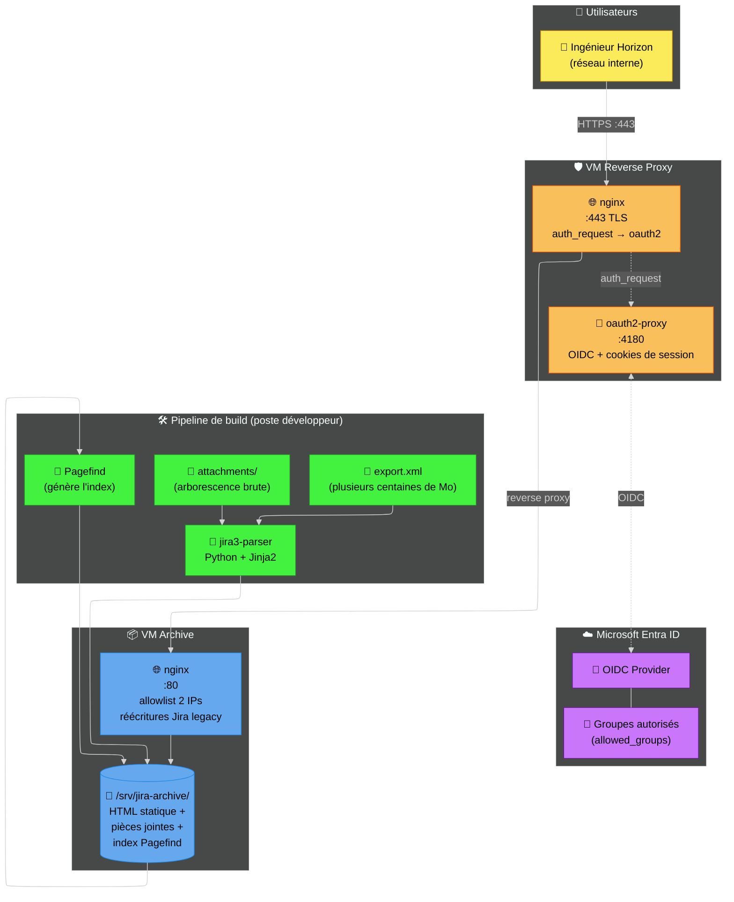
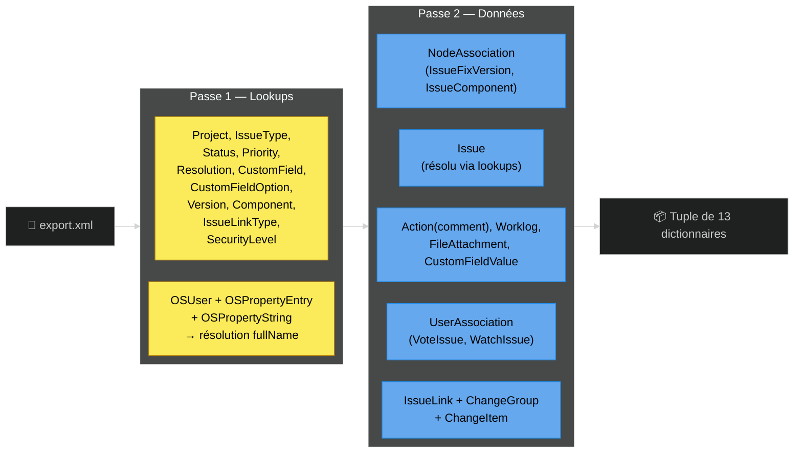
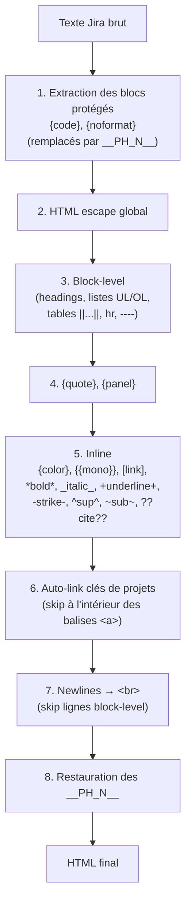
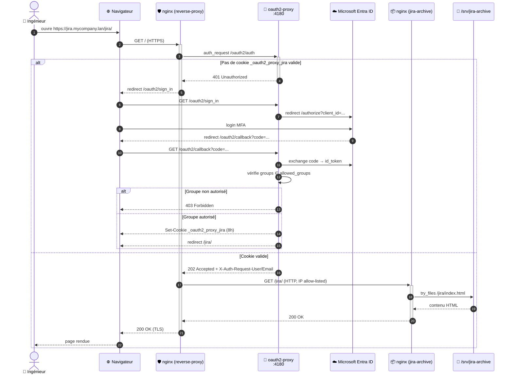
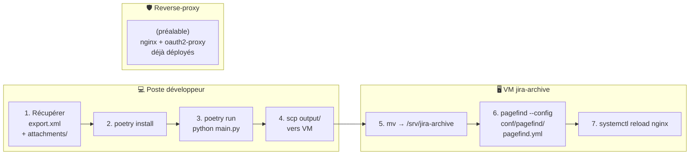

# Compte rendu détaillé

## 1. Contexte de l'entreprise et du projet

### 1.1 L'organisation : Horizon Trading Solutions

Horizon Trading Solutionsest un éditeur de logiciels de trading professionnels destinés aux institutions financières. Avant la migration vers **Jira Cloud**, l'historique de l'entreprise (tickets, développements, incidents, *release notes*) était géré dans une **instance Jira 3.13** auto-hébergée sur un serveur on-premise. Cette instance, vieillissante, contient plusieurs **dizaines de milliers de tickets** répartis sur plusieurs projets, ainsi que des milliers de **pièces jointes** (images, PDF, archives, exports Excel, etc.).

### 1.2 Le besoin

Maintenir cette instance opérationnelle représentait un coût et un risque grandissants :

- **Coût d'exploitation** : Java 8, base MySQL legacy, serveur d'application Tomcat, sauvegardes, supervision.
- **Risque de sécurité** : version Jira 3.13 [sortie en 2008](https://endoflife.date/jira-software), plus aucune mise à jour de sécurité, JVM ancienne.
- **Adhérence faible** : seules quelques personnes consultaient encore l'historique, principalement pour retrouver le contexte d'anciens tickets.

L'objectif fixé par mon tuteur d'entreprise a donc été de **conserver l'intégralité de l'historique en lecture seule**, sans plus jamais avoir à exécuter le serveur Jira lui-même :

> *Nous voulons garder l'accès à l'historique des tickets et des pièces jointes pour les ingénieurs qui en ont besoin, mais nous ne voulons plus exécuter Jira Server. Une archive statique HTML, indexée et sécurisée, est suffisante.*

### 1.3 Existant et ressources fournies

| Ressource | Détail |
|---|---|
| **Export XML Jira** | Export complet produit par Jira (`Administration → System → Backup`). Plusieurs centaines de Mo. |
| **Dossier `attachments/`** | Arborescence brute des pièces jointes (`<projet>/<clé-ticket>/<id>` ou `<id>_<filename>`) totalisant plusieurs Go. |
| **Aucun code existant** | Le projet a été initialisé de zéro. |
| **Infrastructure et moyens** | Hyperviseur ESXi, permettant la création de VM. |
| **Réseau interne** | Réseau privé `mycompany.lan` |
| **Annuaire** | Microsoft Entra ID |

### 1.4 Résultat attendu

- **Archive statique** : un dossier HTML/CSS/images/pièces jointes consultable depuis n'importe quel serveur web sans aucun *backend* applicatif.
- **Recherche full-text** : pour qu'un ingénieur puisse retrouver un ticket par mots-clés (résumé, description, commentaires, code-source dans les commentaires…).
- **Authentification** : aucun document interne ne doit être accessible sans authentification d'entreprise (SSO).
- **Habilitation par groupe** : seuls les membres de groupes Entra ID définis (les anciens utilisateurs Jira) peuvent y accéder.
- **HTTPS** + certificat de l'autorité interne de l'entreprise.
- **URLs préservées** : les anciens *deep-links* (`/jira/browse/PROJ-123`, `ViewIssue.jspa?key=...`, `ReleaseNote.jspa?...`) doivent continuer à fonctionner pour ne pas casser les références éparpillées dans la documentation interne.

---

## 2. Vue d'ensemble de la solution



La solution comporte donc **trois grands pans** :

1. **Un *parser* Python** qui transforme l'export XML Jira et le dossier de pièces jointes en site web statique HTML.
2. **Un index Pagefind** généré une fois après chaque build pour offrir la recherche full-text.
3. **Une infrastructure de mise à disposition sécurisée** : un serveur back-end (nginx) qui sert l'archive, et un reverse-proxy en front (nginx + oauth2-proxy) qui force l'authentification SSO et la terminaison TLS.

---

## 3. Le parser : transformation XML → HTML statique

### 3.1 Architecture du module Python

Le projet est packagé avec **Poetry** et structuré ainsi :

```
jira3-parser/
├── main.py                 ← point d'entrée (délègue à cli.py)
├── jira_parser/
│   ├── cli.py              ← arguments CLI (--issue, --index-only)
│   ├── config.py           ← chemins (input/, output/, templates/)
│   ├── parser.py           ← parseur XML streaming (2 passes)
│   ├── markup.py           ← convertisseur Jira wiki markup → HTML
│   ├── renderer.py         ← rendu Jinja2 + copie des pièces jointes
│   └── utils.py            ← format_time, setup_directories
├── templates/              ← 7 gabarits Jinja2
│   ├── base.jinja2
│   ├── master_index.jinja2
│   ├── project_hub.jinja2
│   ├── issue.jinja2
│   ├── component.jinja2
│   ├── fix_version.jinja2
│   └── release_notes.jinja2
├── conf/
│   ├── nginx/              ← jira.conf, testlocal.conf
│   └── pagefind/pagefind.yml
├── docker/compose.yml      ← prévisualisation locale
├── tests/                  ← suite pytest
└── pyproject.toml
```

### 3.2 Parseur XML : streaming en 2 passes

L'export Jira est une **archive XML monolithique** au format `entity-engine-xml`. Sa taille (plusieurs centaines de Mo) interdit un simple `ElementTree.parse()` qui chargerait tout en mémoire, consommant beaucoup de RAM et rendant le travail long voire impossible sur la machine de build.

La fonction `parse_jira_xml()` utilise donc `ET.iterparse(events=("start", "end"))` et appelle `elem.clear()` + `root.clear()` après chaque élément traité.

Le parsing se fait en **deux passes** sur le même fichier :



Cette stratégie présente trois avantages :

| Avantage | Détail |
|---|---|
| **Mémoire bornée** | À tout instant, un seul élément XML est chargé. Les lookups occupent une fraction de la RAM totale. |
| **Indépendance des passes** | Pendant la passe 2, les `Issue` sont traduits en clair (statuts, priorités, types) grâce aux lookups produits en passe 1. |
| **Robustesse** | Le parseur tolère les exports incomplets : `lookups[...].get(id, "Unknown")` partout. |

#### Cas particulier : la résolution `fullName` des utilisateurs

Jira 3.13 stocke le nom complet d'un utilisateur dans une table générique de propriétés (`OSPropertyEntry` + `OSPropertyString`) plutôt que directement sur `OSUser`. La résolution nécessite donc trois étapes :

1. `OSUser id="42" name="jdoe"` → `_osuser_name_by_id["42"] = "jdoe"`.
2. `OSPropertyEntry entityName="OSUser" entityId="42" propertyKey="fullName" id="999"` → `_fullname_entry_by_userid["42"] = "999"`.
3. `OSPropertyString id="999" value="John Doe"` → `_fullname_by_entry_id["999"] = "John Doe"`.

À la fin de la passe 1, on joint les trois dictionnaires pour produire le mapping final `lookups["users"]["jdoe"] = "John Doe"`. Cela permet de remplacer partout `assignee="jdoe"` par `John Doe` dans le rendu HTML, sans laisser apparaître les *usernames* techniques.

### 3.3 Rendu HTML avec Jinja2

Le module `renderer.py` parcourt les structures produites par le parseur et délègue le rendu à **sept gabarits Jinja2** héritant tous d'un `base.jinja2`. Chaque ticket produit un fichier `output/jira/browse/<KEY>/index.html` (ce qui permet à nginx de servir des URLs propres avec `index index.html;`).

Les pages générées sont :

| Page | URL | Gabarit |
|---|---|---|
| Master Index | /jira/index.html | `master_index.jinja2` |
| Project Hub | /jira/browse/<KEY>/index.html | `project_hub.jinja2` |
| Ticket | /jira/browse/<KEY-NNN>/index.html | `issue.jinja2` |
| Component | /jira/browse/<KEY>/component/<id>/index.html | `component.jinja2` |
| Fix Version | /jira/browse/<KEY>/fixforversion/<id>/index.html | `fix_version.jinja2` |
| Release Notes | /jira/secure/ReleaseNote.jspa@projectId=...&styleName=Html&version=....htm | `release_notes.jinja2` |

L'arobase (`@`) dans le nom de fichier des Release Notes est intentionnel : il **encode l'URL Jira originale** (`?projectId=...&styleName=...&version=...`) dans un nom de fichier compatible avec un système de fichiers, puis nginx réécrit dynamiquement l'URL d'entrée vers ce fichier (cf. § 4.4).

#### Auto-linkage des clés de tickets

Les commentaires et descriptions Jira contiennent souvent des références à d'autres tickets sous la forme `PROJ-123`. Le rendu construit une regex à partir des clés de projets connues :

```python
project_key_pattern = re.compile(
    rf"\b((?:{'|'.join(re.escape(k) for k in project_keys)})-\d+)\b"
)
```

et cette regex est appliquée par `format_jira_markup()` à toutes les zones de texte libre, en **sautant l'intérieur des balises HTML** déjà générées (cf. `markup.py` étape 6) pour ne pas casser les liens existants.

#### Gestion des pièces jointes

L'export Jira indique pour chaque `FileAttachment` un `id` numérique et un `filename`. Le dossier brut de pièces jointes peut respecter plusieurs conventions selon l'historique de l'instance (par projet *key*, par projet *name*, fichier nommé par `id` seul, ou `id_filename`, etc.). Le rendu **sonde dans cet ordre les six emplacements possibles** :

```python
possible_paths = [
    os.path.join(ATTACHMENTS_RAW_DIR, project_key, key, att_id),
    os.path.join(ATTACHMENTS_RAW_DIR, project_name, key, att_id),
    os.path.join(ATTACHMENTS_RAW_DIR, project_key, key, filename_str),
    os.path.join(ATTACHMENTS_RAW_DIR, project_name, key, filename_str),
    os.path.join(ATTACHMENTS_RAW_DIR, project_key, key, f"{att_id}_{filename_str}"),
    os.path.join(ATTACHMENTS_RAW_DIR, project_name, key, f"{att_id}_{filename_str}"),
]
```

Le premier qui existe est copié dans `output/jira/secure/attachment/<id>/<filename>` (la même hiérarchie que celle utilisée par Jira Server, ce qui préserve les *deep-links*). Les pièces manquantes sont signalées dans le HTML par `❌ <filename> (Missing)` plutôt que de produire des liens 404.

### 3.4 Conversion du wiki markup Jira

Jira 3.13 utilise son propre langage de balisage (différent de Markdown). Le module `markup.py` implémente un **convertisseur en 8 étapes** qui couvre toutes les constructions rencontrées dans l'historique :



Deux choix sont importants :

- **Échappement HTML systématique avant tout traitement** : les contenus utilisateur (descriptions, commentaires) sont d'abord HTML-échappés pour neutraliser tout HTML/XSS injecté dans Jira historique, *puis* la conversion ajoute uniquement les balises strictement contrôlées par le convertisseur.
- **Protection des blocs `{code}`** par des *placeholders* `__PH_N__` avant l'échappement, puis restauration en fin de pipeline pour que le contenu de code soit échappé une seule fois et non altéré par les autres règles de markup.

### 3.5 Intégration de Pagefind

L'archive est purement statique : il n'y a pas de moteur de recherche serveur. **[Pagefind](https://pagefind.app/)** indexe l'ensemble des fichiers HTML générés et publie un script JavaScript + WebAssembly + des *fragments* d'index. Le script est embarqué dans `master_index.jinja2` :

```html
<link href="/jira/pagefind/pagefind-ui.css" rel="stylesheet">
<script src="/jira/pagefind/pagefind-ui.js"></script>
...
<div id="search"></div>
<script>
  new PagefindUI({ element: "#search", showSubResults: true });
</script>
```

La configuration `conf/pagefind/pagefind.yml` cible **uniquement** les pages de contenu (et exclut le dossier `attachment/` qui contiendrait des PDF/images binaires) :

```yaml
site: "/srv/jira-archive"
glob: "{jira/browse/**/*.{html,htm},jira/secure/*.{html,htm},jira/*.{html,htm}}"
```

**⚠️ Coût de l'indexation :** sur l'archive complète, la génération de l'index Pagefind requiert **jusqu'à 32 Go** de mémoire (RAM + swap). Cette contrainte est documentée dans le `README.md` et a influencé le choix de générer l'index **sur la VM finale** plutôt que sur le poste de développement (la VM a été temporairement dimensionnée en conséquence avec un fichier d'échange large).

### 3.6 Tests

La suite **pytest** (`tests/`) couvre les quatre modules métier (`parser`, `renderer`, `markup`, `utils`). Les fixtures de `conftest.py` permettent de :

- générer dynamiquement des fragments XML Jira via `make_xml(...)` ;
- fournir un jeu de *lookups* minimal et un jeu de données parsées minimal pour tester le rendu en isolation ;
- rediriger les chemins du *renderer* vers `tmp_path` (`patched_renderer`) pour ne jamais polluer le dossier `output/` réel pendant les tests.

---

## 4. Mise à disposition : infrastructure et sécurité

### 4.1 Architecture en deux serveurs

L'archive est servie par **deux VMs distinctes**, ce qui permet de séparer clairement les responsabilités :

| VM | Rôle |
|---|---|
| **`jira-archive`** *(Ubuntu 24.04 LTS, créée pour l'occasion)* | Sert le contenu statique en HTTP en clair, nginx + 2 règles `allow` IP. |
| **`nginx1`** *(reverse-proxy mutualisé existant)* | Terminaison TLS, authentification Entra ID via `oauth2-proxy`, reverse-proxy vers la VM d'archive. |

Le diagramme de séquence d'un accès s'établit ainsi :



### 4.2 Configuration du reverse-proxy

Le reverse-proxy `/etc/nginx/sites-available/jira.conf` enchaîne **trois `server` blocks logiques** :

1. **Redirection HTTP → HTTPS** (port 80 → 301 vers HTTPS).
2. **Endpoints `/oauth2/*`** proxyfiés vers `127.0.0.1:4180` (oauth2-proxy). L'endpoint `/oauth2/auth` reçoit en plus `proxy_pass_request_body off` et `Content-Length ""` car il s'agit d'une simple vérification de cookie (pas de relai du corps de requête).
3. **Block principal `location /`** :
   - `auth_request /oauth2/auth;` — délègue l'authentification à oauth2-proxy avant chaque requête ;
   - `error_page 401 = /oauth2/sign_in;` — redirige vers le login en cas d'échec ;
   - `auth_request_set $user $upstream_http_x_auth_request_user;` — récupère l'utilisateur authentifié et le passe en en-tête `X-User` au backend (utile pour les logs d'audit) ;
   - `proxy_pass http://jira-archive.mycompany.lan;` — relai vers la VM d'archive.

Les `proxy_buffer_size 128k; proxy_buffers 4 256k;` ainsi que `large_client_header_buffers 4 16k;` ont été dimensionnés pour absorber les **gros cookies de session** Microsoft Entra ID (les *id tokens* JWT contenant la liste des `groups` de l'utilisateur peuvent dépasser plusieurs kilooctets).

### 4.3 Configuration d'`oauth2-proxy`

Le fichier `/etc/oauth2-proxy/oauth2-proxy.cfg` retient les choix suivants :

| Paramètre | Valeur | Justification |
|---|---|---|
| `provider` | OpenID Connect générique | Microsoft Entra ID est un IdP OIDC standard — pas besoin du *provider* `azure` (qui est plus restrictif et déconseillé par les *maintainers*). |
| `oidc_issuer_url` | `https://login.microsoftonline.com/...` | Permet à oauth2-proxy de **récupérer dynamiquement** la configuration OIDC (endpoints, JWKS) via `/.well-known/openid-configuration`. |
| `client_id` / `client_secret_file` | Application Entra ID enregistrée pour l'archive | Le secret est lu depuis un **fichier dédié** (et non en clair dans le `.cfg`), avec des permissions filesystem strictes. |
| `cookie_secret` | 32 octets aléatoires | Chiffre le cookie de session côté client (interdit la falsification). |
| `cookie_name` | Préfixe par projet | Permet de cohabiter avec d'autres applications protégées par d'autres oauth2-proxy sur le même domaine. |
| `cookie_secure` | Cookie HTTPS uniquement | Empêche tout transit du cookie en clair. |
| `cookie_expire` | 8 heures | Couvre une journée de travail sans re-login, mais oblige à se ré-authentifier le lendemain. |
| `session_cookie_minimal` | Stocke uniquement l'essentiel dans le cookie | Limite la taille du cookie ; les données complètes restent côté oauth2-proxy. |
| `allowed_groups`+ `oidc_groups_claim = "groups"` | Filtrage par groupes Entra ID | **Seuls les utilisateurs membres** d'un des deux groupes définis (anciens utilisateurs Jira) ont accès. Tout autre compte `mycompany.com` sera rejeté en 403. |
| `oidc_email_claim` | Microsoft renvoie l'UPN dans `preferred_username`, pas dans `email` | Sans cette ligne, oauth2-proxy rejetterait tous les comptes (le claim `email` étant absent de certains comptes corporate). |
| `set_xauthrequest` | Expose les en-têtes `X-Auth-Request-{User,Email}` | Permet à nginx de logguer **qui** consulte quel ticket. |
| `skip_provider_button` | Saute la page intermédiaire « Sign in with OIDC » | Redirige directement vers Microsoft. |
| `email_domains = ["*"]` | Pas de filtrage par domaine d'e-mail | La sécurité repose entièrement sur `allowed_groups`, pas sur un *email pattern*. |

### 4.4 Configuration de la VM d'archive

La VM Ubuntu 24.04 LTS dédiée `jira-archive.mycompany.lan` héberge **uniquement** l'archive et son nginx. Sa configuration `nginx` est volontairement minimale et **bloque tout trafic ne provenant pas du reverse-proxy** :

```nginx
allow 10.0.10.110; # reverse-proxy 1
allow 10.0.10.111; # reverse-proxy 2
deny  all;
```

Cette défense en profondeur garantit que, même si la VM était par inadvertance exposée à un autre réseau, **aucun document ne pourrait être récupéré sans passer par l'authentification SSO**.

#### Réécritures *legacy* pour préserver les URLs Jira

Beaucoup de pages internes, mails archivés, ou commentaires dans d'autres outils pointent vers les anciennes URLs Jira. Le bloc nginx réécrit dynamiquement plusieurs cas :

| URL d'entrée *(Jira 3.13)* | Réécriture |
|---|---|
| /jira/secure/ViewIssue.jspa?key=PROJ-123 | 301 → /jira/browse/PROJ-123/ |
| /jira/secure/ViewIssue.jspa?id=12345 *(ID interne)* | 302 → /jira/index.html *(graceful fallback)* |
| /jira/secure/IssueNavigator.jspa *(filtres dynamiques)* | 302 → /jira/index.html |
| /jira/secure/thumbnail/<id>/<filename> | rewrite → /jira/secure/attachment/<id>/<filename> |
| /jira/secure/ReleaseNote.jspa?projectId=...&styleName=...&version=... | try_files → /jira/secure/ReleaseNote.jspa@projectId=...&styleName=...&version=....htm |
| / *(racine)* | 301 → /jira/ |

#### Téléchargement forcé des pièces jointes (et bug du `?` dans les noms de fichiers)

Certaines pièces jointes contiennent un caractère `?` dans leur nom, que les navigateurs interprètent comme le début d'une *query string*. Pour contourner ce problème, le bloc nginx **ré-encode récursivement le `?`** en `%3F` via une redirection 301 :

```nginx
location ^~ /jira/secure/attachment/ {
    if ($request_uri ~ "^([^?]*)\?(.*)$") {
        return 301 $1%3F$2;
    }
    add_header Content-Disposition "attachment";
    expires 1y;
    add_header Cache-Control "public, no-transform";
    try_files $uri $uri/ =404;
}
```

L'en-tête `Content-Disposition: attachment` **force le téléchargement** des pièces jointes plutôt que leur affichage *inline*. On évite ainsi que des HTML/SVG/PDF stockés en pièce jointe ne soient interprétés par le navigateur.

### 4.5 Certificat TLS

Le certificat utilisé est un certificat **wildcard `*.mycompany.com` émis par une autorité externe** de confiance. Le renouvellement est intégré au processus existant de gestion des certificats (hors périmètre de ce projet).

---

## 5. Procédure complète de génération et déploiement



| Étape | Commande / action |
|---|---|
| 1 | Export Jira (Administration → System → Backup), copie du dossier `attachments/` brut. |
| 2 | `poetry install` (Python 3.14, dépendance unique : `jinja2`). |
| 3 | `poetry run python main.py` (≈ plusieurs minutes). |
| 4 | `scp -r output/ user@jira-archive.mycompany.lan:/tmp/` |
| 5 | `sudo mv /tmp/output/* /srv/jira-archive/` |
| 6 | `pagefind --config /opt/jira3-parser/conf/pagefind/pagefind.yml` *(jusqu'à 32 Go de RAM/swap)* |
| 7 | `sudo nginx -t && sudo systemctl reload nginx` |

Il existe également deux modes incrémentaux (utiles en cas de correction d'un seul ticket) :

- `python main.py --issue HMM-12345` : régénère **un seul ticket** (sans recréer tout le site).
- `python main.py --index-only` : régénère **uniquement** le master index (rapide).

### 5.1 Prévisualisation locale via Docker Compose

Le fichier `docker/compose.yml` permet de prévisualiser l'archive **sans le reverse-proxy** :

```yaml
services:
  jira-archive:
    image: nginx:alpine
    ports:
      - "8080:80"
    volumes:
      - ../output:/usr/share/nginx/html:ro
      - ../conf/nginx/testlocal.conf:/etc/nginx/conf.d/default.conf:ro
```

Le fichier `testlocal.conf` est une variante de la conf nginx de production **sans** les `allow`/`deny` (puisqu'on est en local) et **avec** `absolute_redirect off;` pour que les `301` fonctionnent depuis `localhost:8080`. C'est exactement la même logique de réécriture que sur la VM, ce qui garantit qu'un test concluant en local reflète bien le comportement de production.

---

## 6. Compétences mobilisées (référentiel BTS SIO)

### 6.1 Bloc 1 — Support et mise à disposition de services informatiques (E5)

Cette réalisation couvre **principalement le Bloc 1**.

| Compétence | Comment elle a été mobilisée dans ce projet |
|---|---|
| **Recenser et identifier les ressources numériques** | Inventaire exhaustif (§ 1.3 et § 4.1) : VM `jira-archive.mycompany.lan` (Ubuntu 24.04 LTS, créée pour le projet), VM reverse-proxy `jira.mycompany.com` (mutualisée), Microsoft Entra ID (tenant `mycompany.com`, deux groupes autorisés, application enregistrée), volume `/srv/jira-archive` (HTML statique + pièces jointes + index Pagefind), certificat wildcard `*.mycompany.com`. |
| **Exploiter des référentiels, normes et standards adoptés par le prestataire informatique** | Standards ouverts : **OpenID Connect** (provider OIDC générique, RFC 6749/6750), **OAuth 2.0 Authorization Code flow**, JWT (`id_token`, `groups` claim), **HTTP/1.1** (`auth_request`, `proxy_pass`), TLS (terminaison nginx), **Pagefind** (moteur de recherche statique conforme à l'esprit JAMstack), conventions Atlassian Jira 3.13 *entity-engine-xml*, PEP 8 / PEP 517 (Poetry). |
| **Mettre en place et vérifier les niveaux d'habilitation associés à un service** | **Triple barrière** d'autorisation : (1) accès via réseau interne uniquement, (2) authentification SSO Microsoft Entra ID via oauth2-proxy avec `allowed_groups` (deux groupes Entra ID ; tout autre compte `mycompany.com` est rejeté en 403), (3) IP allowlist nginx sur la VM d'archive interdisant tout accès qui ne passe pas par le reverse-proxy. |
| **Vérifier les conditions de la continuité d'un service informatique** | Architecture **fail-safe** : la VM d'archive ne sert que des fichiers statiques (pas de base de données, pas de processus métier, donc aucune dérive possible). Nginx redémarre en cas de crash via systemd. Le certificat TLS est partagé avec d'autres services internes et bénéficie du processus de renouvellement central. La consultation est en lecture seule : aucun risque d'altération des données par les utilisateurs. |
| **Gérer des sauvegardes** | L'archive elle-même est **immutable et idempotente** : à partir de l'`export.xml` initial + `attachments/`, le pipeline reproduit à l'identique le site web. Une simple sauvegarde de ces deux ressources (par exemple sur stockage froid type Veeam — *cf. autre pièce du portfolio*) suffit à reconstituer l'archive. Le contenu de `/srv/jira-archive` est lui-même sauvegardable par simple `tar` ou snapshot de VM. |
| **Vérifier le respect des règles d'utilisation des ressources numériques** | Secrets gérés hors du dépôt Git : `client_secret` Entra ID dans `/etc/oauth2-proxy/client-secret` avec permissions filesystem restreintes ; `cookie_secret` aléatoire de 32 octets ; certificat TLS dans `/etc/ssl/private/`. Téléchargement forcé (`Content-Disposition: attachment`) pour empêcher l'exécution d'éventuels HTML/SVG/PDF malveillants stockés en pièce jointe. Logs d'accès (`/var/log/nginx/jira-archive.access.log` + en-tête `X-User`) pour tracer qui consulte quel ticket. |
| **Collecter, suivre et orienter des demandes** | Recueil et formalisation du besoin avec le tuteur d'entreprise (§ 1.2). Diagnostic et résolution de cas concrets : pièces jointes contenant `?` dans le nom, consommation mémoire excessive du parseur sur les exports complets, divergence entre les conventions de nommage des dossiers `attachments/` selon les projets (six chemins testés en cascade). |
| **Traiter des demandes concernant les services réseau et système, applicatifs** | Configuration nginx (deux fichiers : `jira.conf` côté reverse-proxy avec `auth_request` + TLS ; `jira.conf` côté backend avec IP allowlist + réécritures legacy). Ajustement des buffers nginx (`large_client_header_buffers 4 16k`, `proxy_buffer_size 128k`, `proxy_buffers 4 256k`) pour absorber les *id tokens* JWT volumineux contenant la liste des `groups`. Configuration du serveur OIDC (oauth2-proxy.cfg). |
| **Traiter des demandes concernant les applications** | Bug `?` dans les noms de pièces jointes : la cause racine était l'interprétation par nginx du `?` comme début de *query string*. La correction via redirection 301 ré-encodant `?` en `%3F` a été pensée pour fonctionner aussi récursivement sur des noms multi-`?`. Bug de mémoire : passage d'un `ET.parse()` global à un `ET.iterparse()` streaming + `elem.clear()` + `parent.remove()`. |
| **Développer la présence en ligne de l'organisation : valoriser l'image, référencer, faire évoluer un site Web** | Bien que l'archive soit interne (non publique), la même rigueur s'applique : génération de pages **HTML5 sémantiques**, **responsive** (commits `bf9af66 feat: make archive fully responsive`, `df39102 fix: use minmax(0, fr) in grid`), **accessibilité** (titres hiérarchisés, balises `<a>` propres), URL **propres et pérennes** (`/jira/browse/<KEY>/`), recherche full-text (Pagefind) — tout ceci améliore la **visibilité interne** des connaissances de l'entreprise. |
| **Analyser les objectifs et les modalités d'organisation d'un projet** | § 1 : analyse de la situation existante (Jira 3.13 vieillissant, coût croissant, peu d'utilisateurs actifs), formulation du besoin avec le tuteur, choix d'une cible (« archive statique, indexée, sécurisée »), arbitrages (lecture seule, pas de moteur dynamique). |
| **Planifier les activités** | Décomposition en lots successifs visibles dans l'historique Git : initialisation Poetry & extraction HTML par templates (mars 2026), responsive design et corrections de markup, tests unitaires, optimisation mémoire, configuration nginx + Compose local, durcissement par IP allowlist + intégration oauth2-proxy. |
| **Évaluer les indicateurs de suivi d'un projet et analyser les écarts** | Mesures de performance : durée de génération, taille de l'archive produite, consommation RAM (cas critique du *master index* sur l'export complet), nombre de pièces jointes manquantes. Chaque écart a donné lieu à un commit `fix:` ciblé. |
| **Réaliser les tests d'intégration et d'acceptation d'un service** | Suite **pytest** (`tests/test_parser.py`, `test_renderer.py`, `test_markup.py`, `test_utils.py`) avec génération de fragments XML et redirection des chemins du *renderer* vers `tmp_path`. Test d'intégration manuel via `docker compose up` (configuration `testlocal.conf`) pour rejouer en local exactement la même logique nginx que la production, hors authentification. Acceptation par le tuteur d'entreprise sur un sous-ensemble de tickets représentatifs avant la mise en service. |
| **Déployer un service** | Provisionnement d'une VM Ubuntu 24.04 LTS dédiée, installation d'nginx, dépôt de l'archive dans `/srv/jira-archive/`, génération de l'index Pagefind sur la VM (contrainte mémoire), enregistrement d'une application Entra ID, configuration de l'`oauth2-proxy` sur le reverse-proxy mutualisé, ajout d'un `server` block dans `/etc/nginx/sites-available/jira.conf` avec `auth_request` et certificat wildcard. |
| **Accompagner les utilisateurs dans la mise en place d'un service** | Documentation `README.md` couvrant les deux étapes (génération + indexation), notice de la contrainte mémoire 32 Go pour Pagefind, scripts CLI ergonomiques (`--issue KEY` pour régénérer un ticket, `--index-only`), Docker Compose local pour les futurs mainteneurs. Communication interne aux ingénieurs concernés sur l'URL de remplacement. |

### 6.2 Bloc 2 — Conception et développement d'applications (E6 SLAM)

Bien que ce projet soit principalement une réalisation E5, il mobilise aussi plusieurs compétences E6 en lien avec le parser Python.

| Compétence | Comment elle a été mobilisée dans ce projet |
|---|---|
| **Analyser un besoin exprimé et son contexte juridique** | Analyse de l'historique Jira et de ses contraintes (volume, formats, références internes). Prise en compte du contexte **RGPD** : l'archive contient des données personnelles (noms d'utilisateurs, e-mails, commentaires), ce qui justifie le **chiffrement TLS**, l'**authentification forte SSO**, l'**habilitation par groupes Entra ID** et la **traçabilité** via `X-Auth-Request-User`. |
| **Participer à la conception de l'architecture d'une solution applicative** | Architecture en couches : **CLI** (`cli.py`) → **parseur streaming** (`parser.py`) → **convertisseur de markup** (`markup.py`) → **renderer Jinja2** (`renderer.py`) → **artefacts statiques** servis ensuite par nginx. Séparation explicite parsing / rendu / configuration. |
| **Modéliser une solution applicative** | Modélisation des données Jira sous forme de **dictionnaires Python** organisés par entité (lookups, issues, comments, attachments, custom_values, worklogs, history_items, issue_links, subtasks, fix_versions, issue_components, voters, watchers — soit 13 collections), chacune indexée par l'`id` Jira. La résolution `OSUser` → `fullName` via `OSPropertyEntry` + `OSPropertyString` est un cas concret de **résolution de relations XML hétérogènes**. |
| **Exploiter les ressources d'un cadre applicatif (framework)** | **Jinja2** : héritage de gabarits (`base.jinja2`), filtres (`groupby('type')` pour les release notes, `e` pour l'échappement), blocs surchargeables, `Environment(loader=FileSystemLoader)`. **Poetry** : gestion déterministe des dépendances et lockfile. |
| **Identifier, développer, utiliser ou adapter des composants logiciels** | Composants développés : `format_jira_markup()` (convertisseur Jira wiki en 8 étapes), `format_time()` (`seconds → "Xh Ym"`), `parse_jira_xml()` (parseur streaming générique), `_write_master_index()` (fonction privée réutilisée par `--index-only`). Adaptation de **Pagefind** comme composant tiers. |
| **Exploiter les technologies Web pour mettre en œuvre les échanges entre applications** | Intégration **OAuth 2.0 / OpenID Connect** avec Microsoft Entra ID via oauth2-proxy. **HTTP `auth_request`** (sous-requête nginx vers oauth2-proxy avant de servir une page). HTTPS / TLS (terminaison nginx). Préservation des *deep-links* Jira (`ViewIssue.jspa?key=...`) via réécritures nginx. |
| **Utiliser des composants d'accès aux données** | `xml.etree.ElementTree.iterparse()` en mode streaming (event-based parsing), `collections.defaultdict(list)` pour les associations 1-N (commentaires, pièces jointes, *fix versions*, *components*, etc.), filesystem comme système de stockage final. |
| **Intégrer en continu les versions d'une solution applicative** | Workflow Git linéaire avec messages de commit conventionnels (`feat:`, `fix:`, `refactor:`, `chore:`), tags d'étape (initial Poetry, extraction templates, responsive, tests, mémoire, nginx + Compose, oauth2-proxy). Image Docker `nginx:alpine` minimale pour la prévisualisation locale. |
| **Réaliser les tests nécessaires à la validation ou à la mise en production d'éléments adaptés ou développés** | Suite pytest sur les 4 modules métier, fixtures `make_xml()` / `minimal_lookups` / `minimal_parsed_data` / `patched_renderer`. Validation de bout en bout en local via `docker compose up` avec la même configuration nginx que la production. |
| **Rédiger des documentations technique et d'utilisation d'une solution applicative** | [`README.md`](https://github.com/wblondel/jira3-parser/blob/master/README.md) couvrant prérequis, génération, indexation, contrainte mémoire Pagefind. Configuration nginx auto-documentée par commentaires. Ce compte rendu. |
| **Exploiter les fonctionnalités d'un environnement de développement et de tests** | PyCharm / VS Code, Poetry (`poetry install`, `poetry shell`, `poetry run`), Git/GitHub, Docker Compose pour la prévisualisation, pytest pour les tests, `nginx -t` pour valider la configuration avant `reload`. |
| **Recueillir, analyser et mettre à jour les informations sur une version d'une solution applicative** | Historique Git linéaire avec messages explicites, commits *fix:* ciblés, évolutions documentées dans le `README.md`. |
| **Évaluer la qualité d'une solution applicative** | Sécurité : échappement HTML systématique avant interprétation du wiki markup, neutralisation de `javascript:` dans les liens (`markup.py`), `Content-Disposition: attachment` pour bloquer l'exécution de pièces jointes potentiellement actives, IP allowlist + SSO. Performance : streaming XML, `lookups` indexés, `defaultdict` pour éviter les `KeyError`. Maintenabilité : modules courts (chacun < 300 lignes), templates lisibles. |
| **Analyser et corriger un dysfonctionnement** | `7a122bb fix: memory consumption` (passage de `parse()` à `iterparse()` + nettoyage explicite via `parent.remove()`),<br> `09289d4 fix: 403 and 404 errors when downloading attachments with question marks in their name` (ré-encodage récursif `?` → `%3F`),<br> `4c4e5a9 fix: markup and parent issues`,<br> `7386175 fix: HTML-escape voter and watcher display names`,<br> `d9ac0a7 fix: escape p.name and p.key in master_index.html`. |
| **Mettre à jour des documentations technique et d'utilisation d'une solution applicative** | Mise à jour du `README.md` à chaque évolution majeure (ajout de Pagefind, contrainte mémoire). Migration des deux configurations nginx (`testlocal.conf` pour Compose / `jira.conf` pour la production). |
| **Élaborer et réaliser les tests des éléments mis à jour** | Ajout de tests dédiés après l'extraction des templates ; chaque module dispose de son propre fichier de tests. |

---

## 7. Bilan et perspectives

### 7.1 Bilan fonctionnel

L'archive est **en service** et accessible aux ingénieurs autorisés via leur compte Microsoft Entra ID. Elle a permis de :

- **Décommissionner** l'instance Jira 3.13 historique (sécurité renforcée).
- **Préserver** intégralement l'historique : tickets, commentaires, pièces jointes, historique de modifications, custom fields, voters/watchers, sub-tasks, links, fix-versions, components, release notes.
- **Conserver** les *deep-links* Jira historiques grâce aux réécritures nginx, sans modification des documents internes qui y font référence.
- **Mettre à disposition une recherche full-text** performante (Pagefind) côté client, sans serveur d'indexation à maintenir.

### 7.2 Bilan personnel

Ce projet m'a permis d'appréhender **trois dimensions complémentaires** d'un service informatique :

1. **Le développement** d'un outil de transformation de données (parsing, rendu, conversion de markup, gestion d'attachements) avec une vraie contrainte de volume et de mémoire ;
2. **La mise en production** d'un service web statique (nginx, certificats TLS, redirections legacy) ;
3. **La sécurisation** par SSO d'entreprise (OAuth 2.0 / OIDC, oauth2-proxy, autorisation par groupes Entra ID, défense en profondeur via IP allowlist).

J'ai particulièrement apprécié de découvrir le pattern `auth_request` de nginx, qui permet de **déléguer entièrement l'authentification** à un binaire dédié (oauth2-proxy) sans toucher au code applicatif — une approche très saine en termes de séparation des responsabilités.

### 7.3 Perspectives d'évolution

- **Régénération incrémentale** : aujourd'hui un *re-build* complet est nécessaire pour intégrer un nouvel export. Un mode différentiel pourrait être étudié si le besoin se présentait (peu probable, l'instance Jira historique est figée).
- **Sauvegarde automatisée** : versionner les exports XML successifs sur stockage froid (Veeam ou équivalent) pour pouvoir reconstituer une archive intermédiaire si besoin.
- **Audit d'accès enrichi** : exploiter les en-têtes `X-Auth-Request-User` / `X-Auth-Request-Email` pour produire un rapport périodique sur l'usage de l'archive (qui, quand, quels tickets).
- **Migration vers HTTP/3** : la VM reverse-proxy supporte déjà HTTP/2 ; l'ajout de HTTP/3 (QUIC) pourrait être envisagé en cas de mise à jour générale du parc.
