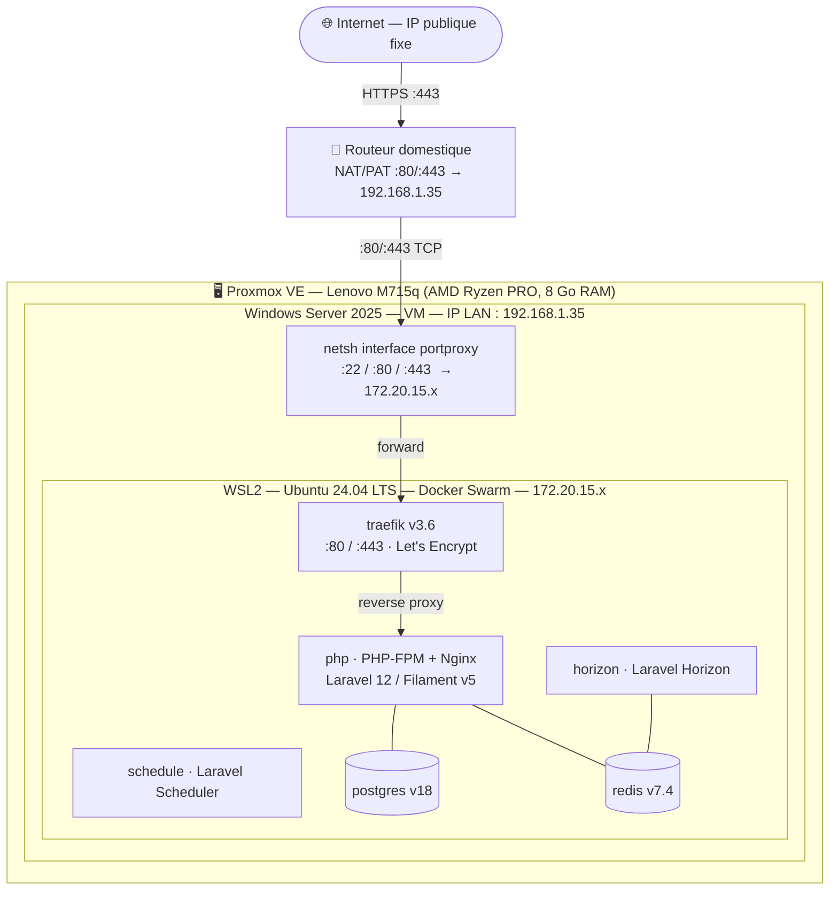
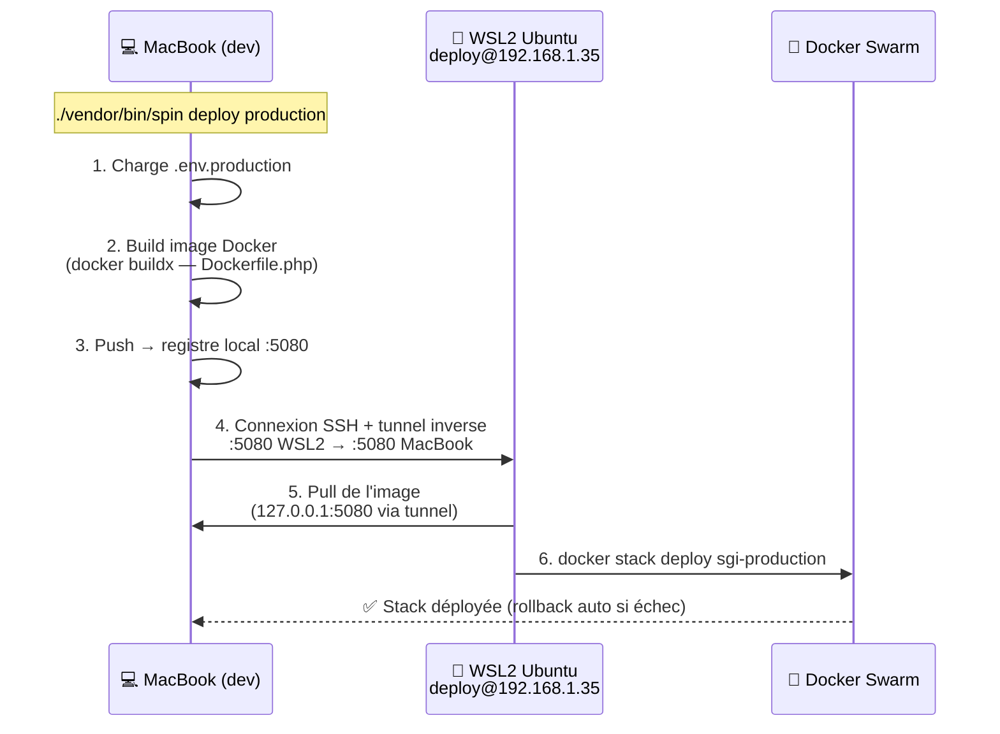

# Compte rendu détaillé

## 1. Contexte et objectif

| Élément | Détail |
| --- | --- |
| **Application** | SGI — Système de Gestion de l'Intendance (application web Laravel 12 / Filament v5) |
| **Environnement cible** | Windows Server 2025 (contrainte auto-imposée pour le challenge technique) |
| **Hébergement** | Serveur physique Lenovo ThinkCentre M715q (AMD Ryzen PRO, 8 Go RAM) sous Proxmox VE, hébergé sur site |
| **Objectif** | Rendre l'application accessible en HTTPS sur un nom de domaine public avec certificat Let's Encrypt, depuis une infrastructure Windows Server |
| **Candidat** | William Gérald Blondel |
| **Période** | Avril 2026 |

### 1.1 Problématique

L'application SGI a été développée avec une pile technologique entièrement conteneurisée sous Linux (Docker, Traefik, PostgreSQL, Redis, Laravel Horizon). L'outillage de déploiement du projet — **ServerSideUp Spin** — est conçu exclusivement pour des hôtes Ubuntu.

Par curiosité technique et pour explorer un scénario réaliste (de nombreuses entreprises exécutent encore des workloads Windows Server), j'ai choisi de me contraindre à déployer sur **Windows Server 2025**. Il a donc fallu concevoir une architecture hybride permettant de concilier ce choix avec l'écosystème Docker/Linux du projet.

### 1.2 Contraintes identifiées

| Contrainte | Impact |
| --- | --- |
| Windows Server 2025 (contrainte auto-imposée) | Impossible d'utiliser `spin provision` (Ansible pour Ubuntu uniquement) |
| Application conteneurisée (6 services Docker) | Nécessite un runtime Docker sous Windows |
| Traefik en reverse proxy avec Let's Encrypt | Nécessite les ports 80/443 accessibles depuis Internet |
| Hébergement sur site (réseau domestique) | Nécessite une exposition publique via redirection de ports |
| Serveur virtualisé sous Proxmox | Nécessite la virtualisation imbriquée (nested virtualization) |

---

## 2. Étude des solutions et choix d'architecture

### 2.1 Solutions envisagées

| Solution | Description | Verdict |
| --- | --- | --- |
| **Docker Desktop pour Windows** | Installation directe de Docker Desktop sur Windows Server | Licence payante en usage commercial, Docker Swarm déprécié dans Docker Desktop. **Écarté.** |
| **IIS + PHP natif + PostgreSQL** | Installation de PHP 8.5, IIS, PostgreSQL et Redis directement sur Windows | Reconfiguration majeure, abandon de toute la stack Docker/Traefik existante. **Écarté.** |
| **WSL2 + Docker Engine** | Installation de WSL2 (Ubuntu 24.04) dans Windows Server, Docker Engine natif Linux dans la distribution WSL | Conservation de l'intégralité de la stack existante, aucune licence supplémentaire, compatibilité avec `spin deploy`. **Retenu.** |
| **Hyper-V avec VM Ubuntu** | Utilisation de Windows Server comme simple hyperviseur | Ajoute une couche sans bénéfice par rapport à WSL2. **Écarté.** |

### 2.2 Architecture retenue



### 2.3 Flux réseau

1. **Requête HTTPS entrante** : Internet → IP publique → routeur (NAT/PAT port 443) → Windows Server (192.168.1.35:443) → `netsh interface portproxy` → WSL2 (172.20.15.x:443) → Traefik → conteneur PHP-FPM.
2. **Déploiement via `spin deploy`** : MacBook (LAN) → SSH sur 192.168.1.35:22 → `netsh portproxy` → WSL2:22 → utilisateur `deploy` → Docker Swarm → `docker stack deploy`.

---

## 3. Mise en oeuvre détaillée

### 3.1 Préparation de l'hyperviseur Proxmox

**Objectif :** permettre à la VM Windows Server d'exécuter WSL2, qui repose sur Hyper-V (virtualisation imbriquée).

**Actions réalisées :**

1. Vérification du support AMD-V (SVM) sur le processeur hôte :
   ```bash
   grep -c svm /proc/cpuinfo    # → 4 (4 threads AMD)
   ```

2. Activation de la virtualisation imbriquée dans le module noyau KVM :
   ```bash
   cat /sys/module/kvm_amd/parameters/nested    # doit afficher 1
   # Si 0 :
   echo "options kvm-amd nested=1" > /etc/modprobe.d/kvm-amd.conf
   update-initramfs -u && reboot
   ```

3. Configuration du type de CPU de la VM en mode `host` (passage transparent des instructions SVM) :
   ```bash
   qm set 110 --cpu host
   ```

**Problème rencontré :** la VM était configurée avec le type CPU par défaut `x86-64-v2-AES`, qui ne transmet pas les extensions de virtualisation au système invité. WSL2 échouait avec l'erreur `HCS/ERROR_NOT_SUPPORTED` puis `HCS_E_HYPERV_NOT_INSTALLED`. Le passage au type `host` a résolu le problème.

### 3.2 Configuration de Windows Server 2025

**Objectif :** installer et configurer WSL2 avec Ubuntu 24.04.

**Actions réalisées :**

1. Activation des composants Windows requis :
   ```powershell
   Enable-WindowsOptionalFeature -Online -FeatureName VirtualMachinePlatform -All -NoRestart
   Enable-WindowsOptionalFeature -Online -FeatureName Microsoft-Windows-Subsystem-Linux -All -NoRestart
   Restart-Computer -Force
   ```

2. Installation de la distribution Ubuntu :
   ```powershell
   wsl --set-default-version 2
   wsl --install -d Ubuntu-24.04
   ```

3. Configuration des ressources WSL2 via `C:\Users\Administrateur\.wslconfig` :
   ```ini
   [wsl2]
   memory=6GB
   processors=2
   swap=2GB
   ```

**Problème rencontré :** la commande `wsl --install` sur Windows Server n'active pas automatiquement les composants `VirtualMachinePlatform` et `Microsoft-Windows-Subsystem-Linux` contrairement à Windows 11 client. L'activation manuelle via `Enable-WindowsOptionalFeature` suivie d'un redémarrage a été nécessaire.

**Problème rencontré :** le mode réseau `networkingMode=mirrored` de WSL2 (qui partage les interfaces réseau de l'hôte) n'est pas compatible avec la virtualisation imbriquée sous Proxmox. L'erreur `CreateInstance/CreateVm/ConfigureNetworking/0x803b0015` a imposé l'utilisation du mode NAT par défaut, compensé par des règles de redirection de ports (`netsh interface portproxy`).

### 3.3 Installation de Docker Engine dans WSL2

**Objectif :** disposer d'un runtime Docker complet (daemon + CLI + Compose + Buildx) dans l'environnement Ubuntu.

**Actions réalisées :**

1. Vérification de systemd (requis par Docker) :
   ```bash
   ps -p 1 -o comm=    # → systemd
   ```

2. Installation de Docker Engine via le dépôt officiel Docker pour Ubuntu :
   ```bash
   sudo apt-get install -y docker-ce docker-ce-cli containerd.io \
        docker-buildx-plugin docker-compose-plugin
   sudo usermod -aG docker $USER
   sudo systemctl enable docker containerd
   ```

3. Validation :
   ```bash
   docker run --rm hello-world    # → Hello from Docker!
   ```

### 3.4 Démarrage automatique au boot de Windows

**Objectif :** garantir que WSL2 et Docker démarrent automatiquement lorsque la VM Windows redémarre, sans intervention manuelle.

**Actions réalisées :**

1. Création du script de lancement :
   ```cmd
   REM C:\start-wsl.cmd
   wsl.exe -d Ubuntu-24.04 -- sleep infinity
   ```
   Le processus `sleep infinity` reste au premier plan, empêchant WSL2 de s'arrêter après la fin de la commande. Systemd, actif dans Ubuntu, démarre automatiquement le service Docker.

2. Création d'une tâche planifiée Windows :
   ```powershell
   $action = New-ScheduledTaskAction -Execute "C:\start-wsl.cmd"
   $trigger = New-ScheduledTaskTrigger -AtStartup
   $trigger.Delay = "PT30S"    # Délai de 30 secondes (attente du service LxssManager)
   $settings = New-ScheduledTaskSettingsSet -ExecutionTimeLimit (New-TimeSpan -Days 0)
   Register-ScheduledTask -TaskName "Start WSL2 Ubuntu" `
       -Action $action -Trigger $trigger -Settings $settings `
       -User "Administrateur" -Password $password -RunLevel Highest
   ```

**Problème rencontré :** la première tentative utilisait le compte `SYSTEM`, qui n'a pas accès aux distributions WSL2 (celles-ci sont enregistrées par utilisateur). Le passage au compte `Administrateur` avec un délai de 30 secondes (pour laisser le service `LxssManager` démarrer) a résolu le problème.

### 3.5 Configuration réseau — Redirection de ports

**Objectif :** rendre les services Docker (ports 80, 443, 22) accessibles depuis le réseau local et depuis Internet, malgré le NAT de WSL2.

**Actions réalisées :**

1. Script de redirection dynamique (`C:\update-wsl-portproxy.ps1`) :
   ```powershell
   $wslIp = (wsl -d Ubuntu-24.04 -- hostname -I).Trim().Split(" ")[0]
   if ($wslIp) {
       netsh interface portproxy reset
       netsh interface portproxy add v4tov4 listenport=22  listenaddress=0.0.0.0 `
           connectport=22  connectaddress=$wslIp
       netsh interface portproxy add v4tov4 listenport=80  listenaddress=0.0.0.0 `
           connectport=80  connectaddress=$wslIp
       netsh interface portproxy add v4tov4 listenport=443 listenaddress=0.0.0.0 `
           connectport=443 connectaddress=$wslIp
   }
   ```
   Ce script est exécuté automatiquement au démarrage via une seconde tâche planifiée (délai de 60 secondes, après le démarrage de WSL2).

2. Ouverture du pare-feu Windows Defender :
   ```powershell
   New-NetFirewallRule -DisplayName "HTTP Inbound"  -Direction Inbound `
       -Protocol TCP -LocalPort 80  -Action Allow -Profile Any
   New-NetFirewallRule -DisplayName "HTTPS Inbound" -Direction Inbound `
       -Protocol TCP -LocalPort 443 -Action Allow -Profile Any
   ```

3. Redirection de ports sur le routeur domestique :
   - Port 80 TCP → 192.168.1.35:80
   - Port 443 TCP → 192.168.1.35:443
   - Réservation DHCP pour garantir la stabilité de l'adresse IP de la VM.

**Justification du script dynamique :** l'adresse IP interne de WSL2 (172.20.x.x) change à chaque redémarrage de la distribution. Le script récupère l'adresse courante et met à jour les règles de redirection en conséquence.

### 3.6 Préparation du serveur pour le déploiement

**Objectif :** permettre aux outils `spin provision` et `spin deploy` (exécutés depuis le poste de développement) de se connecter au serveur via SSH et de piloter Docker Swarm.

**Actions réalisées :**

1. Installation du serveur OpenSSH dans Ubuntu WSL2 :
   ```bash
   sudo apt-get install -y openssh-server
   sudo systemctl enable ssh
   ```

2. Initialisation du cluster Docker Swarm (l'option `--advertise-addr` est nécessaire car WSL2 expose plusieurs interfaces réseau) :
   ```bash
   docker swarm init --advertise-addr 172.20.15.103
   ```

3. Configuration du fichier `.spin.yml` pour déclarer le serveur de production et l'utilisateur de déploiement :
   ```yaml
   users:
     - username: wblondel
       name: William Blondel
       groups: ['sudo']
       authorized_keys:
         - public_key: "ssh-ed25519 AAAA... wblondel@MacBook"

   servers:
     - server_name: dev-docker
       environment: production
       address: 192.168.1.35
   ```

4. Provisionnement du serveur via Spin (connexion initiale en `root`, avant que le compte de déploiement ne soit créé par les playbooks Ansible) :
   ```bash
   ./vendor/bin/spin provision -u root
   ```
   Spin exécute des playbooks Ansible qui créent l'utilisateur de déploiement, configurent les clés SSH autorisées et préparent l'environnement pour `spin deploy`.

### 3.7 Déploiement avec Spin

**Objectif :** utiliser l'outil de déploiement du projet (`spin deploy`) pour automatiser la construction de l'image Docker, son transfert et le déploiement sur Docker Swarm.

**Fonctionnement de `spin deploy` :**



**Actions réalisées sur le poste de développement (MacBook) :**

1. Création du fichier `.env.production` avec les variables de production :
   - `APP_ENV=production`, `APP_DEBUG=false`
   - Mots de passe PostgreSQL et Redis générés aléatoirement (`openssl rand -base64 24`)
   - `APP_URL` pointant vers le nom de domaine public
   - `APP_KEY` générée avec `echo "base64:$(openssl rand -base64 32)"`

2. Construction des assets frontend :
   ```bash
   ./vendor/bin/spin run node npm run build
   ```

3. Suppression du fichier `public/hot` (fichier créé par le serveur de développement Vite, qui redirige Laravel vers `vite.dev.test` au lieu d'utiliser les assets compilés).

4. Ajout de `public/hot` au `.dockerignore` pour éviter toute récurrence du problème.

5. Lancement du déploiement :
   ```bash
   cp .env.production .env      # L'image Docker embarque le .env
   ./vendor/bin/spin deploy production
   cp .env.dev.bak .env         # Restauration de l'environnement de développement
   ```

6. Exécution des migrations et du seeding :
   ```bash
   ssh deploy@192.168.1.35 'PHP=$(docker ps -q -f name=sgi-production_php.1); \
     docker exec $PHP php artisan migrate --force && \
     docker exec $PHP php artisan db:seed --force && \
     docker exec $PHP php artisan storage:link && \
     docker exec $PHP php artisan optimize'
   ```

**Problème rencontré :** le premier déploiement a échoué car `APP_KEY` était vide dans `.env.production`. Le conteneur PHP tombait en boucle de redémarrage avec l'exception `MissingAppKeyException`. La génération locale de la clé et le redéploiement ont résolu le problème.

**Problème rencontré :** après le déploiement, l'application tentait de se connecter au serveur de développement Vite (`vite.dev.test`) au lieu de servir les assets compilés. La cause était la présence du fichier `public/hot` dans le contexte de build Docker. Sa suppression et son ajout au `.dockerignore` ont corrigé le problème.

### 3.8 Certificat HTTPS — Let's Encrypt

**Objectif :** obtenir un certificat TLS valide automatiquement via Traefik et le protocole ACME.

**Configuration existante** (fichier `.infrastructure/conf/traefik/prod/traefik.yml`) :

```yaml
certificatesResolvers:
  letsencryptresolver:
    acme:
      email: "contact@williamblondel.fr"
      storage: "/certificates/acme.json"
      httpChallenge:
        entryPoint: web    # Challenge HTTP-01 sur le port 80
```

**Fonctionnement :** Traefik intercepte les requêtes HTTP-01 de Let's Encrypt sur le port 80, prouve la possession du domaine, et stocke le certificat dans un volume Docker persistant. Le renouvellement est automatique (tous les 60 jours).

**Prérequis validés :**
- Enregistrement DNS de type A pointant vers l'adresse IP publique fixe.
- Ports 80 et 443 redirigés du routeur vers la VM Windows Server.
- Ports 80 et 443 redirigés par `netsh portproxy` vers la distribution WSL2.
- Ports 80 et 443 autorisés dans le pare-feu Windows Defender.

---

## 4. Services déployés

| Service | Image | Rôle | Port exposé |
| --- | --- | --- | --- |
| **traefik** | `traefik:v3.6` | Reverse proxy, terminaison TLS, Let's Encrypt, routage HTTP | 80, 443 |
| **php** | `sgi-php:latest` (custom) | Application Laravel (PHP-FPM + Nginx) | 8443 (interne) |
| **schedule** | `sgi-php:latest` | Exécution de `php artisan schedule:work` (tâches planifiées Laravel) | — |
| **horizon** | `sgi-php:latest` | Exécution de `php artisan horizon` (workers Redis pour les jobs queued) | — |
| **postgres** | `postgres:18` | Base de données PostgreSQL | 5432 (interne) |
| **redis** | `redis:7.4` | Cache des sessions et file d'attente des jobs | 6379 (interne) |

Tous les services sont orchestrés par **Docker Swarm** en mode single-node, avec :
- **Rollback automatique** en cas d'échec de déploiement (`failure_action: rollback`).
- **Health checks** sur chaque service (PostgreSQL : `pg_isready`, Redis : `redis-cli ping`, PHP : `/up`, Traefik : `traefik healthcheck`).
- **Volumes persistants** pour les données PostgreSQL, Redis, les fichiers uploadés et les certificats TLS.
- **Redémarrage automatique** (`restart_policy: condition: any`).

---

## 5. Sécurité

| Mesure | Détail |
| --- | --- |
| **HTTPS obligatoire** | Traefik redirige automatiquement HTTP → HTTPS (entrypoint `web` → `websecure`). |
| **Certificat TLS** | Let's Encrypt via ACME HTTP-01, renouvellement automatique. |
| **Secrets applicatifs** | Mots de passe BDD et Redis générés aléatoirement (`openssl rand`), stockés uniquement dans `.env.production` (non versionné). |
| **Clé de chiffrement** | `APP_KEY` Laravel générée avec 32 octets d'entropie (`openssl rand -base64 32`). |
| **Accès SSH** | Authentification par clé publique uniquement (pas de mot de passe). Utilisateur `deploy` dédié. |
| **Pare-feu Windows** | Seuls les ports 80, 443 et 22 sont ouverts. Le port RDP (3389) est restreint à l'IP de l'administrateur. |
| **Réseau Docker** | Les services internes (PostgreSQL, Redis) ne sont pas exposés en dehors du réseau Docker `web-public`. |
| **Fichier `.env`** | Exclu du versionnage Git (`.gitignore`). |
| **Docker Swarm** | Les secrets ne transitent pas en clair grâce au chiffrement TLS natif de Swarm. |

---

## 6. Procédure de redéploiement

Pour les mises à jour ultérieures de l'application, la procédure est la suivante :

```bash
# Depuis le poste de développement (MacBook)
cd /chemin/vers/application-sgi

# 1. Construire les assets frontend
./vendor/bin/spin run node npm run build

# 2. Préparer l'environnement de production
cp .env.production .env

# 3. Déployer (build + push + deploy Swarm)
./vendor/bin/spin deploy production

# 4. Restaurer l'environnement de développement
cp .env.dev.bak .env

# 5. Exécuter les migrations si nécessaire
ssh deploy@192.168.1.35 'PHP=$(docker ps -q -f name=sgi-production_php.1); \
  docker exec $PHP php artisan migrate --force'
```

Le pipeline CI/CD GitHub Actions existant (`action_deploy-production.yml`) peut également être configuré pour automatiser ce processus à chaque push sur la branche `main`, sous réserve d'exposer le port SSH du serveur sur Internet.

---

## 7. Difficultés rencontrées et solutions

| Problème | Cause | Solution |
| --- | --- | --- |
| `HCS/ERROR_NOT_SUPPORTED` lors de l'installation WSL2 sur Hetzner Cloud | Hetzner Cloud ne propose pas la virtualisation imbriquée sur ses instances cloud (CX, CPX, CCX). | Migration vers un serveur physique autohébergé sous Proxmox VE. |
| `HCS_E_HYPERV_NOT_INSTALLED` après activation des composants Windows | Le type CPU de la VM Proxmox (`x86-64-v2-AES`) ne transmet pas les extensions SVM. | Changement du type CPU en `host` (`qm set 110 --cpu host`). |
| `VirtualMachinePlatform : Disabled` malgré `wsl --install` | Sur Windows Server 2025, `wsl --install` n'active pas automatiquement les composants optionnels contrairement à Windows 11. | Activation manuelle via `Enable-WindowsOptionalFeature` + redémarrage. |
| WSL2 s'arrête après le démarrage automatique | La tâche planifiée utilisait `SYSTEM` (pas d'accès aux distributions WSL) et la commande se terminait immédiatement. | Exécution sous le compte `Administrateur` avec `sleep infinity` au premier plan. |
| `networkingMode=mirrored` échoue (erreur `0x803b0015`) | Le mode réseau miroir nécessite des capacités de virtualisation imbriquée que Proxmox ne transmet pas entièrement. | Retour au mode NAT par défaut + `netsh interface portproxy` pour la redirection de ports. |
| `MissingAppKeyException` au démarrage du conteneur PHP | `APP_KEY` vide dans `.env.production`. | Génération locale de la clé (`openssl rand -base64 32`) et redéploiement. |
| L'application tente de se connecter à `vite.dev.test` | Le fichier `public/hot` (créé par `npm run dev`) était présent lors du build de l'image Docker. | Suppression du fichier et ajout au `.dockerignore`. |

---

## 8. Bilan

### 8.1 Compétences mobilisées (référentiel BTS SIO)

#### 8.1.1 Bloc 1 — Support et mise à disposition de services informatiques (E5)

Ce projet est avant tout une réalisation du **Bloc 1**. Le tableau ci-dessous détaille comment chaque sous-compétence a été mobilisée ; les sous-compétences non couvertes ici sont démontrées dans d'autres pièces du portfolio.

| Compétence | Comment elle a été mobilisée dans ce projet |
|---|---|
| **Recenser et identifier les ressources numériques** | Inventaire exhaustif de l'infrastructure déployée : serveur physique Lenovo ThinkCentre M715q (AMD Ryzen PRO, 8 Go RAM), hyperviseur Proxmox VE, VM Windows Server 2025 (8 Go RAM alloués), distribution WSL2 Ubuntu 24.04 LTS (6 Go RAM, 2 vCPU, eth0 172.20.15.103), 6 services Docker (Traefik, PHP-FPM, Horizon, Schedule, PostgreSQL, Redis), volumes persistants et réseau Docker `web-public`. Tous ces éléments sont documentés dans les sections 2.2 et 4 de ce compte rendu. |
| **Exploiter des référentiels, normes et standards adoptés par le prestataire informatique** | Utilisation de standards ouverts : Docker Engine (spécification OCI), Docker Swarm (orchestration), Traefik v3.6 (proxy HTTP/2), protocole ACME HTTP-01 (RFC 8555) pour Let's Encrypt, OpenSSH (authentification par clé publique, RFC 4253), `netsh interface portproxy` (commande Microsoft documentée), format YAML pour la configuration Spin (`.spin.yml`), playbooks Ansible exécutés par `spin provision`. |
| **Mettre en place et vérifier les niveaux d'habilitation associés à un service** | Création d'un utilisateur `deploy` dédié (sans mot de passe) appartenant au groupe `docker`, clé publique SSH du poste de développement ajoutée dans `authorized_keys` (interdiction de l'authentification par mot de passe), pare-feu Windows Defender limité aux ports 80, 443 et 22, port RDP (3389) restreint à l'IP de l'administrateur. Les services internes (PostgreSQL 5432, Redis 6379) ne sont exposés qu'à l'intérieur du réseau Docker. |
| **Vérifier les conditions de la continuité d'un service informatique** | Deux tâches planifiées Windows garantissent le démarrage automatique sans intervention : (1) `sleep infinity` maintient WSL2 actif, systemd démarre Docker ; (2) le script `update-wsl-portproxy.ps1` recrée les règles `netsh` avec la nouvelle IP WSL2 après chaque redémarrage. Docker Swarm est configuré avec `restart_policy: condition: any` et `failure_action: rollback`. Health checks actifs sur chaque service (PostgreSQL : `pg_isready`, Redis : `redis-cli ping`, PHP : `/up`, Traefik : `traefik healthcheck`). |
| **Gérer des sauvegardes** | Les données critiques (PostgreSQL, Redis, fichiers uploadés, certificats TLS Let's Encrypt) sont stockées dans des volumes Docker nommés et persistants, indépendants du cycle de vie des conteneurs. Un rollback automatique Docker Swarm est configuré (`failure_action: rollback`) pour revenir à la version précédente en cas d'échec d'un redéploiement. La sauvegarde des volumes peut être réalisée par simple export Docker. |
| **Vérifier le respect des règles d'utilisation des ressources numériques** | Fichier `.env.production` exclu du versionnage Git (`.gitignore`) ; fichier `public/hot` (qui aurait exposé l'adresse du serveur Vite) ajouté au `.dockerignore` pour ne jamais être inclus dans l'image Docker ; secrets (mots de passe BDD, Redis, clé `APP_KEY`) générés avec `openssl rand` (entropie suffisante) ; clé SSH exclusive (aucun mot de passe ne circule en clair). |
| **Collecter, suivre et orienter des demandes** | Diagnostic méthodique et itératif de 7 problèmes techniques successifs : chaque problème a été identifié (message d'erreur, log système ou comportement observé), analysé (cause racine), résolu (action corrective précise) et documenté dans ce compte rendu (section 7). Cette démarche illustre la capacité à traiter des incidents de manière structurée même sur des technologies nouvelles. |
| **Traiter des demandes concernant les services réseau et système, applicatifs** | Configuration réseau complète : mode NAT WSL2, redirection dynamique (`netsh interface portproxy` sur 22/80/443 vers l'IP interne de WSL2), ouverture du pare-feu Windows Defender, redirection de ports TCP 80/443 sur le routeur domestique avec réservation DHCP. Résolution du problème de mode `networkingMode=mirrored` (erreur `0x803b0015`) par retour au mode NAT. |
| **Traiter des demandes concernant les applications** | Résolution de deux problèmes applicatifs distincts : (1) `MissingAppKeyException` — `APP_KEY` vide dans `.env.production`, corrigée par génération `openssl rand -base64 32` et redéploiement ; (2) `vite.dev.test` — fichier `public/hot` présent lors du build de l'image Docker, corrigé par suppression du fichier et ajout au `.dockerignore`. |
| **Analyser les objectifs et les modalités d'organisation d'un projet** | Section 1 et 2 de ce compte rendu : analyse des 5 contraintes imposées (Windows Server, conteneurs Docker, Traefik/Let's Encrypt, hébergement sur site, virtualisation Proxmox), étude comparative de 4 solutions possibles (Docker Desktop, IIS natif, WSL2 + Docker Engine, VM Hyper-V) avec verdict argumenté pour chacune. |
| **Planifier les activités** | Décomposition du déploiement en 8 étapes séquentielles (sections 3.1 à 3.8 de ce compte rendu), chacune avec un objectif précis, une liste d'actions et un résultat attendu. Les 12 étapes de déploiement ont été suivies et complétées dans l'ordre. |
| **Évaluer les indicateurs de suivi d'un projet et analyser les écarts** | Section 7 : les 7 problèmes rencontrés constituent autant d'écarts par rapport au plan initial. Pour chacun, la cause racine a été identifiée et une solution corrective a été appliquée. Ce suivi permet de mesurer la complexité réelle de l'infrastructure (virtualisation imbriquée, réseau WSL2, interopérabilité Windows/Linux) par rapport à une installation Linux native directe. |
| **Réaliser les tests d'intégration et d'acceptation d'un service** | Tests de bout en bout après chaque étape : connexion SSH depuis le MacBook (`ssh deploy@192.168.1.35`), test Docker (`docker run hello-world`), test de redémarrage automatique après reboot de la VM, test HTTP/HTTPS depuis Internet (`curl https://app-sgi.127011.xyz`), validation des health checks Docker Swarm (`docker service ps sgi-production_php`), vérification de la signature du certificat Let's Encrypt dans le navigateur. |
| **Déployer un service** | **Cœur du projet** : déploiement de 6 services Docker (Traefik, PHP-FPM, Horizon, Schedule, PostgreSQL, Redis) via `spin deploy production`, qui orchestre le build multi-stage de l'image Docker (buildx), le push vers le registre local (port 5080), l'établissement d'un tunnel SSH inverse, et le `docker stack deploy` sur le nœud Swarm. Migrations, seeders et optimisation Laravel exécutés via SSH après le déploiement. |
| **Accompagner les utilisateurs dans la mise en place d'un service** | Ce compte rendu détaillé (sections 1 à 9) constitue la documentation de référence. La section 6 fournit la procédure de redéploiement complète, prête à être utilisée par un autre développeur. Le rapport `.docs/Rapport_Deploiement_Windows_Server.md` est versionné dans le dépôt Git du projet. |
| **Mettre en place son environnement d'apprentissage personnel** | Exploration et maîtrise de technologies nouvelles : Proxmox VE (hyperviseur), WSL2 sur Windows Server 2025, Docker Swarm (vs Docker Compose en développement), Traefik v3.6, `netsh interface portproxy`, tâches planifiées Windows Server, flux `spin provision` + `spin deploy` en production. |
| **Mettre en œuvre des outils et stratégies de veille informationnelle** | Documentation officielle consultée : Microsoft (WSL2 sur Windows Server, `netsh interface portproxy`, tâches planifiées), Docker (Engine, Swarm, Buildx), Traefik (v3.6, `providers.swarm`, ACME), Let's Encrypt (ACME HTTP-01, RFC 8555), Proxmox VE (virtualisation imbriquée KVM AMD), ServerSideUp Spin (`.spin.yml`, `spin provision`, `spin deploy`). |

#### 8.1.2 Bloc 2 — Conception et développement d'applications (E6 SLAM)

Ce projet de déploiement complète les deux réalisations E6 (*Application SGI* et *H3 Release Checker*) sur les compétences de mise en production et d'environnement. Il ne se substitue pas à ces réalisations pour les compétences de conception et de développement.

| Compétence | Comment elle a été mobilisée dans ce projet |
|---|---|
| **Intégrer en continu les versions d'une solution applicative** | Flux `spin provision` + `spin deploy production` : `spin provision -u root` prépare le serveur via des playbooks Ansible ; `spin deploy production` orchestre le build multi-stage de l'image Docker (`docker buildx`), le push vers le registre local (port 5080), la création d'un tunnel SSH inverse, et le `docker stack deploy` avec rollback automatique. La procédure de redéploiement (section 6) permet des livraisons ultérieures en 5 commandes. |
| **Rédiger des documentations technique et d'utilisation d'une solution applicative** | Ce compte rendu détaillé (9 sections, schémas ASCII de l'architecture et du flux `spin deploy`, tableaux de comparaison des solutions, procédure de redéploiement en section 6, tableau des 8 difficultés rencontrées), le rapport `.docs/Rapport_Deploiement_Windows_Server.md` versionné dans le dépôt, et les deux scripts PowerShell commentés (`start-wsl.cmd`, `update-wsl-portproxy.ps1`). |
| **Exploiter les fonctionnalités d'un environnement de développement et de tests** | Maîtrise de l'outillage de déploiement : Docker Engine (daemon, CLI, Compose, Buildx), Docker Swarm (`docker swarm init --advertise-addr`, `docker stack deploy`, `docker service ps`, rollback), Traefik v3.6 (`providers.swarm`, ACME, entrypoints), ServerSideUp Spin (`spin deploy`, `spin run`), OpenSSH (tunnel inverse, `authorized_keys`), PowerShell (`netsh`, `New-ScheduledTask`, `Enable-WindowsOptionalFeature`), Proxmox CLI (`qm set --cpu host`). |

Les compétences de conception, modélisation, développement de composants, gestion de base de données et tests applicatifs sont couvertes dans les projets *Application SGI* (Réalisation 2, E6) et *H3 Release Checker* (Réalisation 1, E6).

### 8.2 Apports personnels

- **Conception d'une architecture hybride Windows/Linux** conciliant la contrainte « Windows Server » avec l'écosystème Docker/Linux du projet — solution documentée et reproductible.
- **Résolution méthodique** de 7 problèmes techniques successifs (virtualisation imbriquée, composants Windows, réseau WSL2, autostart, clé applicative, assets Vite) par diagnostic systématique.
- **Mise en œuvre du flux `spin provision` + `spin deploy`** dans un contexte non standard : une fois la couche réseau (WSL2 NAT, netsh portproxy, SSH via port proxy) correctement construite, Spin fonctionne comme sur un serveur Ubuntu natif — ce qui valide l'architecture hybride Windows/Linux retenue.
- **Automatisation complète** : le serveur redémarre de manière autonome (tâches planifiées Windows → WSL2 → systemd → Docker → services applicatifs) sans intervention manuelle.

### 8.3 Limites et perspectives

- **Hébergement sur site** : la disponibilité dépend de la connexion Internet domestique et de l'alimentation électrique du serveur. Un onduleur (UPS) et un monitoring (Uptime Kuma ou similaire) seraient souhaitables.
- **Adresse IP WSL2 dynamique** : l'adresse interne de WSL2 change à chaque redémarrage, nécessitant le script de mise à jour du port proxy. Le mode réseau `mirrored` éliminerait cette complexité si la virtualisation imbriquée le permettait.
- **CI/CD depuis GitHub Actions** : le pipeline existant pourrait déployer automatiquement à chaque push sur `main`, mais nécessiterait l'exposition du port SSH sur Internet (actuellement limité au LAN).
- **Migration vers un hébergeur cloud** : pour une mise en production pérenne, un VPS Ubuntu (Hetzner, OVH, Scaleway) avec `spin provision` + `spin deploy` offrirait une solution plus robuste et mieux adaptée à la stack du projet.

---

## 9. Annexes

| Document | Description |
| --- | --- |
| `.spin.yml` | Configuration Spin : utilisateurs, clés SSH autorisées, serveurs de production (`address`, `environment`) |
| `.env.production` | Variables d'environnement de production (non versionné) |
| [`docker-compose.yml`](https://github.com/LucaBONNIN/application-sgi/blob/master/docker-compose.yml) | Définition de base des services Docker |
| [`docker-compose.prod.yml`](https://github.com/LucaBONNIN/application-sgi/blob/master/docker-compose.prod.yml) | Surcharges de production (Traefik, volumes, replicas, health checks) |
| [`Dockerfile.php`](https://github.com/LucaBONNIN/application-sgi/blob/master/Dockerfile.php) | Image Docker multi-stage pour PHP-FPM + Nginx |
| [`.infrastructure/conf/traefik/prod/traefik.yml`](https://github.com/LucaBONNIN/application-sgi/blob/master/.infrastructure/conf/traefik/prod/traefik.yml) | Configuration Traefik (entrypoints, ACME, Cloudflare trusted IPs) |
| [C:\start-wsl.cmd](#34-démarrage-automatique-au-boot-de-windows) | Script de démarrage automatique de WSL2 |
| [C:\update-wsl-portproxy.ps1](#35-configuration-réseau--redirection-de-ports) | Script de mise à jour dynamique des règles de redirection de ports |
