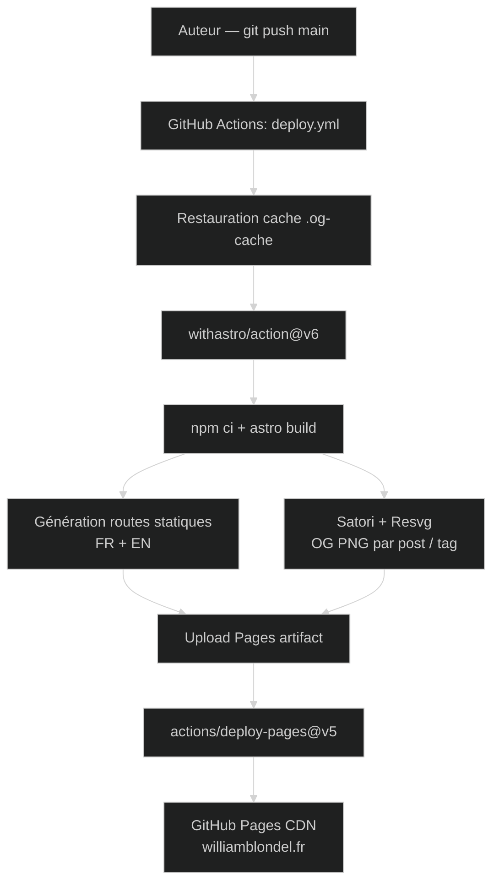

# Compte rendu détaillé

## 1. Contexte et objectif

| Élément | Détail |
| --- | --- |
| **Nature** | Réalisation professionnelle personnelle — support obligatoire de l'épreuve E5 du BTS SIO. |
| **Période** | 2024 → 2026 |
| **Modalité** | Seul, bénévole, sans cadre client. |
| **URL publique** | [williamblondel.fr](https://williamblondel.fr) |
| **Code source** | [github.com/wblondel/blog](https://github.com/wblondel/blog) |

### 1.1 Problématique

Le BTS SIO impose la mise à disposition d'un **support de type portfolio** accessible en ligne pendant les épreuves E5 et E6 (cf. §1 de l'épreuve E5 : *« Son accessibilité en format électronique est obligatoire et est de la seule responsabilité de la personne candidate »*). Au-delà de cette contrainte académique, j'avais trois objectifs personnels :

1. **Valoriser mon image professionnelle** sur les médias numériques (parcours, expériences, certifications, recommandations) ;
2. **Tenir un blog technique bilingue** (français / anglais) sur la cybersécurité et l'IA, à raison d'un article par semaine sur 52 semaines ;
3. **Centraliser les comptes rendus détaillés** des réalisations professionnelles E5/E6 ainsi que les fiches descriptives `Annexe VII-1-B`, les liens GitHub, les accès BDD, les vidéos de démonstration et les tableaux de synthèse.

### 1.2 Cahier des charges (auto-imposé)

| Exigence | Justification |
| --- | --- |
| **Bilingue FR / EN** dès la racine | Cible recruteurs francophones et anglophones (j'ai travaillé 4 ans à l'international). |
| **100 % statique**, sans serveur applicatif | Hébergement gratuit (GitHub Pages), pas de surface d'attaque côté backend, performance maximale. |
| **Aucun JavaScript bloquant** | Accessibilité, SEO, score Lighthouse élevé. |
| **Hébergement sur domaine propre** | Maîtrise de l'identité numérique. |
| **Mode sombre / clair** persistant | Confort de lecture, attendu par le public technique. |
| **Sitemap, RSS, Open Graph, hreflang** | Référencement naturel multilingue, partage sur les réseaux sociaux. |
| **Versionnage Git + revue automatisée** | Traçabilité, mises à jour de dépendances suivies. |
| **Fiches descriptives E6 téléchargeables** | Conformité Annexe VII-1-B (modalités d'accès aux productions). |

---

## 2. Présentation de l'existant et étude préalable

### 2.1 Existant

**Aucun.** Le dépôt a été initialisé de zéro. Plusieurs versions antérieures de mon site personnel (WordPress, Hugo, Ghost...) existaient mais ont été abandonnés par... manque de movitation :).

### 2.2 Étude comparative des frameworks

| Framework étudié | Forces | Faiblesses pour mon cas | Décision |
| --- | --- | --- | --- |
| **Next.js 15** | Écosystème React, ISR, App Router. | Surcharge JavaScript côté client, hébergement statique moins direct, complexité du *bundling* RSC. | Écarté. |
| **Hugo** | Compilation très rapide en Go, écosystème thèmes mûr. | Templating Go peu agréable, écriture de plugins complexe, i18n moins flexible. | Écarté. |
| **Jekyll** | Natif GitHub Pages, simple. | Stack Ruby vieillissante, MDX impossible, peu adapté aux composants riches. | Écarté. |
| **Astro 6** | *Islands architecture*, sortie 100 % statique par défaut, support natif `.md` / `.mdx`, *content collections* typées Zod, i18n intégré, intégrations officielles MDX / sitemap / RSS. | Communauté plus jeune. | **Retenu.** |

L'étude détaillée des choix est consignée dans le [`README.md`](https://github.com/wblondel/blog/blob/main/README.md).

### 2.3 Choix technologiques détaillés

| Couche | Choix retenu | Rôle |
| --- | --- | --- |
| **Framework** | [Astro](https://astro.build) | Génération de site statique, *islands*, routes file-based. |
| **Langage** | TypeScript | Typage des composants `.astro` et des *content collections*. |
| **Styles** | [Tailwind CSS](https://tailwindcss.com) v4 | Utility-first, intégration via plugin Vite. |
| **Typographie** | `@tailwindcss/typography` | Mise en forme des articles `prose`. |
| **Contenu** | MDX via `@astrojs/mdx` | Markdown enrichi de composants Astro. |
| **Validation contenu** | Zod (via Astro Content Layer) | Schémas typés pour `blog`, `projects`, `series`. |
| **Icônes** | `astro-icon` + `@iconify-json/fa6-*` | Inlining SVG Font Awesome 6 (solid, brands, regular). |
| **Images** | `sharp` | Compression mozjpeg / webp / avif / png au build. |
| **Diagrammes** | `astro-mermaid` + `@mermaid-js/layout-elk` | Rendu des diagrammes Mermaid (séquence, flowchart) avec *layout* ELK. |
| **Open Graph** | `satori` + `satori-html` + `@resvg/resvg-js` | Génération PNG OG par article et par tag à la compilation. |
| **Polices** | `@fontsource/inter` | Police self-hosted pour les images OG. |
| **RSS** | `@astrojs/rss` | Flux RSS par langue. |
| **Sitemap** | `@astrojs/sitemap` | Sitemap multilingue avec balises `xhtml:link`. |
| **Liens externes** | `rehype-external-links` | Ajout automatique de `target="_blank" rel="noopener noreferrer"`. |
| **Tests E2E** | `playwright` | Vérifications manuelles ponctuelles (formulaires, redirections). |
| **Versionnage** | Git + GitHub | Branches *feature*, dépôt public. |
| **CI/CD** | GitHub Actions + `withastro/action` | Build et déploiement automatique sur GitHub Pages. |
| **Hébergement** | GitHub Pages | CDN mondial, HTTPS Let's Encrypt, gratuit. |
| **Suivi de dépendances** | Dependabot | Mises à jour npm proactives. |
| **Analyse SEO** | Lighthouse, Sitebulb | Audits ponctuels. |
| **Mesure** | Google Tag Manager | Audience anonymisée, opt-in. |

---

## 3. Architecture de l'application

### 3.1 Vue d'ensemble

L'application est un **générateur de site statique** : à chaque `git push` sur `main`, GitHub Actions lance Astro qui pré-rend l'intégralité des pages HTML, génère les images Open Graph PNG et publie le tout sur GitHub Pages.



### 3.2 Arborescence du dépôt

```
my-portfolio/
├── .github/
│   ├── workflows/deploy.yml      # Pipeline CI/CD
│   └── dependabot.yml            # Mises à jour npm hebdo
├── astro.config.mjs              # Config Astro (i18n, redirects, plugins)
├── src/
│   ├── content.config.ts         # Schémas Zod (blog, projects, series)
│   ├── content/
│   │   ├── blog/{en,fr}/         # 110 articles .md/.mdx
│   │   ├── projects/{en,fr}/     # Comptes rendus E5/E6
│   │   └── series/{en,fr}/       # 8 séries thématiques
│   ├── data/portfolio-{en,fr}.json   # Données du CV (expériences, skills…)
│   ├── i18n/{ui.ts,utils.ts}     # ~200 clés de traduction + helpers
│   ├── layouts/Layout.astro      # SEO, OG, hreflang, GTM
│   ├── components/
│   │   ├── Header / Footer / PostCard / PageHeader / TOC / Tags
│   │   └── portfolio/            # Sections du CV (AboutMe, Skills…)
│   ├── pages/
│   │   ├── [lang]/
│   │   │   ├── index.astro       # Accueil bilingue
│   │   │   ├── [slug].astro      # Article de blog
│   │   │   ├── [slug]/og.png.ts  # Image OG dynamique par article
│   │   │   ├── archive.astro     # Liste chronologique
│   │   │   ├── portfolio.astro   # Page CV/portfolio
│   │   │   ├── projects/[slug].astro
│   │   │   ├── series/[slug].astro
│   │   │   ├── tag/[tag].astro + tag/[tag]/og.png.ts
│   │   │   └── tags/index.astro
│   │   ├── archive/, series/, tag/, tags/   # Redirections legacy
│   │   ├── index.astro           # Redirection racine vers /en/
│   │   └── rss.xml.js
│   ├── remark/                   # Plugins Markdown personnalisés
│   │   ├── remark-video-optimizer.js
│   │   ├── remark-autoscroll-image.js
│   │   └── remark-language-tabs.js
│   ├── rehype/rehype-image-zoom.js
│   ├── redirects/                # JSON de redirections 301
│   │   ├── slug-redirects.json
│   │   ├── tag-redirects.json
│   │   └── custom-redirects.json
│   ├── scripts/image-zoom.js     # Overlay JS de zoom
│   ├── styles/                   # global.css, syntax.css, geist-mono.css
│   └── assets/                   # Images optimisées (post-covers, projects, fonts)
├── public/                       # Fichiers servis tels quels
│   ├── documents/
│   │   ├── E5/Epreuve E5.md
│   │   ├── E6/                   # Fiches descriptives PDF + xlsx Trello
│   │   └── certifications/       # PDF des attestations
│   ├── og-default.png
│   └── favicon.ico
├── scripts/                      # Scripts Node/Python de maintenance
│   ├── rename-numbered-posts.mjs
│   ├── update-series-order.mjs
│   ├── fetch-cover-images.mjs
│   ├── clean-slug-redirects.mjs
│   ├── add_slashes_to_internal_links.py
│   └── check_tag_links.py
└── package.json                  # 14 deps prod, 5 deps dev
```

### 3.3 Modèle de contenu (Content Collections)

Le fichier [`src/content.config.ts`](https://github.com/wblondel/blog/blob/main/src/content.config.ts) définit trois collections typées par Zod, ce qui joue le rôle d'**équivalent base de données pour un site statique** :

| Collection | Loader | Champs principaux | Exemples |
| --- | --- | --- | --- |
| `blog` | `glob('**/[^_]*.{md,mdx}', './src/content/blog')` | `title`, `seoTitle?`, `description?`, `pubDate`, `coverImage?`, `tags[]`, `series?`, `seriesOrder?`, `readTime` | 110 articles |
| `projects` | `glob('**/[^_]*.{md,mdx}', './src/content/projects')` | `title`, `context`, `coverImage?`, `githubLink?`, `liveLink?`, `credentialsLink?`, `documentationLink?`, `projectManagementLink?`, `ficheDescriptiveLink?`, `bts?`, `order?`, `draft?` | 5 réalisations |
| `series` | `glob('**/[^_]*.{md,mdx}', './src/content/series')` | `title`, `description`, `translationKey?` | 8 séries |

Le préfixe `[^_]` exclut les fichiers `_*.md` (brouillons jamais publiés). Le filtre `data.draft` est appliqué uniquement en production : `import.meta.env.DEV || !data.draft`.

### 3.4 Internationalisation

La configuration Astro déclare deux locales et préfixe **toutes** les routes par leur langue :

```js
i18n: {
  defaultLocale: "en",
  locales: ["en", "fr"],
  routing: {
    prefixDefaultLocale: true,
    redirectToDefaultLocale: false
  }
}
```

L'i18n repose sur trois éléments :

1. Un **dictionnaire centralisé** [`src/i18n/ui.ts`](https://github.com/wblondel/blog/blob/main/src/i18n/ui.ts) (~200 clés `en` / `fr`).
2. Des **helpers** [`useTranslations(lang)`](https://github.com/wblondel/blog/blob/main/src/i18n/utils.ts) et `usePlural(lang)` (gestion des formes `zero` / `one` / `other` avec interpolation `{count}`).
3. Une **détection de langue** côté serveur via `getLangFromUrl(url)` qui inspecte le segment d'URL.

Chaque page émet des balises `hreflang` complètes (alternates explicites + `x-default`) et un `<link rel="canonical">`. Sur les pages de tag et d'article, si l'autre langue ne possède pas l'équivalent, un *fallback* (`isFallback: true`) est généré.

### 3.5 Génération des routes

| Pattern | Fichier | Sortie |
| --- | --- | --- |
| `/{lang}/` | `src/pages/[lang]/index.astro` | Accueil EN/FR |
| `/{lang}/portfolio/` | `src/pages/[lang]/portfolio.astro` | CV + projets + recommandations |
| `/{lang}/projects/{slug}/` | `src/pages/[lang]/projects/[slug].astro` | Compte rendu projet |
| `/{lang}/{slug}/` | `src/pages/[lang]/[slug].astro` | Article de blog |
| `/{lang}/{slug}/og.png` | `src/pages/[lang]/[slug]/og.png.ts` | Image OG dynamique |
| `/{lang}/series/{slug}/` | `src/pages/[lang]/series/[slug].astro` | Liste d'articles d'une série |
| `/{lang}/tag/{tag}/` | `src/pages/[lang]/tag/[tag].astro` | Articles par tag |
| `/{lang}/tag/{tag}/og.png` | `src/pages/[lang]/tag/[tag]/og.png.ts` | Image OG dynamique par tag |
| `/{lang}/tags/` | `src/pages/[lang]/tags/index.astro` | Nuage de tags |
| `/{lang}/archive/` | `src/pages/[lang]/archive.astro` | Liste chronologique |
| `/rss.xml` | `src/pages/rss.xml.js` | Flux RSS |

Les fonctions `getStaticPaths()` parcourent les `getCollection()` filtrées et déclarent toutes les permutations `{ lang, slug }` à la compilation.

---

## 4. Implémentations notables

### 4.1 Génération d'images Open Graph (Satori + Resvg)

Pour chaque article et chaque tag, une **image PNG 1200×630** est générée à la volée pendant `astro build` :

1. `satori` rend un *layout* JSX en SVG en utilisant la police `Inter` *self-hosted* (`@fontsource/inter`).
2. `@resvg/resvg-js` convertit le SVG en PNG.
3. Les rendus sont **mis en cache** sur disque (`.og-cache/<sha1>.png`) pour ne recompiler que les images dont le contenu a changé. Le cache est restauré entre les *runs* CI via `actions/cache@v5`.
4. Un **pool de concurrence** (`MAX_CONCURRENT = 3`) limite la pression CPU/mémoire pendant le build.

Cf. [`src/pages/[lang]/[slug]/og.png.ts`](https://github.com/wblondel/blog/blob/main/src/pages/[lang]/[slug]/og.png.ts).

### 4.2 Plugins Markdown / HTML personnalisés

| Plugin | Type | Rôle |
| --- | --- | --- |
| `remark-video-optimizer` | remark | Convertit les balises `<video>` en *lazy-loading* avec `preload="metadata"`, `playsinline`, *poster* généré. |
| `remark-autoscroll-image` | remark | Ajoute des panneaux de défilement horizontal pour les captures d'écran longues. |
| `remark-language-tabs` | remark | Génère des onglets de code multi-langues à partir de blocs `\`\`\`lang` consécutifs. |
| `rehype-image-zoom` | rehype | Décore chaque `` d'un `data-zoomable`, lié à un overlay JS pour zoom plein écran. |
| `rehype-external-links` | rehype (officiel) | Ouvre les liens externes en nouvel onglet, ajoute `rel="external noopener noreferrer"`. |

### 4.3 Système de redirections

Pour ne **jamais perdre un lien** historique (anciens articles renommés, *re-tagging*, ancien domaine), le `astro.config.mjs` agrège quatre sources :

1. `getLocaleRedirects()` — génère dynamiquement `/old-slug → /en/old-slug/` pour chaque fichier `.md` détecté à la compilation.
2. `getSlugRedirects()` — lit [`src/redirects/slug-redirects.json`](https://github.com/wblondel/blog/blob/main/src/redirects/slug-redirects.json), maintenu par le script `scripts/rename-numbered-posts.mjs --audit --fix`.
3. `getTagRedirects()` — redirections `301` pour les tags renommés.
4. `getCustomRedirects()` — redirections manuelles diverses.

Toutes sont émises sous forme de fichiers HTML statiques avec balise `meta http-equiv="refresh"` et balise `<link rel="canonical">` vers la nouvelle URL.

### 4.4 Données du portfolio

Les sections `À propos`, `Expérience`, `Formation`, `Compétences`, `Certifications`, `Centres d'intérêt`, `Recommandations` sont sérialisées dans deux fichiers JSON jumeaux :

- [`src/data/portfolio-en.json`](https://github.com/wblondel/blog/blob/main/src/data/portfolio-en.json)
- [`src/data/portfolio-fr.json`](https://github.com/wblondel/blog/blob/main/src/data/portfolio-fr.json)

Chaque section est un composant Astro autonome (`AboutMe.astro`, `ExperienceAndEducation.astro`, `Skills.astro`, `Projects.astro`, `Recommendations.astro`, `ContactForm.astro`) consommant la portion de JSON pertinente. Les projets de la section *Réalisations* sont, eux, lus depuis la *content collection* `projects` filtrée par la langue courante.

### 4.5 Protection de l'adresse e-mail

Pour éviter le *scraping* par les robots de spam, l'adresse e-mail est **encodée en Base64 au build** et **décodée en JavaScript dans le navigateur** au chargement de la page (cf. [`ContactForm.astro:14,49-58`](https://github.com/wblondel/blog/blob/main/src/components/portfolio/ContactForm.astro)). Le HTML statique ne contient jamais l'adresse en clair.

### 4.6 Mode sombre sans *flash*

Le script *inline* dans [`Layout.astro:157-187`](https://github.com/wblondel/blog/blob/main/src/layouts/Layout.astro) lit la préférence `localStorage.theme` (`light` / `dark` / `system`) **avant** le premier rendu et applique la classe `dark` au `<html>`. Aucun *flash of unstyled content* (FOUC) lors du chargement initial.

### 4.7 Optimisation des images

La configuration Astro pousse les *encoders* à leurs paramètres optimaux :

```js
image: {
  service: {
    config: {
      jpeg: { mozjpeg: true },
      webp: { effort: 6, alphaQuality: 80 },
      avif: { effort: 4, chromaSubsampling: '4:2:0' },
      png:  { compressionLevel: 9 }
    }
  }
}
```

Les composants `<Image>` et `<Picture>` Astro génèrent automatiquement les variantes responsives (`srcset`, `sizes`) et le format `avif` / `webp` avec *fallback* JPG.

---

## 5. Déploiement et CI/CD

### 5.1 Pipeline GitHub Actions

Le workflow [`.github/workflows/deploy.yml`](https://github.com/wblondel/blog/blob/main/.github/workflows/deploy.yml) :

1. Se déclenche sur **push `main`** ou via **`workflow_dispatch`** (manuel).
2. Restaure le cache `.og-cache/` (clé `og-images-${runner.os}-${sha}` avec *fallback* préfixe).
3. Exécute `withastro/action@v6` (Node 24, `npm ci`, `astro build`, *upload* artifact `_site`).
4. Le job `deploy` consomme l'artifact via `actions/deploy-pages@v5` et publie sur l'environnement `github-pages`.
5. La variable d'environnement `PUBLIC_GTM_ID` est injectée depuis les *secrets* GitHub.

Permissions minimales accordées : `contents: read`, `pages: write`, `id-token: write` (*OIDC* pour Pages).

### 5.2 Domaine personnalisé

- Domaine `williamblondel.fr` enregistré chez OVH.
- Configuration DNS : enregistrements `A` vers les IP GitHub Pages + `AAAA` IPv6 + `CNAME` `www`.
- Configuration sur GitHub Pages
- Certificat HTTPS Let's Encrypt provisionné automatiquement par GitHub.

### 5.3 Veille des dépendances

[`dependabot.yml`](https://github.com/wblondel/blog/blob/main/.github/dependabot.yml) déclenche un audit `npm` hebdomadaire. Chaque PR est revue, testée localement (`npm run build` + `npm run preview`) puis fusionnée. La règle d'override `vite: ^7` force la cohérence du *bundler* malgré les versions transitionnelles.

---

## 6. Référencement et présence en ligne

| Levier SEO | Mise en œuvre |
| --- | --- |
| **Sitemap XML** | `@astrojs/sitemap` configuré avec les locales `en` / `fr`. Soumis à Google Search Console. |
| **RSS** | `src/pages/rss.xml.js` — flux séparés par langue, lus par Hashnode et certains agrégateurs. |
| **OG / Twitter Cards** | Toutes les pages : `og:type`, `og:title`, `og:description`, `og:image` (1200×630), `og:locale`, `twitter:card=summary_large_image`. |
| **Schema.org JSON-LD** | `WebSite` sur toutes les pages, `Article` sur les articles. |
| **`hreflang` + `x-default`** | Émis par `Layout.astro` et par les pages produisant des *alternates* explicites. |
| **Slugs propres** | URL canoniques en kebab-case, redirections 301 pour les renommages. |
| **Lighthouse** | Audits stockés dans `.lighthouse/`, score Performance > 95 sur les pages testées. |
| **Sitebulb** | Audit complet (~400 URL) stocké dans `.sitebulb/`. |
| **Mesure d'audience** | Google Tag Manager (`PUBLIC_GTM_ID`), chargé conditionnellement, avec tag PostHog. |
| **Linking sortant** | LinkedIn, GitHub, Credly (certifications). |

À la date de rédaction : **110 articles publiés**, **8 séries**, **5 comptes rendus de réalisations professionnelles**, ~400 pages indexables (× 2 langues).

---

## 7. Tests et qualité

| Domaine | Outillage |
| --- | --- |
| **Validation de schéma** | Zod via `astro:content` — un build échoue si une frontmatter est incomplète. |
| **Validation des liens internes** | Script Python [`scripts/check_tag_links.py`](https://github.com/wblondel/blog/blob/main/scripts/check_tag_links.py) — vérifie qu'aucun *tag* référencé dans un article n'est orphelin. |
| **Normalisation des liens** | [`scripts/add_slashes_to_internal_links.py`](https://github.com/wblondel/blog/blob/main/scripts/add_slashes_to_internal_links.py) — homogénéise les *trailing slashes* (cohérence avec le mode `prefixDefaultLocale: true`). |
| **Audit des slugs** | [`scripts/rename-numbered-posts.mjs --audit --fix`](https://github.com/wblondel/blog/blob/main/scripts/rename-numbered-posts.mjs) — détecte les renommages non-redirigés. |
| **Tests E2E ponctuels** | Playwright (`devDependencies`) pour valider manuellement les changements de routage. |
| **Build de prévisualisation** | `npm run preview` testé localement avant chaque PR de dépendance. |
| **Lighthouse / Sitebulb** | Audits manuels périodiques (perf, a11y, SEO). |

---

## 8. Sécurité

| Risque | Mesure |
| --- | --- |
| **Surface d'attaque applicative** | Aucune : sortie 100 % statique, pas de PHP, pas de base SQL exposée. |
| **Vulnérabilités de dépendances** | Dependabot hebdomadaire + GitHub `Security advisories`. |
| **Scraping d'e-mail** | Encodage Base64 + décodage JS au runtime. |
| **CSRF / XSS** | `rehype-external-links` ajoute `rel="noopener noreferrer"`. Tous les contenus *user-generated* sont absents. |
| **HTTPS** | Forcé par GitHub Pages (HSTS). |
| **Confidentialité** | Aucun cookie applicatif. GTM optionnel via `PUBLIC_GTM_ID`. |
| **Habilitations** | Pousser sur `main` requiert d'être propriétaire du dépôt ; les *secrets* (`PUBLIC_GTM_ID`) sont chiffrés côté GitHub. |
| **Sauvegardes** | Code source : redondance Git locale + remote GitHub. Contenu : versionné dans le même dépôt. |

---

## 9. Couverture des compétences du référentiel

### 9.1 Bloc 1 — E5 « Support et mise à disposition de services informatiques »

| Compétence | Contribution apportée par le portfolio |
| --- | --- |
| **Recenser et identifier les ressources numériques** | Inventaire des dépendances (`package.json`, `package-lock.json`), des plugins remark / rehype maison, des images sources sous `src/assets/`. |
| **Exploiter des référentiels, normes et standards** | Conformité aux standards W3C (HTML sémantique, ARIA), schema.org, Open Graph, RSS 2.0, sitemap.xml, ECMAScript, MDX, Markdown CommonMark. |
| **Mettre en place et vérifier les niveaux d'habilitation** | Permissions GitHub Actions (`contents: read`, `pages: write`, `id-token: write`) — principe du moindre privilège. |
| **Vérifier les conditions de la continuité d'un service informatique** | Hébergement CDN GitHub Pages (SLA implicite multi-régions), redirections 301 préservant les liens entrants, surveillance des builds via les notifications GitHub. |
| **Gérer des sauvegardes** | Versionnage Git + miroirs locaux ; aucun état serveur à sauvegarder grâce à l'architecture statique. |
| **Vérifier le respect des règles d'utilisation** | RGPD : aucun cookie sans consentement, GTM opt-in, mention légale dans le footer, pas de stockage de données personnelles côté serveur. |
| **Collecter, suivre et orienter des demandes** | Suivi via les Issues GitHub pour les bugs reportés ou notifications de mises à jour de dépendances (Dependabot). |
| **Traiter des demandes concernant les applications** | Issues GitHub publiques, corrections livrées via des PR Dependabot ou *feature branches*. |
| **Participer à la valorisation de l'image de l'organisation** | Section **Portfolio** complète (CV, expériences, certifications, recommandations, projets) en deux langues, partage social via les images OG dynamiques. |
| **Référencer les services en ligne et mesurer leur visibilité** | Sitemap soumis à Google Search Console, audits Lighthouse / Sitebulb, mesure PostHog via GTM, balises `hreflang` pour le ciblage géographique. |
| **Participer à l'évolution d'un site Web** | Itérations hebdomadaires (1 article / semaine), refonte de la page Skills, ajout des comptes rendus E5/E6 au fil de la formation. |
| **Analyser les objectifs et l'organisation d'un projet** | [`SCHEDULE.md`](https://github.com/wblondel/blog/blob/main/SCHEDULE.md) : planning éditorial sur 52 semaines, 4 séries thématiques. |
| **Planifier les activités** | Cadence d'1 article tous les vendredis sur un an, *backlog* maintenu dans `SCHEDULE.md`. |
| **Évaluer les indicateurs de suivi** | Nombre d'articles publiés, score Lighthouse, taille du build, nombre de redirections, cache hit-rate des images OG. |
| **Réaliser les tests d'intégration et d'acceptation** | `npm run preview` local + audits Lighthouse / Sitebulb avant publication. |
| **Déployer un service** | Déploiement automatique sur GitHub Pages via Actions à chaque *push* `main`. |
| **Accompagner les utilisateurs** | [`README.md`](https://github.com/wblondel/blog/blob/main/README.md) bilingue, documentation contributeur, conventions de frontmatter. |
| **Mettre en place son environnement d'apprentissage** | `.nvmrc` (version Node figée), `.vscode/` (extensions partagées), `tsconfig.json`, environnement reproductible. |
| **Outils et stratégies de veille informationnelle** | Dependabot, abonnements RSS, Hashnode, Hacker News, daily.dev (référencés dans `interests`). |
| **Gérer son identité professionnelle** | Domaine personnel `williamblondel.fr`, profils LinkedIn / GitHub / Credly liés, cohérence visuelle. |
| **Développer son projet professionnel** | Section *Projet professionnel* mise en avant : « Développeur Full-Stack Senior / Ingénieur Sécurité — sécurité applicative et DevSecOps ». |

### 9.2 Bloc 2 — E6 « Conception et développement d'applications »

Bien que ce projet ne soit pas une des **deux réalisations professionnelles** présentées en E6 (ce sont *H3 Release Checker* et *Application SGI*), il mobilise nombre des compétences du bloc 2 :

| Compétence | Contribution apportée par le portfolio |
| --- | --- |
| **Analyser un besoin et son contexte juridique** | Cahier des charges auto-imposé, prise en compte du RGPD pour la mesure d'audience. |
| **Participer à la conception de l'architecture** | Choix d'une architecture *Jamstack* (statique + CDN) après étude comparative de Next.js, Hugo, Jekyll. |
| **Modéliser une solution applicative** | Schémas Mermaid embarqués dans les comptes rendus, modèle de contenu (3 collections, frontmatter typé). |
| **Exploiter les ressources d'un *framework*** | Astro 6 : *Content Layer*, *islands*, plugins remark/rehype, intégrations MDX/sitemap/RSS, hooks d'image. |
| **Identifier, développer ou adapter des composants logiciels** | Composants `.astro` réutilisables, plugins remark/rehype maison, composants portfolio (`AboutMe`, `Skills`, etc.). |
| **Exploiter les technologies Web pour mettre en œuvre les échanges** | Génération RSS, JSON-LD, OG, hreflang ; intégration Hashnode (cross-posting). |
| **Utiliser des composants d'accès aux données** | Loaders `glob` Astro, schémas Zod ; les fichiers Markdown jouent le rôle de modèle de données. |
| **Intégrer en continu** | GitHub Actions (build + déploiement), Dependabot, cache `.og-cache`. |
| **Réaliser les tests** | Validation de schémas Zod, scripts d'audit (`check_tag_links.py`, `--audit`), Playwright. |
| **Rédiger des documentations technique et d'utilisation** | `README.md` bilingue, `SCHEDULE.md`, comptes rendus détaillés des projets, ce document. |
| **Exploiter les fonctionnalités d'un environnement de développement et de tests** | TypeScript, Vite (HMR), `astro dev`, `astro preview`, ESLint via VS Code, Playwright. |
| **Recueillir, analyser et mettre à jour les informations sur une version** | Versions sémantiques figées dans `package.json`, *changelog* implicite via Git, suivi Dependabot. |
| **Évaluer la qualité d'une solution applicative** | Lighthouse (perf, a11y, SEO, best-practices), Sitebulb, audits manuels. |
| **Analyser et corriger un dysfonctionnement** | Issues GitHub, debugging local, redirections 301 pour les liens cassés détectés. |
| **Mettre à jour des documentations** | README et frontmatter mis à jour à chaque modification structurelle. |
| **Élaborer et réaliser les tests des éléments mis à jour** | Build complet vérifié avant chaque merge, prévisualisation locale. |
| **Concevoir ou adapter une base de données** | Pas de SGBD relationnel — modèle de contenu Astro (Zod + MDX) joue le rôle équivalent ; schémas évolutifs. |
| **Administrer et déployer une base de données** | N/A pour ce projet (statique). |

---

## 10. Bilan

### 10.1 Résultats

- **Site bilingue de ~400 URL × 2 langues** en ligne sur `williamblondel.fr`, **0 € de coût d'hébergement**, **build < 2 min** et **TTI < 1 s** sur les pages testées.
- **Conformité E5** : le portfolio porte le tableau de synthèse, les fiches descriptives `Annexe VII-1-B`, les comptes rendus détaillés de chaque réalisation professionnelle, les certifications téléchargeables, et est consultable depuis n'importe quel poste d'examen.
- **Itérations régulières** : 110 articles publiés au rythme prévu par `SCHEDULE.md` (1 par semaine sur 52 semaines).
- **Maîtrise verticale** : du choix de framework à la mise en production en passant par la CI/CD, le référencement et la sécurité.

### 10.2 Difficultés rencontrées

| Difficulté | Solution |
| --- | --- |
| Migration d'Astro 5 → 6 (changements *content layer*) | Lecture du *upgrade guide*, refonte de `content.config.ts`, adaptation des `getCollection()`. |
| Performance du build d'images OG (Satori CPU-bound) | Cache disque `.og-cache` + pool de concurrence + restauration via `actions/cache`. |
| Cohérence des *trailing slashes* avec `prefixDefaultLocale` | Script Python `add_slashes_to_internal_links.py` exécuté en pré-commit informel. |
| Renommage rétroactif de slugs sans casser le SEO | Script `rename-numbered-posts.mjs --audit --fix` qui alimente automatiquement `slug-redirects.json`. |

### 10.3 Pistes d'évolution

- Réintégrer **Pagefind** (recherche full-text *client-side*) — actuellement commenté dans `astro.config.mjs`.
- Ajouter un *workflow* GitHub Actions de **vérification de liens cassés** (lychee) sur chaque PR.
- Ajouter une page **`/uses`** listant matériel et logiciels utilisés (tendance « now / uses »).
- Étendre les **tests Playwright** à un *smoke test* automatisé (visite des principales routes + capture d'écran).
- Intégrer un **flux Atom alternatif** au RSS pour les agrégateurs plus modernes.
- Migrer les **données du CV** (`portfolio-{en,fr}.json`) vers une *content collection* Zod typée pour bénéficier de la validation au build.

---

Les sources, la configuration complète et l'historique du projet sont accessibles publiquement sur [GitHub](https://github.com/wblondel/blog).

