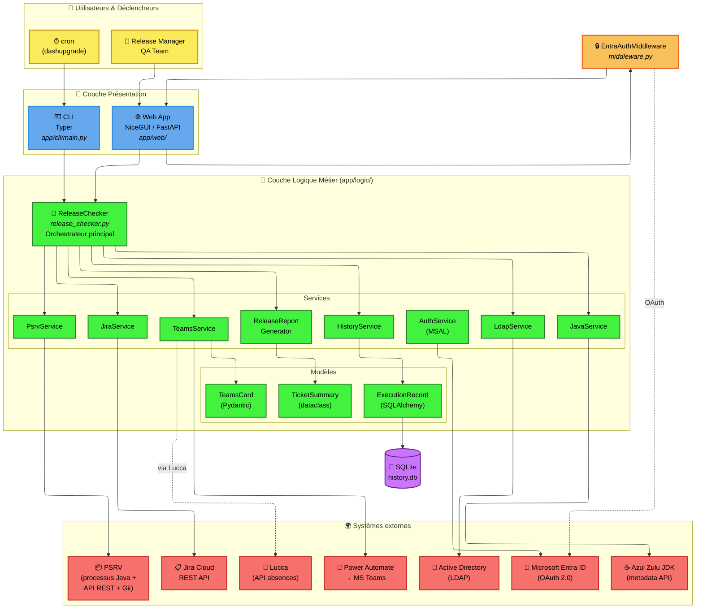
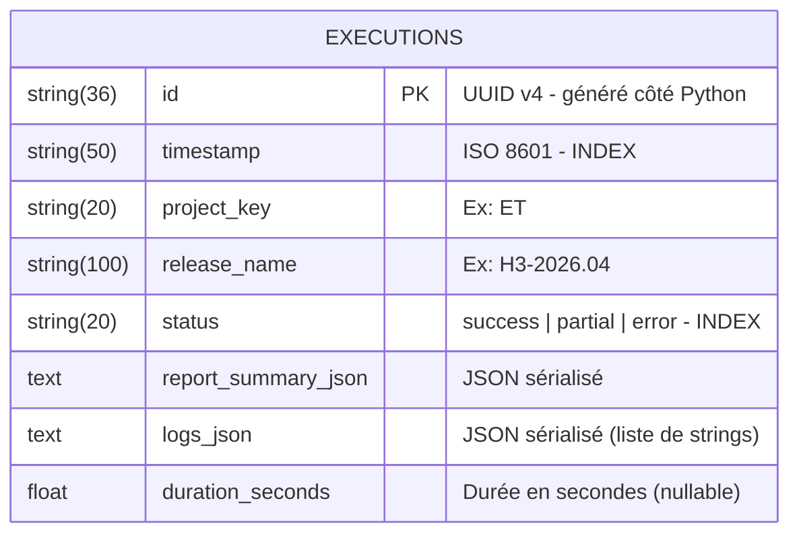
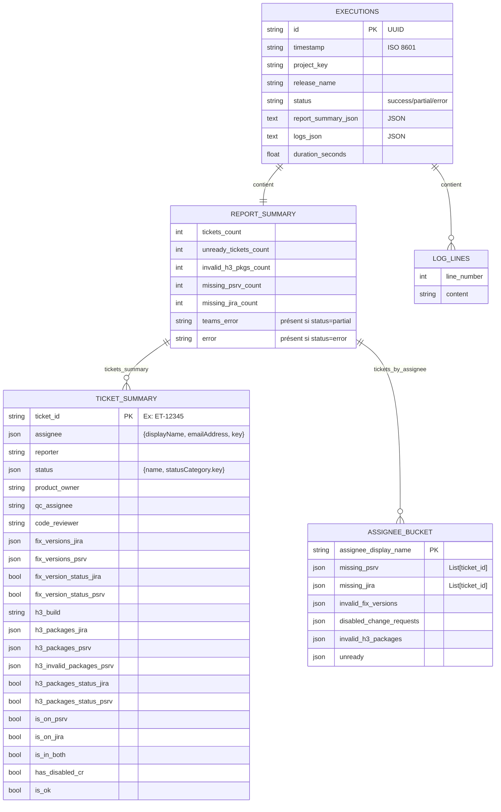
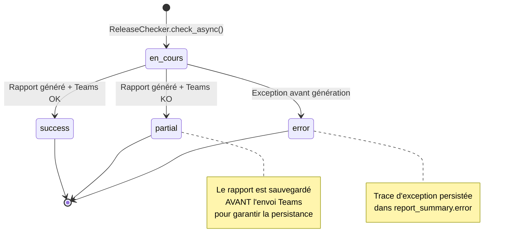
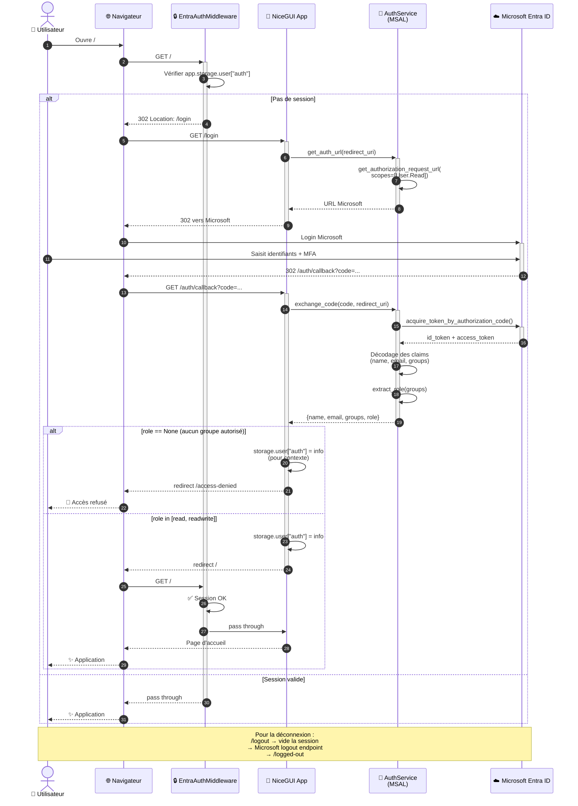
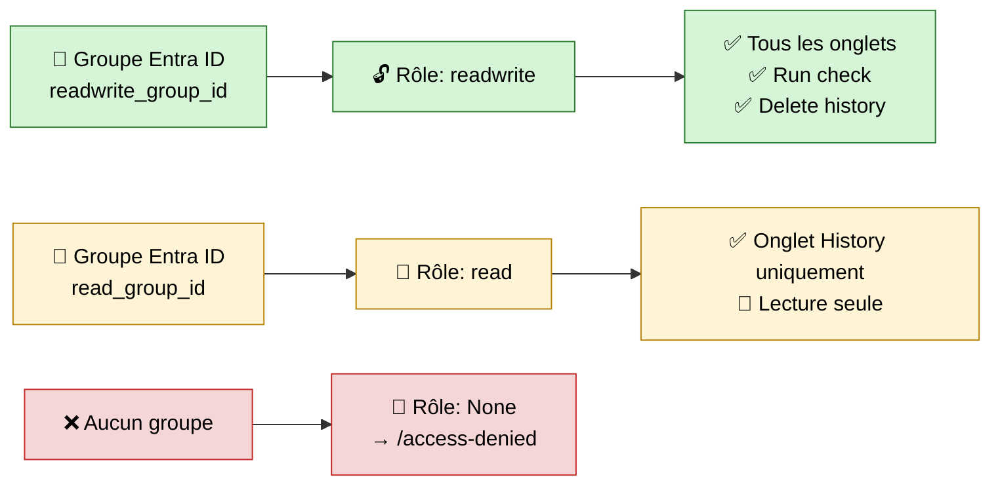
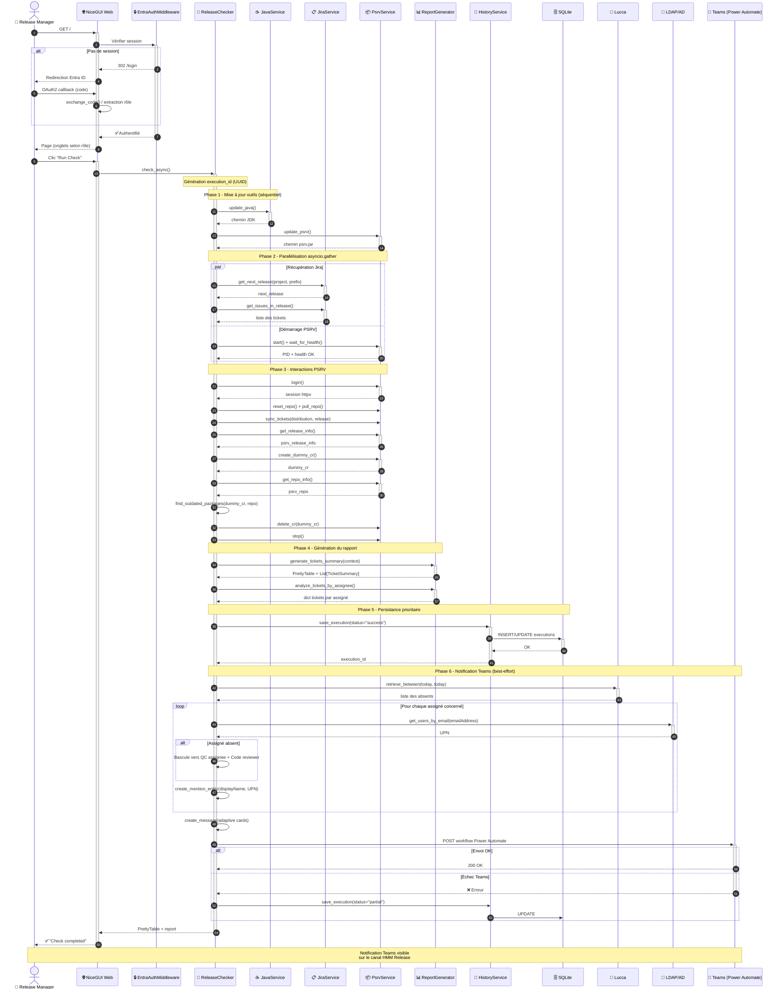
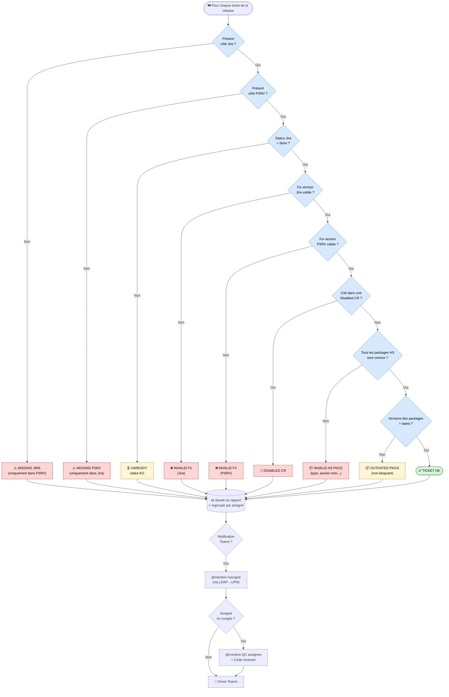
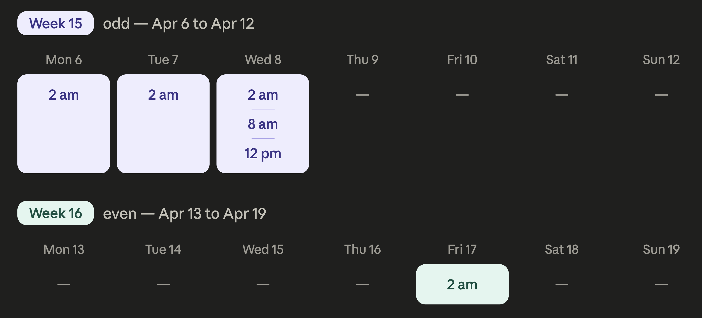

# Compte rendu détaillé

## 1. Contexte de l'entreprise et du projet

### 1.1 L'organisation : Horizon Trading

Horizon Trading est un éditeur de logiciels de trading professionnels destinés aux institutions financières (banques d'investissement, brokers, fonds). Son produit phare, **Horizon Market Maker 3** (H3 / *HMM3*), est une plateforme modulaire utilisée en production par de nombreux clients à travers le monde.

Le développement de H3 est organisé en **Scrum Teams** travaillant sur des sprints de deux semaines. À chaque fin de cycle, une nouvelle version (*service pack*) du logiciel est préparée, validée et livrée aux clients.

### 1.2 Le rôle de Release Manager

À chaque sprint, **une équipe Scrum joue à tour de rôle le rôle de Delivery Manager** (Release Manager) pour H3. Sa responsabilité est de **garantir la cohérence et la qualité de la prochaine version** avant qu'elle ne soit publiée.

Pour cela, il devait dérouler une **check-list manuelle** (formalisée dans le document interne *« How To Deliver a H3 Service Pack »*) qui comprenait, pour la partie *Tasks done by the delivery manager*, plus d'une dizaine de vérifications distinctes :

1. Vérifier qu'aucune *Change Request* n'est désactivée pour la release.
2. Vérifier que les versions des packages sont à jour.
3. Vérifier la complétion du *Quality Control* (QC) pour tous les tickets de la release.
4. Vérifier qu'aucun nom de client ne figure dans les tickets ET de la *release note*.
5. *Resync* manuellement tous les tickets sur le PSRV.
6. Vérifier les *fix versions* (chaque ticket doit être lié à la bonne version).
7. Identifier et corriger les tickets présents dans deux versions consécutives.
8. Vérifier la liste des packages H3 (typos, packages inconnus, etc.).
9. Re-synchroniser après chaque correction.
10. Demander un *Go / NoGo* à l'équipe QA.
11. Créer la version finale et publier.

Cette procédure était **chronophage** (de l'ordre de 30 à 45 minutes par release, et davantage en cas d'incohérences à corriger), **fastidieuse** et **sensible aux erreurs humaines**.

### 1.3 L'expression du besoin

Mon tuteur d'entreprise, en concertation avec l'équipe QA et les Release Managers, a formulé le besoin suivant :

> *« Nous voulons un outil qui, lancé automatiquement plusieurs fois par semaine et à la demande, exécute toutes les vérifications de la check-list, génère un rapport synthétique et le poste sur le canal Teams "HMM Release" en mentionnant les bonnes personnes. Le Release Manager doit pouvoir, d'un coup d'œil, savoir si la release est prête. »*

Une exigence forte est que **les contrôles soient le reflet exact de la check-list manuelle existante**, afin que le rapport de l'outil soit immédiatement compris et accepté par les équipes.

| Avant : détection visuelle des anomalies  | Avant : détection visuelle des packages obsolètes  |
|:-----------------------------------------:|:--------------------------------------------------:|
|  |  |

---

## 2. Présentation de l'existant et analyse préalable

### 2.1 Outils déjà en place

| Outil | Rôle | Mode d'accès |
|---|---|---|
| **Jira Cloud** | Gestion des tickets, des versions et des *fix versions* | API REST + bibliothèque Python `pycontribs/jira` |
| **PSRV** *(Packaging Server)* | Outil interne qui gère les distributions, les *change requests*, les packages, les *release notes* et la synchronisation avec un dépôt Git de packaging | API REST `httpx` + processus Java local |
| **Microsoft Teams** | Communication d'équipe, notamment le canal *HMM Release* | Webhook via Power Automate Workflow |
| **Active Directory** | Annuaire des utilisateurs (résolution UPN ↔ e-mail) | LDAP (`ldap3`) |
| **Lucca** | Gestion des absences (congés, RTT) | API REST via la bibliothèque interne `lucca` |
| **GitLab interne** | Forge de code, *issues*, CI/CD, *registry* Docker | SSH + HTTPS |
| **Microsoft Entra ID** | Authentification SSO de l'organisation | OAuth 2.0 (MSAL) |

### 2.2 Code existant

**Aucun.** Le projet a été initialisé de zéro le **17 décembre 2024**. C'est une réalisation entièrement personnelle, du *design* à la mise en production, en passant par les évolutions successives demandées par les utilisateurs.

| Une release H3 dans Jira | Custom fields utilisés sur un ticket |
|:---:|:---:|
|  |  |

### 2.3 Analyse des besoins fonctionnels

À partir de la check-list manuelle, j'ai extrait la **liste exhaustive des contrôles à automatiser** :

1. **Tickets manquants côté PSRV** : un ticket Jira marqué comme *fixVersion = `<release>`* mais absent de la *release* PSRV.
2. **Tickets manquants côté Jira** : à l'inverse, un ticket figurant dans la *release* PSRV mais sans la *fixVersion* Jira correspondante.
3. **Fix versions invalides** : un ticket dont la *fixVersion* (Jira ou PSRV) est vide, dupliquée ou ne correspond pas exactement au nom de la prochaine release.
4. **Change Requests désactivées** : présence d'une *change request* avec `disabled = true` pour la release.
5. **Packages H3 invalides** : un ticket déclare un package qui n'existe pas dans la liste des packages connus du PSRV (typos, anciens noms…).
6. **Packages obsolètes** : la version d'un package incluse dans la release n'est pas la dernière disponible (ex. : `SHORTSELL 0.16.0 (latest: 0.17.0)`).
7. **Tickets non terminés** : un ticket dont la `statusCategory` Jira n'est pas `done`.
8. **Exclusion des tickets internes** : les tickets portant le label *INTERNAL* ne doivent pas figurer dans la *release note* publique.

---

## 3. Conception et architecture de la solution

### 3.1 Vue d'ensemble

L'application est structurée en **trois grands modules** :

```
app/
├── cli/        ← Application Typer (interface ligne de commande)
│   └── main.py
├── logic/      ← Cœur métier réutilisable
│   ├── clients/        (wrappers de bibliothèques tierces : JiraClient)
│   ├── services/       (services métier : Jira, PSRV, Teams, LDAP, History, Auth, Java…)
│   ├── models/         (modèles SQLAlchemy + Pydantic Adaptive Cards)
│   ├── enums/          (JiraCustomField...)
│   ├── exceptions/     (exceptions métier)
│   ├── utils/          (logger, file_manager, path_helper...)
│   ├── config/         (settings Pydantic)
│   └── release_checker.py    (orchestrateur principal)
└── web/        ← Application NiceGUI (interface web)
    ├── main.py
    ├── middleware.py           (Entra ID auth)
    ├── auth_routes.py
    ├── components/             (ReleaseCheckForm, PsrvControl...)
    └── tabs/                   (release_check, history, latest_release, tools_management)
```

Cette séparation permet de **réutiliser** la même logique métier à la fois depuis la CLI, depuis l'interface web et depuis les tests unitaires.

### 3.2 Architecture technique



**Légende**

- **🟡 Utilisateurs & Déclencheurs** : qui ou quoi déclenche un contrôle de release.
- **🔵 Couche Présentation** : interfaces utilisateur (web NiceGUI ou CLI Typer).
- **🟠 Middleware d'authentification** : protège l'interface web (deny by default).
- **🟢 Couche Logique Métier** : services réutilisables, modèles de données, orchestrateur central.
- **🟣 Persistance** : base de données SQLite locale (historique des exécutions).
- **🔴 Systèmes externes** : APIs et services tiers consommés par l'application.


### 3.3 Choix technologiques justifiés

| Choix | Justification |
|---|---|
| **Python 3.13** | Langage déjà utilisé dans d'autres outils internes ; large écosystème (Jira, MSAL, ldap3, SQLAlchemy, NiceGUI). |
| **Poetry 2** | Gestion déterministe des dépendances, *lockfile*, *groups* de dépendances dev/prod, packaging facile. |
| **Typer** | Construction très rapide d'une CLI propre à partir de simples annotations de type Python. |
| **NiceGUI (sur FastAPI)** | Permet d'écrire un frontend web réactif **entièrement en Python** sans devoir développer un client React/Vue séparé. Idéal pour un outil interne maintenu par une seule personne. |
| **Pydantic + Pydantic Settings** | Validation et sérialisation typées (utilisée à la fois pour les *Adaptive Cards* et pour la configuration via variables d'environnement). |
| **SQLAlchemy 2.0 + SQLite** | ORM mature, pas de serveur de base de données à administrer ; SQLite suffit largement pour le volume d'historique d'un outil interne. |
| **httpx (async)** | Client HTTP asynchrone, indispensable pour paralléliser les appels à Jira et au PSRV (ce qui réduit nettement le temps total d'exécution). |
| **MSAL Python** | Bibliothèque officielle Microsoft pour l'authentification Entra ID en flux *Authorization Code*. |
| **Docker multi-stage** | Image de production minimale, image de développement avec hot-reload, build d'examen *offline* (`Dockerfile.exam`) sans réseau interne. |
| **Ruff** | *Linter* + formateur ultra-rapide, preset `ALL` pour un niveau d'exigence maximal. |
| **pytest** | Standard de fait des tests Python, asynchrone supporté via `pytest-asyncio`. |

### 3.4 Modèle de données : table `executions`

#### 3.4.1 Modèle mono-table
L'application persiste l'historique des exécutions dans une base **SQLite locale** gérée via l'ORM **SQLAlchemy 2.0**. Le schéma est volontairement simple : **une seule table `executions`**, dans laquelle les champs complexes (rapport et logs) sont sérialisés en JSON dans des colonnes `TEXT`.

**Pourquoi un modèle "mono-table avec JSON" ?**

| Choix | Justification |
|---|---|
| **Une seule table** | L'application est mono-utilisateur côté écriture (cron + clics ponctuels). Aucun besoin de jointures complexes. |
| **`report_summary` en JSON** | Le contenu du rapport (statistiques, tableau ticket par ticket, regroupement par assigné) est **opaque** au moteur SQL : il n'est jamais filtré ni agrégé en SQL, il sert uniquement à l'affichage du détail d'une exécution. |
| **`logs` en JSON** | Idem : les logs d'une exécution sont consultés en bloc dans la vue détail, jamais cherchés ligne par ligne. |
| **Index sur `timestamp` et `status`** | Ces deux colonnes sont les seules utilisées dans les filtres de la vue *History* (tri par date, filtre par statut). |
| **`id` en `String(36)`** | UUID v4 généré côté Python, passé tel quel à Power Automate pour permettre le *deep-link* `?tab=history&id=<uuid>` depuis la notification Teams. |


*<p align="center">Diagramme ER de la table `executions`</p>*

Les statuts `success` / `partial` / `error` permettent de distinguer :
- `success` : tout s'est bien passé.
- `partial` : le rapport a été généré et persisté, mais l'envoi à Teams a échoué (par exemple Power Automate indisponible). Le rapport reste consultable dans l'historique.
- `error` : une exception est remontée avant que le rapport n'ait pu être généré. La trace est sauvegardée pour analyse.

#### 3.4.2 Structure du rapport
Bien que SQLAlchemy ne voie qu'un blob `TEXT`, la structure interne du `report_summary_json` est elle-même **fortement typée côté Python** (via les *dataclasses* `TicketSummary` et `ReportContext`).

Voici sa décomposition logique :


*<p align="center">Structure interne du JSON stocké dans `report_summary_json` et `logs_json`</p>*

#### 3.4.3 Cycle de vie d'une ligne `executions`
Le cycle de vie d'une ligne `executions` est le suivant :


#### 3.4.4 Volumétrie estimée

| Champ | Taille typique | Commentaire |
|---|---|---|
| `id` | 36 octets | UUID v4 fixe |
| `timestamp` | ~26 octets | ISO 8601 avec microsecondes |
| `project_key` | 2 à 20 octets | Ex: `ET` |
| `release_name` | ~10 à 15 octets | Ex: `H3-2026.04` |
| `status` | 5 à 7 octets | Énum |
| `report_summary_json` | **5 à 50 Ko** | Dépend du nombre de tickets dans la release (50 à 300 tickets en pratique) |
| `logs_json` | **2 à 10 Ko** | ~50 à 200 lignes de logs par exécution |
| `duration_seconds` | 8 octets | Float |

À raison d'environ **3 exécutions par semaine** (cron) et de quelques exécutions manuelles, la base atteint à peine **quelques mégaoctets sur une année complète** : SQLite est largement dimensionné pour ce besoin.

### 3.5 Sécurité et authentification

L'interface web est protégée par un **middleware Starlette** (`app/web/middleware.py`) qui applique le principe **« deny by default »** :

- Toutes les routes nécessitent une session utilisateur valide (`app.storage.user["auth"]`).
- Une liste blanche très restreinte autorise les routes publiques nécessaires au flux OAuth : `/login`, `/auth/callback`, `/logout`, `/logged-out`, `/access-denied` et les ressources statiques NiceGUI (`/_nicegui/`, `/static/`).

Le service d'authentification (`app/logic/services/auth.py`) :

1. Génère l'URL d'autorisation Entra ID via MSAL (`get_authorization_request_url`).
2. À la réception du *callback*, échange le code d'autorisation contre un *access token* + *id token* (`acquire_token_by_authorization_code`).
3. Extrait les *claims* (`name`, `preferred_username`, `groups`) du *id token*.
4. Mappe les `groups` (object IDs Entra ID) sur deux rôles applicatifs :
   - `readwrite` (groupe `ENTRA_READWRITE_GROUP_ID`)
   - `read` (groupe `ENTRA_READ_GROUP_ID`)
5. Si l'utilisateur n'appartient à aucun groupe autorisé, il est redirigé vers la page `/access-denied`.

L'application web réagit ensuite au rôle :

- Un utilisateur `read` ne voit que l'onglet **History** (consultation seule).
- Un utilisateur `readwrite` voit tous les onglets et peut déclencher des contrôles, supprimer des entrées d'historique, etc.


*<p align="center">Diagramme du flux OAuth 2.0</p>*


*<p align="center">Mapping des rôles</p>*

| Page Microsoft de connexion | En-tête authentifié + rôle |
|:---:|:---:|
|  |  |

| Page *Access Denied* (aucun groupe) | Page *Logged Out* |
|:---:|:---:|
|  |  |

---

## 4. Détail des fonctionnalités

Ce diagramme illustre **le déroulé complet** d'une exécution de la commande `releases check` (depuis l'interface web ou la CLI), depuis le clic utilisateur jusqu'à la notification Microsoft Teams. Il met en évidence la **parallélisation asynchrone** entre la récupération du contexte Jira et le démarrage du PSRV grâce à `asyncio.gather`.



Les six phases sont les suivantes :

1. **Phase 1** : Mise à jour des outils (Java, PSRV) en séquentiel.
2. **Phase 2** : Parallélisation `asyncio.gather` : pendant que le PSRV démarre, les données Jira sont récupérées en parallèle.
3. **Phase 3** : Interactions HTTP avec l'API REST du PSRV : reset/pull du repo, *resync*, création/suppression d'une CR fictive pour détecter les packages obsolètes.
4. **Phase 4** : Génération du tableau récapitulatif et des regroupements par assigné.
5. **Phase 5** : Persistance immédiate du rapport en base **avant** d'essayer la notification Teams (pour ne jamais perdre un rapport en cas d'échec d'envoi).
6. **Phase 6** : Envoi de la notification Microsoft Teams via Power Automate, avec résolution UPN par LDAP, prise en compte des absences via Lucca, et mécanisme de **fallback `partial`** si l'envoi échoue.

Ce diagramme présente l'**arbre de décision** appliqué à chaque ticket lors d'un release check, ainsi que les anomalies remontées dans le rapport.



Les anomalies sont de plusieurs types :

| Catégorie | Sévérité | Description |
|---|---|---|
| **MISSING PSRV** | 🔴 Bloquant | Le ticket Jira a la bonne *fixVersion* mais n'est pas dans la release PSRV. |
| **MISSING JIRA** | 🔴 Bloquant | Le ticket figure dans la release PSRV mais n'a pas la *fixVersion* Jira correspondante. |
| **INVALID FV** | 🔴 Bloquant | La *fixVersion* Jira ou PSRV est vide, dupliquée, ou pointe sur une autre release. |
| **DISABLED CR** | 🔴 Bloquant | Le ticket est rattaché à une *change request* désactivée. |
| **INVALID H3 PKGS** | 🔴 Bloquant | Au moins un des packages déclarés sur le ticket n'est pas connu du PSRV (typo). |
| **UNREADY** | 🟡 À surveiller | Le statut Jira n'est pas en `done` (ex. : *In Progress*, *In Review*). |
| **OUTDATED PKGS** | 🟡 Informatif | Un package est en production avec une version inférieure à la dernière disponible (info, non bloquant). |


### 4.1 Commande CLI `releases check`

```text
Usage: my-cli releases check [OPTIONS]

 Check release.

 Raises:
 typer.Exit: If an error occurs during the release check.

╭─ Options ─────────────────────────────────────────────────────────────────────────────────────────────────────────────────────────────╮
│ --project-key          -p       TEXT  Project key [default: ET]                                                                       │
│ --release-prefix       -r       TEXT  Release prefix [default: H3]                                                                    │
│ --release                       TEXT  Release to check. If none is provided, the latest will be determined automatically.             │
│ --[no]-stop-psrv                      Stop the PSRV after checks are done. [default: stop-psrv]                                       │
│ --[no]-start-psrv                     Start the PSRV before doing the checks. [default: start-psrv]                                   │
│ --[no]-hard-reset-repo                Hard reset the repo before doing the checks. [default: hard-reset-repo]                         │
│ --[no]-update-tools                   Update the tools before doing the checks. [default: update-tools]                               │
│ --[no]-resync-tickets                 Resync all tickets before doing the checks. [default: resync-tickets]                           │
│ --[no]-push-commit                    Push the 'Refresh tickets' commit after synchronization. [default: no-push-commit]              │
│ --reply-to-message-id           TEXT  ID of the Teams Channel Message ID to reply to.                                                 │
│ --[no]-show-done-each-step            On each step, write 'Done!' at the end of line when done. [default: no-show-done-each-step]     │
│ --help                                Show this message and exit.                                                                     │
╰───────────────────────────────────────────────────────────────────────────────────────────────────────────────────────────────────────╯
```

C'est cette commande qui est appelée depuis le **cron** sur le serveur `dashupgrade`. Elle peut également être utilisée par les développeurs.

| Aide générale `--help` | Aide de `releases check` |
|:---:|:---:|
|  |  |

| Exécution réussie en CLI (PrettyTable) | Gestion des outils |
|:---:|:---:|
|  |  |

### 4.2 Le moteur de comparaison

Le cœur métier est implémenté dans [**`ReleaseReportGenerator.generate_tickets_summary()`**](https://github.com/wblondel/h3-release-checker/app/logic/services/release_report.py). Il prend en entrée un `ReportContext` contenant les tickets Jira de la release, les tickets PSRV de la release, les *change requests* désactivées et la liste des packages connus, et produit pour chaque ticket un objet `TicketSummary` contenant tous les champs nécessaires à l'affichage : statut, *fix versions* Jira et PSRV, packages, *flags* d'incohérence, etc.

L'algorithme :

1. Pour chaque ticket Jira de la release :
   - Vérifier s'il est aussi présent dans la release PSRV.
   - Vérifier s'il est cité dans une *change request* désactivée.
   - Récupérer la *fix version* PSRV correspondante.
   - Comparer les packages H3 déclarés au niveau du ticket avec les `packageRules` de la release PSRV.
   - Marquer comme **invalide** tout package qui n'apparaît dans aucune des règles.
2. Calculer pour chaque ticket les booléens : `is_in_both`, `has_disabled_cr`, `is_ok` (vert si tout est bon).
3. Construire un `PrettyTable` avec un *custom format* par colonne (`Y` / `N` / `N/A` pour les booléens, *display name* pour les *Jira Users*, etc.).

Une seconde méthode, **`analyze_tickets_by_assignee()`**, regroupe les anomalies par assigné, ce qui permet à la notification Teams de mentionner directement les bonnes personnes plutôt que de leur faire parcourir une longue liste.

### 4.3 Interaction avec le PSRV

Le service [`PsrvService`](https://github.com/wblondel/h3-release-checker/app/logic/services/psrv.py) gère le cycle de vie complet du processus PSRV :

1. **Téléchargement** du JAR le plus récent depuis l'artifactory interne.
2. **Démarrage** du processus Java avec et toutes les options nécessaires.
3. **Attente de la disponibilité** via une *health check* HTTP.
4. **Authentification** sur l'API REST.
5. **Exécution des opérations** : reset du repo, pull, *resync* des tickets, récupération des informations de release et du repo, création/suppression d'une *change request* fictive (utilisée pour détecter les packages obsolètes).
6. **Arrêt propre** du processus en lisant le PID file produit par le PSRV.

L'utilisation systématique de `httpx.AsyncClient` permet de **paralléliser** la récupération du contexte Jira et le démarrage du PSRV (qui prend plusieurs dizaines de secondes), via `asyncio.gather`. Cela réduit notablement le temps total d'exécution.

### 4.4 La notification Microsoft Teams (Adaptive Cards + Power Automate)

J'ai modélisé l'intégralité de l'Adaptive Card en [Pydantic](https://github.com/wblondel/h3-release-checker/app/logic/models/teams_card.py). Le `TeamsService.create_message()` produit un `TeamsMessage` constitué de **trois cartes attachées** :

1. **Carte principale** : avatar + nom de la release + date de début + description + `FactSet` (compteurs : `Tickets missing in PSRV`, `Invalid FV`, `Disabled CRs`, `Outdated pkgs`, `Invalid H3 pkgs`, `Unready tickets`) + bloc de personnes mentionnées + boutons d'action.
2. **Carte tableau** : un *Table* `Adaptive Card` qui liste, par assigné, les tickets concernés par chaque type d'anomalie.
3. **Carte « reply »** : si un `parentMessageId` Teams a été passé en paramètre, la nouvelle notification est postée en *réponse* à un message existant, ce qui permet de *threader* l'historique des contrôles d'une même release.

Le payload est ensuite POSTé sur un **workflow Power Automate** dont l'URL et la signature sont configurées par variables d'environnement (`TEAMS_WORKFLOW_HOST`, `TEAMS_WORKFLOW_ID`, `TEAMS_WORKFLOW_SIGNATURE`). Le flow Power Automate reçoit le payload et le poste sur le canal Teams.

#### Le système de mentions intelligentes

Pour qu'une mention `@Nom` soit cliquable sur Teams, il faut connaître l'**UPN** (User Principal Name) de la personne, pas seulement son nom. Or Jira ne fournit que l'adresse e-mail. La résolution se fait donc en plusieurs étapes :

1. Pour chaque assigné concerné par une anomalie, récupérer son `emailAddress` depuis Jira.
2. Interroger l'**Active Directory** via LDAP (`LdapService.get_users_by_email()`) pour obtenir l'`userPrincipalName`.
3. Si l'UPN est trouvé, créer une `MentionEntity` Adaptive Card.
4. **Si l'assigné est en congés** (information récupérée via l'API Lucca avec la bibliothèque interne `lucca`), basculer la mention sur les **QC assignee** et **code reviewer** (récupérés via les *custom fields* Jira `JiraCustomField.QC_ASSIGNEE` et `JiraCustomField.CODE_REVIEWER`).

Cette logique évite de spammer une personne absente et permet de faire avancer le ticket avec son backup.

| Adaptive Card principale | Tableau par assigné |
|:---:|:---:|
|  |  |

| Réponse en *thread* |
|:---:|
|  |

| Flux Power Automate | Détail d'une exécution réussie du flux |
|:---:|:---:|
|  |  |

### 4.5 Interface web

L'application web NiceGUI propose **quatre onglets** :

#### 4.5.1 Release Check

- Formulaire de configuration (clé projet, préfixe, release optionnelle, *Reply to Message ID*).
- Boutons bascule pour activer/désactiver chaque étape.
- **Détection automatique** : si on colle une URL Teams dans le champ *Reply To Message ID*, l'application en extrait le `parentMessageId` automatiquement.
- **Journal en direct** : la sortie du `ReleaseChecker` est *streamée* dans en bas du formulaire.

| Formulaire vide (état initial) | Exécution en cours (logs en direct) |
|:---:|:---:|
|  |  |

| Exécution terminée avec succès |
|:---:|
|  |

#### 4.5.2 Get Latest Release

- Petit utilitaire qui interroge Jira pour afficher la prochaine release (utile au Release Manager pour vérifier rapidement).

| Affichage de la prochaine release |
|:---:|
|  |

#### 4.5.3 Tools Management

- Boutons pour démarrer / arrêter le PSRV manuellement (utile en debug) et déclencher la mise à jour de Java et du PSRV.

| Onglet *Tools Management* |
|:---:|
|  |

#### 4.5.4 History

- Liste paginée des exécutions avec :
  - filtres par **statut** et par **release** ;
  - badges colorés (vert / orange / rouge) selon le statut ;
  - boutons *View report* et *Delete* ;
  - bouton *Clear All* (lecture-écriture uniquement) ;
  - **rafraîchissement automatique** toutes les 2 secondes (uniquement quand on est sur la liste, pas dans le détail).
- Vue détaillée d'une exécution :
  - en-tête (release, projet, statut, durée, date) ;
  - bouton **Export JSON** pour télécharger le rapport ;
  - 4 cartes statistiques (tickets totaux, *missing PSRV*, *invalid pkgs*, *unready*) ;
  - tableau **« Actionable Items by Assignee »** ;
  - tableau ticket par ticket avec liens Jira cliquables et icônes visuelles (✓ vert / ⚠ rouge) ;
  - panneau des journaux d'exécution dépliable.
- Si le statut est `error`, la vue affiche directement la trace de l'exception et les logs (court-circuit du reste).
- Si le statut est `partial`, un bandeau orange explique que le rapport a bien été généré mais que la notification Teams a échoué, et donne accès au détail de l'erreur.

| Liste paginée (statuts mélangés, filtres) | Vue détaillée — statut `success` |
|:---:|:---:|
|  |  |

| Vue détaillée — statut `partial` | Vue détaillée — statut `error` |
|:---:|:---:|
|  |  |

| Bouton *Export JSON* (téléchargement du rapport) |
|:---:|
|  |

### 4.6 Déploiement

#### Image Docker multi-stage

```dockerfile
FROM python:3.13.11-slim AS python-base
...
FROM python-base AS builder-base
RUN apt-get install ... build-essential curl ssh
RUN curl -sSL https://install.python-poetry.org | python3 -
COPY poetry.lock pyproject.toml ./
RUN poetry install --no-root --without=dev
...
FROM python-base AS development
...
RUN poetry install --no-root --with=dev
USER appuser
ENTRYPOINT ["python", "-m", "app.web.main"]

FROM python-base AS production
COPY --from=builder-base $PYSETUP_PATH $PYSETUP_PATH
COPY ./app /app/app
USER appuser
ENTRYPOINT ["python", "-m", "app.web.main"]
```

L'image *production* ne contient ni le code source de Poetry, ni les dépendances de développement, ni les outils de build : elle est minimale et tourne sous un utilisateur non-root (`appuser`).

#### Profils Docker Compose

Le `compose.yaml` propose **trois profils** :

- `dev` : build local de l'image *development*, hot-reload via volume monté.
- `prod` : build local de l'image *production*.
- `registry` : utilise directement l'image *production* publiée sur le registry interne.

#### Cron sur `dashupgrade`

```shell
# Lundi à mercredi (et vendredi) à 8h HKT (2h CEST)
0 2 * * 1-3,5 $HOME/h3-releases-auto-follow-up/send_post.sh

# Mercredi à 8h et 12h CEST
0 8,12 * * 3 $HOME/h3-releases-auto-follow-up/send_post.sh
```

Le script `send_post.sh` applique une **logique de parité de semaine** :

- **Vendredi** : exécution uniquement les semaines **paires**.
- **Lundi à jeudi** : exécution uniquement les semaines **impaires**.

Cela colle au cycle des sprints de deux semaines : on contrôle l'avancement en début de sprint puis en fin, sans déranger les équipes en dehors des fenêtres utiles.



| Pipeline GitLab CI (dernier *run* réussi) | Image Docker dans le registry interne |
|:---:|:---:|
|  |  |

| Liste des conteneurs Docker sur `dashupgrade` | Tâches planifiées sur `dashupgrade` |
|:---:|:---:|
|  |  |

### 4.7 Mode démonstration et build d'examen

Pour pouvoir présenter l'outil **lors de l'épreuve E6**, sans accès au réseau d'entreprise, j'ai mis en place :

- Un mode démonstration activable par variable d'environnement, qui remplace `JiraService`, `PsrvService`, `LdapService` et `LuccaCalendar` par leurs équivalents [*mock*](https://github.com/wblondel/h3-release-checker/app/logic/services/mock_services.py). Le mode démonstration génère un rapport plausible (avec des tickets factices et quelques anomalies représentatives) et conserve l'expérience utilisateur intacte.
- Une copie locale du paquet privé `lucca` dans `vendor/lucca/`.
- Un **`Dockerfile.exam`**, un **`pyproject.exam.toml`** et un **`compose.exam.yaml`** qui *override* la configuration standard pour pointer vers le `lucca` *vendored*. Ce build n'a besoin d'aucun accès SSH au GitLab interne.
- Le tout documenté dans [`README.exam.md`](https://github.com/wblondel/h3-release-checker/README.exam.md).

---

## 5. Tests et qualité de code

### 5.1 Stratégie de test

- **Tests unitaires des services métier** : ils valident que `ReleaseReportGenerator` produit le bon `TicketSummary` pour des cas variés (ticket OK, ticket avec *fix version* invalide, package inconnu, *change request* désactivée, etc.).
- **Tests des composants web**.
- **Tests asynchrones** avec `pytest-asyncio`.
- **Mocks** des services externes (`pytest-mock`) pour ne jamais dépendre du réseau pendant les tests.
- **Cas d'erreur** : la suite vérifie également que `_save_failure_record` persiste bien les exécutions qui échouent, que les exceptions Jira / LDAP sont correctement propagées et que la notification Teams est *fail-safe* (statut `partial`).

### 5.2 Linting et formatage

- **Ruff** est configuré avec le preset `ALL` (cf. `pyproject.toml`), ce qui active toutes les règles disponibles.
- Les exceptions sont **explicitement justifiées** par fichier (`per-file-ignores`).
- Le code respecte une longueur de ligne de 120 caractères et la convention `google` pour les *docstrings*.

| Sortie de `pytest` | Sortie de `ruff check` |
|:---:|:---:|
|  |  |

### 5.3 Refactorings successifs

Plusieurs refactorings visant à améliorer la maintenabilité ou ajouter des fonctionnalités ont été nécessaires :

- `90670f` : remplacement des longues listes d'arguments par des *dataclasses*.
- `91d52ae` : modularisation de l'interface web en composants et onglets séparés.
- `2639885` : migration du stockage de l'historique d'un fichier JSON vers SQLite + SQLAlchemy.
- `45f4acb` : ajout de l'authentification Entra ID.

---

## 6. Compétences mobilisées (référentiel BTS SIO)

| Compétence | Comment elle a été mobilisée dans ce projet |
|---|---|
| **Analyser un besoin exprimé et son contexte juridique** | Lecture, formalisation et validation de la check-list manuelle existante avec le Release Manager et la QA. Prise en compte du contexte réglementaire interne (sécurité des accès, gestion des secrets, RGPD pour les données personnelles AD). |
| **Participer à la conception de l'architecture d'une solution applicative** | Conception en couches CLI / logique / web, séparation des responsabilités, choix d'une orchestration centralisée (`ReleaseChecker`). |
| **Modéliser une solution applicative** | Modèles `dataclass` (`TicketSummary`, `ReportContext`, `ReleaseCheckerConfig`), modèles SQLAlchemy (`ExecutionRecord`), modèles Pydantic (Adaptive Cards Teams). |
| **Exploiter les ressources d'un cadre applicatif (framework)** | FastAPI / NiceGUI pour le web, Typer pour la CLI, SQLAlchemy ORM pour la BD, Pydantic Settings pour la configuration. |
| **Identifier, développer, utiliser ou adapter des composants logiciels** | Développement de composants NiceGUI réutilisables (`ReleaseCheckForm`, `PsrvControl`, `ToolsUpdate`), wrappers `JiraClient`, `LdapService`. |
| **Exploiter les technologies Web pour mettre en œuvre les échanges entre applications** | Appels REST asynchrones avec `httpx`, intégration OAuth 2.0 avec MSAL, webhooks Power Automate, API Atlassian Jira Cloud, API PSRV REST, API Lucca, API Azul Zulu. |
| **Utiliser des composants d'accès aux données** | SQLAlchemy 2.0 (sessions, *DeclarativeBase*, `mapped_column`, requêtes ORM, *upsert*), `lru_cache` pour la résolution de service Jira, sérialisation JSON pour les payloads. |
| **Intégrer en continu les versions d'une solution applicative** | Pipeline GitLab CI, build et publication automatique de l'image Docker dans le registry interne, profils Compose `dev` / `prod` / `registry`, *cron* sur `dashupgrade`. |
| **Réaliser les tests nécessaires à la validation ou à la mise en production** | Tests unitaires `pytest`, tests asynchrones, tests de composants web, vérifications de cas d'erreurs, exécution manuelle de bout en bout en mode démo. |
| **Rédiger des documentations technique et d'utilisation** | [`README.md`](https://github.com/wblondel/h3-release-checker/README.md) complet (build, configuration, commandes, déploiement), [`README.exam.md`](https://github.com/wblondel/h3-release-checker/README.exam.md) (build d'examen *offline*), docstrings Google sur toutes les fonctions publiques, ce compte rendu, et l'[Annexe VII-1-B](/documents/E6/BLONDEL_WILLIAM_VII-1-B_R2.pdf). |
| **Exploiter les fonctionnalités d'un environnement de développement et de tests** | PyCharm, debugger Python, intégration ruff, pytest, Docker Compose, Git/GitLab. |
| **Recueillir, analyser et mettre à jour les informations sur une version d'une solution applicative** | Versionnage sémantique, historique Git riche, documentation des évolutions dans les commits *feat:* / *fix:* / *refactor:*, mise à jour de la documentation interne *« How To Deliver a H3 Service Pack »*. |
| **Évaluer la qualité d'une solution applicative** | Linter Ruff *preset ALL*, suite de tests, revue manuelle des refactorings, surveillance de la durée d'exécution (champ `duration_seconds` dans la base). |
| **Analyser et corriger un dysfonctionnement** | Plusieurs commits *fix:* (`fix: app gets stuck when Jira instance is not responding`, `fix(release_check): resolve ruff issues and refactor db sessions`…) : diagnostic à partir des logs d'exécution stockés en base, reproduction en mode démo, correction et test. |
| **Mettre à jour des documentations technique et d'utilisation d'une solution applicative** | Mise à jour de `README.md` à chaque évolution majeure, mise à jour du document interne *« How To Deliver a H3 Service Pack »* après mise en service de l'outil. |
| **Élaborer et réaliser les tests des éléments mis à jour** | À chaque refactoring (par exemple la migration JSON → SQLite), ajout de tests dédiés et exécution complète de la suite. |
| **Exploiter des données à l'aide d'un langage de requêtes** | Requêtes ORM SQLAlchemy (`session.query(ExecutionRecord).order_by(...).all()`), filtres en Python sur les listes de tickets, JQL côté Jira (`project = ET AND fixVersion = "..."`). |
| **Développer des fonctionnalités applicatives au sein d'un système de gestion de base de données** | Création d'un schéma SQLite via SQLAlchemy `Base.metadata.create_all`, sérialisation/désérialisation JSON dans des colonnes `Text`, *upsert* manuel pour les exécutions partielles. |
| **Concevoir ou adapter une base de données** | Choix du modèle (table unique `executions` avec colonnes JSON), choix des index (`timestamp`, `status`), évolution du schéma sans migration formelle (SQLite local, recréation autorisée). |
| **Administrer et déployer une base de données** | SQLite *file-based*, persistance dans le volume Docker `storage/`, sauvegarde simple par copie de fichier. |

---

## 7. Bilan et perspectives

### 7.1 Bilan fonctionnel

L'outil est **en production** et utilisé **quotidiennement**. Il a remplacé la check-list manuelle dans la nouvelle version de la documentation interne (cf. [`How-To-Deliver-H3-after-automated-tool.md`](../How-To-Deliver-H3-after-automated-tool.md)). Les Release Managers successifs n'ont plus à effectuer les contrôles à la main : ils consultent simplement le rapport posté automatiquement sur Teams et n'interviennent que lorsque celui-ci signale une anomalie.

**Gains mesurables** :

- Temps consacré aux contrôles manuels : **divisé par 5 à 10**.
- Erreurs humaines (oubli de *resync*, *fix version* ratée) : **éliminées**.
- Visibilité de l'équipe sur l'état d'avancement de la release : **améliorée** (rapport quotidien sur Teams).

### 7.2 Bilan personnel

Ce projet m'a permis de mener **un projet logiciel complet de bout en bout** : analyse, conception, développement, tests, déploiement, maintenance, support utilisateurs, refactorings, sécurisation. Il est représentatif du métier de développeur en entreprise : on y trouve aussi bien des questions d'architecture (où mettre la limite entre couches ?) que des problèmes très concrets (comment résoudre un UPN à partir d'un e-mail ? comment faire fonctionner Java et Python ensemble dans un conteneur ?).

J'ai particulièrement apprécié :

- l'**impact concret** sur l'équipe (les utilisateurs sont mes propres collègues) ;
- la **richesse de l'écosystème** Python (Jira, MSAL, ldap3, SQLAlchemy, NiceGUI, Pydantic, httpx) ;
- la **liberté d'architecture** que m'a laissée mon tuteur, et le retour qu'il m'a donné à chaque revue ;
- la **mise en production réelle** : l'outil tourne tous les jours et il faut donc qu'il soit **robuste**.

### 7.3 Perspectives d'évolution

- Étendre l'outil à d'autres distributions que H3.
- Permettre une *whitelist* / *blacklist* de packages, afin de pouvoir ignorer volontairement certaines anomalies récurrentes.
- Migrer SQLite vers PostgreSQL si la base d'historique grossit (plusieurs années d'historique).
- Intégrer la **vérification du QC** (statut Jira *Quality Control*) directement dans le rapport.
